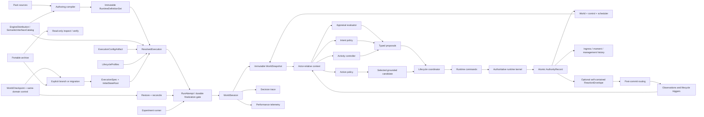

# Target Architecture Package

## Status and authority

This directory is the normative architecture for the redesign of `world`.

The repository is still an early implementation, so these documents describe
the target system rather than the current code. When a document elsewhere
under `docs/architecture/` or `docs/design/` conflicts with this package, this
package wins. Older documents remain useful as detailed research and design
inputs until they are either reconciled or archived.

### Contract ownership inside this package

The package is normative as a whole, but each detailed contract has one
documentation owner. Repeated excerpts elsewhere explain consequences; they do
not create a second definition.

| Contract | Normative definition owner |
|---|---|
| `Γ`, `Σ`, `Ω`, transition relations, safety/progress properties, identity axioms, refinement obligations | `formal-model.md` |
| Plane/component ownership and logical dependency direction | `system-architecture.md` |
| Physical Rust package/module ownership, visibility, concrete public API, rewrite cutover | `code-architecture.md` |
| Evidence, context projection, lifecycle ports, agency protocols, policy noninterference | `cognition-and-agency.md` |
| Time, scheduler, authority records, request ledgers, atomic publication, run-attempt recovery, checkpoints, archives, replay | `runtime-persistence-and-scale.md` |
| Compiler stages, pack/extension trust, artifact closure, research/run/analysis artifacts, trace products | `extensibility-and-research.md` |
| Decision rationale and rejected alternatives | `decisions.md` |
| Conformance examples and adversarial acceptance tests | `validation-scenarios.md` |
| Stable milestone order, outcomes, and exit gates | `implementation-roadmap.md` |
| Active milestone status, work packages, and completion evidence | `docs/implementation/target-rewrite/` |
| Mapping from superseded documents/code to the target | `legacy-reconciliation.md` |

The formal invariants constrain every subsystem owner. A decision record,
scenario, roadmap bullet, or research note cannot silently redefine an owned
protocol. If two owned definitions appear inconsistent, that is a package
defect to resolve explicitly rather than a precedence choice for implementers.

The target is intentionally complete at the level of:

- ownership;
- authority;
- lifecycle;
- scheduling;
- cross-component contracts;
- determinism and persistence;
- extension trust;
- evaluation and product boundaries.

It is intentionally incomplete inside components whose complexity can remain
local, including the final action DSL, planner algorithm, appraisal ontology,
pack source syntax, storage backend, and multi-resolution conversion models.

## Architectural thesis

`world` is a headless, simulation-first RPG engine with a research surface.
Its stable causal spine is:

```text
compiled definitions + authoritative state
    -> actor-relative evidence and context
    -> incremental appraisal
    -> persistent intent
    -> persistent activity
    -> grounded next-action selection
    -> authoritative runtime execution
    -> committed state, events, and future work
```

Seven separations make that spine reliable:

1. **A proposal is not an accepted state change.**
2. **World truth is not actor belief.**
3. **Intent, activity, action, and process have different lifetimes.**
4. **Decision explanation is not authoritative causal history.**
5. **Extensibility does not imply mutation authority.**
6. **Derived values do not become durable truth merely because they are
   retained for continuation or recovery.**
7. **Engine-private freshness and authority metadata is not policy-visible
   meaning.**

The smallest world-transition model beneath the component names is:

```text
immutable execution semantics
  + one authoritative session state
  + capability-scoped immutable subsystem input
  -> bounded proposal or selected supplied ID
  -> verified atomic authority transition
  -> later typed causal work
```

This is a conceptual law, not a request for a universal subsystem trait,
proposal enum, or workflow framework. Concrete domain types preserve the
meaning of each boundary.

The complete controlled-attempt state is
`Ω = (AttemptControlPlane, WorldSession)`. The control plane contains the
durable `RunAttemptControl`, accepted control-event log, disposition evidence,
artifact-pin ownership records, and publication receipts required for
reconciliation and declared verification. It admits at most one world
transition at a time and freezes one terminal authority cursor under the exact
termination contract. It selects a trajectory prefix without becoming another
way to mutate the world.

## System at a glance



The arrows into the runtime are requests. Only the runtime's typed commit gates
can replace the authoritative session head.

## Documents

Recommended reading order:

1. [System Architecture](system-architecture.md) — system model, authority,
   component ownership, logical dependency direction, and public surfaces.
2. [Formal System Model](formal-model.md) — the minimal state, transition,
   subsystem, compiler, determinism, and refinement model beneath every
   component.
3. [Target Rust Code Architecture](code-architecture.md) — physical package
   graph, module/type ownership, visibility, concrete APIs, and clean-break
   rewrite cuts.
4. [Cognition and Agency Lifecycles](cognition-and-agency.md) — evidence,
   appraisal, intent, activity, action, process, context, and evaluator
   contracts.
5. [Runtime, Persistence, and Scale](runtime-persistence-and-scale.md) —
   virtual time, scheduling, atomic commit, replay, randomness,
   multi-resolution, and scaling.
6. [Extensibility and Research](extensibility-and-research.md) — packs,
   executable definition families, trust tiers, versioning, optional
   evaluators, experiments, and observability.
7. [Architecture Decisions](decisions.md) — compact records of the decisions
   that constrain implementation.
8. [Validation Scenarios](validation-scenarios.md) — adversarial scenarios
   used to test whether the boundaries are operational rather than merely
   descriptive.
9. [Implementation Roadmap](implementation-roadmap.md) — stable milestones,
   outcomes, and exit gates for replacing the current implementation.
10. [Legacy Reconciliation](legacy-reconciliation.md) — adopted, refined, and
   replaced parts of the earlier documents and implementation.

Research support is recorded in
[Architecture Redesign Research Synthesis](../../research/architecture-redesign-synthesis.md).

Current execution status and rolling milestone plans are under
[`docs/implementation/target-rewrite/`](../../implementation/target-rewrite/README.md).

## Stable now and deferred now

| Stable architectural contract | Deliberately deferred implementation |
|---|---|
| Immutable compiled and linked `RuntimeDefinitionSet` per session epoch | Final pack source language |
| Exact required semantic-interface closure and execution semantics | Dynamic native plugins |
| Reconstructible process-local `ActivatedDefinitionRegistry` | Final index and cache layout |
| Private invocation envelopes paired with projection-safe actor policy payloads | Rich belief revision algorithms |
| Separate appraisal, intent, activity, and action cadences | Comprehensive emotion or social ontology |
| Persistent intent and activity; one-shot action opportunities | Universal plan representation |
| Grounded action candidates selected by ID | Full action or effect DSL |
| Atomic ingress, moment, and management authority records | Durable database backend |
| Durable run-attempt gate and unique terminal authority cursor | Distributed run scheduling |
| Checkpoint, artifact closure, and compactable committed history | Distributed simulation |
| One active representation per resolution scope | Population aggregation algorithms |
| Typed extension trust ladder | Wasm runtime and interfaces |
| Separate execution, trajectory, study, capture, and analysis identities/artifacts | Server, editor, and package registry |

Deferral is not omission. Each deferred concern already has an owner and a
boundary through which a future implementation can be added without changing
who controls authoritative state.
