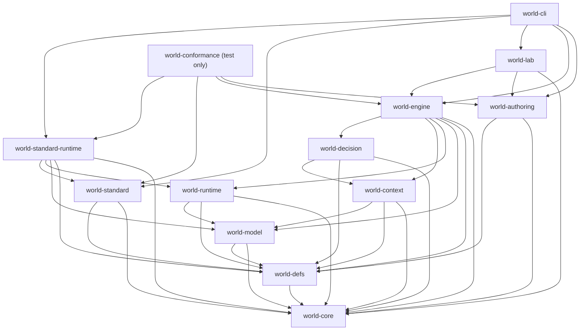

# Target Rust Code Architecture

## Status and purpose

This document is the normative physical design for the target Rust
implementation. It refines the logical component and dependency model in
[`system-architecture.md`](system-architecture.md) without changing the formal
semantics in [`formal-model.md`](formal-model.md).

It fixes:

- the final workspace package graph;
- package and module ownership;
- the location of authoritative state and capabilities;
- the intended public Rust API;
- the engine/runtime collaboration seam;
- construction and serialization boundaries;
- the clean-break physical cutover constraints and deletion gates.

The current implementation has no compatibility obligation. Existing source
is evidence from which algorithms and tests may be rewritten; it is not an API
or data model that constrains this design.

## Physical design thesis

The implementation has one authoritative consistency boundary:

```text
AttemptControlPlane + private SessionHead + AuthorityRecord
```

The attempt control plane includes its control event log, pin ledger,
disposition evidence, and publication receipts. The complete boundary belongs
to `world-runtime` and is changed through one atomic runtime service. No other
package owns a mutable world root,
history append operation, scheduler mutation handle, or commit capability.

The rest of the workspace either:

- defines immutable vocabulary;
- compiles and verifies artifacts;
- builds read projections;
- evaluates a bounded policy port;
- coordinates typed proposals;
- or presents read-only product and research surfaces.

Rust package boundaries enforce dependency and trust direction. Rust modules
hide algorithms and representations that may change together. A package is not
created merely because a box exists in an architecture diagram.

## Design rules

### Packages follow independent ownership pressure

A package is justified by at least one of:

- a required one-way dependency;
- a compile-time authority or trust boundary;
- an independently selectable trusted implementation;
- a product leaf that must not flow back into production execution.

Otherwise the boundary is a private module.

### Data is not authority

Immutable state records, proposals, requests, and deltas may cross packages.
Possessing those values does not grant authority. Authority is the ability to
replace the private session head and publish the matching record through the
runtime repository.

Consequently:

- `world-model` may expose immutable records and typed deltas;
- `world-context` may inspect a trusted read snapshot;
- `world-engine` may submit proposals and selected IDs;
- only `world-runtime` may seal and publish an authoritative transition.

### Invalid transient states are rejected at construction

Use newtypes, private fields, checked constructors, and sealed products for
local validation boundaries:

```text
ArtifactEnvelope -> VerifiedPackArtifact
ExecutionSpec input -> ResolvedExecution
DraftAuthorityRecord -> SealedAuthorityRecord
DecodedCheckpoint -> VerifiedCheckpoint
```

Durable distributed lifecycles use explicit enums plus compare-and-set, not
compile-time typestate alone. A Rust value cannot prove that another process
has not advanced a durable record.

### Public ports are concrete

The system has no universal `Subsystem<I, O>`, proposal envelope, workflow
engine, mutable blackboard, or compiler pass trait. Each lifecycle and
authority path has its own request, result, failure, and persistence rules.

Shared private helpers are allowed where they do not erase those contracts.

### Checked values are never constructed by deserialization alone

Identity-bearing and authority-bearing values do not derive a public
`Deserialize` implementation that bypasses validation. Storage and wire
representations decode into unchecked DTOs. Their owner then validates the
schema, identity, relevant domain limits, references, stage legality, and
direct succession before constructing a checked value. This boundary protects
correctness; hostile-input hardening is added only at an actual hostile
ingestion boundary.

Canonical identity encoding is separate from convenient storage encoding.
`world-core::canonical` owns a small versioned canonical preimage writer for
identity-bearing types; it is not a general serialization framework.

## Final workspace topology

The production workspace has twelve packages and one test-only conformance
leaf:



`world-conformance` contains black-box facade scenarios and workspace
dependency tests. Compile-fail privacy tests live beside the package whose
boundary they probe, so the conformance leaf does not need artificial direct
dependencies on every lower package. It exports no production API and is never
a dependency of another package.

### Why the existing package names remain

Keeping the current package names is not compatibility work. After their
contents are replaced, the names still accurately identify stable ownership:

- `world-model` is the immutable world and protocol model;
- `world-runtime` is the authoritative execution runtime;
- `world-decision` owns pure lifecycle decision ports;
- `world-authoring` owns the compiler-facing authoring toolchain.

Renaming them would introduce vocabulary churn without improving dependency,
privacy, or authority.

### Packages deliberately not created

Do not initially create:

- `world-kernel`: the kernel is the private authority core of
  `world-runtime`; separating it would force a wider authority API;
- `world-storage`: session head, history, attempt control, and receipts share
  one atomic protocol; a backend adapter may become a leaf only after a real
  second backend exists;
- `world-artifact`: compiled definition artifacts belong to `world-defs`,
  execution/checkpoint artifacts belong to `world-runtime`, and source forms
  belong to `world-authoring`;
- one package per lifecycle: the ports have separate types and schedules but
  no independent package consumers;
- `world-compat`, `world-legacy`, or versioned copies of current packages.

## Package ownership and module shape

The trees below are ownership maps, not a requirement to create empty files.
A module is added with its first real producer, consumer, and invariant test.

### `world-core`

```text
world-core/src/
  lib.rs
  canonical.rs       explicit identity preimages and domain separation
  content.rs         content digests and hash protocol identifiers
  identity.rs        truly cross-plane entity and actor identity
  time.rs            SimTime, Microstep, SimMoment, exact duration
  revision.rs        checked revision and sequence scalars
  provenance.rs
  diagnostic.rs
  budget.rs          checked deterministic budget scalars
```

It is not a shared-utility bin. Definition, attempt, authority, lifecycle, and
study IDs remain beside their owning concepts unless multiple lower packages
genuinely require them.

M4's concrete `ActionReadWitness` remains beside action projection in
`world-context`. A shared dependency-key or witness primitive is introduced
only after a second lower-package protocol proves the same abstraction.
Runtime's separate `PreparationReadEvidence` is private same-step transaction
evidence in `world-runtime`; it is neither a context witness nor a reusable
cross-crate abstraction.

### `world-defs`

```text
world-defs/src/
  lib.rs
  key.rs             pack-qualified durable DefinitionKey
  interface.rs       serializable semantic-interface descriptors
  condition/
  action/
  effect/
  event/
  process/
  observation/
  artifact/
    data.rs          compiler-produced or decoded ArtifactData
    envelope.rs      unchecked serialized artifact envelope
    codec.rs         private deterministic storage encoding
    validate.rs      shared catalog-aware domain validation
    verified.rs      sealed VerifiedPackArtifact
    lock.rs          exact PackLock
  set/
    runtime.rs       immutable RuntimeDefinitionSet
    digest.rs
  link.rs            exact total linker/sealer
  validation/
```

`RuntimeDefinitionSet` uses durable definition keys and exact content
identity. Process-local interning and dispatch do not belong here.

### `world-model`

```text
world-model/src/
  lib.rs
  accepted/
    domain/
    epistemic/
    social/
    agency/
  protocol/
    intent.rs
    activity.rs
    action_opportunity.rs
    process.rs
    reservation.rs
    resolution.rs
  delta/
    domain.rs
    epistemic.rs
    social.rs
    agency.rs
  event.rs
  snapshot.rs
  query/
```

This package contains immutable data, checked protocol records, read models,
and typed semantic deltas. It contains no:

- mutable aggregate root;
- store implementation;
- `apply_*` method;
- history append method;
- scheduler mutation method;
- runtime-issued local ID allocator.

`WorldSnapshot` is immutable and safe to clone. Constructing a fixture
snapshot does not create an authoritative session.

`ActionOpportunity` and its checked `Open | WaitingForEvaluation | Consumed`
transitions are model protocol. The retained invocation, artifact bounds,
capture ledger, blocker, fallback, and scheduler integration are runtime
control and therefore live in `world-runtime/action_evaluation.rs`; there is no
generic model-level evaluator-invocation aggregate.

### `world-runtime`

```text
world-runtime/src/
  lib.rs
  service.rs
  action_evaluation.rs
  execution/
    config.rs
    lifecycle_profile.rs
    semantics_manifest.rs
    spec.rs
    initial_root.rs
    activation.rs
    termination.rs
  session/
    head.rs           private SessionHead
    mode.rs
    snapshot.rs
  authority/
    cursor.rs
    record.rs
    draft.rs
    seal.rs
    apply.rs
  attempt/
    binding.rs
    control.rs
    reservation.rs
    receipt.rs
    finalization.rs
    retention.rs
  kernel/
    admit.rs
    fire.rs
    manage.rs
    prepare.rs
    resolve.rs
    gates/
  transaction/
  scheduler/
  process/
  control/
    lifecycle.rs
    dedup.rs
    reaction.rs
  persistence/
    repository.rs
    memory.rs
    artifact_retention.rs
    delivery_retention.rs
  checkpoint/
  archive/
  random.rs
```

`SessionHead`, canonical record application, record sealing, and all
publication-capable values stay private to this package. Runtime's public
world-changing protocols may succeed only through one `Admit`, `Fire`, or
`Manage`.

Runtime also exposes validated construction and read operations plus declared
`Ca`-only reservation, reconciliation, cancellation, retention, compaction,
and archive-fencing protocols. Those operations cannot change `Σ`, its
authority cursor, or its trajectory prefix.

The process-local `ActivatedDefinitionRegistry` belongs under
`execution/activation.rs`. Its intern IDs, indexes, caches, and implementation
pointers are reconstructible and never enter durable identity.

### `world-context`

```text
world-context/src/
  lib.rs
  availability.rs
  witness.rs
  projection/
    observation.rs
    evidence.rs
    epistemic.rs
    social.rs
    capability.rs
    affordance.rs
    chronology.rs
  candidate/
    intent.rs
    action.rs
    private_resolution.rs
  payload/
    appraisal.rs
    intent.rs
    activity.rs
    action.rs
  invalidation.rs
```

There is no one broad context pipeline result. The facade has explicit
lifecycle methods and returns a typed build result:

```rust
ContextProjector::build_appraisal(...)
ContextProjector::build_intent(...)
ContextProjector::build_activity(...)
ContextProjector::build_action(...)
```

Projectors backed only by total checked inputs may return a complete build
directly. The first genuinely partial provider introduces the shared typed
complete-versus-unavailable result and an engine-private dependency witness.
Actor-safe payloads never carry the witness, global revision, or private
candidate-resolution table. No milestone introduces a partial-provider result
solely to satisfy a synthetic failure test.

### `world-decision`

```text
world-decision/src/
  lib.rs
  ports/
    evidence.rs
    appraisal.rs
    social.rs
    intent.rs
    activity.rs
    action.rs
  baseline/
  trace/
  external/
```

The current stable production ports are:

```text
EvidenceAssimilator
AppraisalEvaluator
IntentPolicy
ActivityController
ActionPolicy
```

Each port has a concrete input and result enum. The current cross-lifecycle
pass/profile/representation runner is not part of this package after the
rewrite. If a future experiment needs a pass graph, it is implemented anew as
one evaluator behind one of these ports.

`SocialInterpretationEvaluator` is a future optional target port. M4 keeps its
profile position explicitly disabled and does not retain an unused production
trait before a concrete social semantic slice exists. When introduced, it
returns only an `ActorSocialInterpretationProposal`. The social gate's broader
`SocialTransitionProposal` also admits separately typed intersubjective-claim
and institutional-fact transitions, but the interpretation evaluator cannot
construct those variants.

### `world-authoring`

```text
world-authoring/src/
  lib.rs
  source/
  manifest/
  package_resolution/
  compiler/
    parse.rs
    resolve.rs
    typecheck.rs
    lower/
    verify.rs
    canonicalize.rs
    emit.rs
  upgrade/
  diagnostic.rs
  builder.rs
```

The compiler uses distinct internal stage types:

```text
SourcePackage
  -> ResolvedPackage
  -> ArtifactData
  -> defs-owned catalog-aware validation
  -> VerifiedPackArtifact
  -> finalized artifact-digest PackLock
  -> ExactPackSet
  -> RuntimeDefinitionSet
```

Only phases that add a distinct invariant receive a stage type. A future text
frontend may add parsed and typed forms without changing the `ArtifactData`
boundary. These stages do not imply a public pass manager or one universal IR;
family-specific lowering and validation remain in family-owned modules.

### `world-engine`

```text
world-engine/src/
  lib.rs
  builder.rs
  distribution.rs
  artifact.rs
  resolution.rs
  attempt.rs
  session.rs
  coordinator/
    mod.rs
    evidence.rs
    appraisal.rs
    intent.rs
    activity.rs
    action.rs
  routing.rs
  delivery.rs
  verification.rs
  inspection/
  branching.rs
  migration.rs        prior-target-schema child-epoch migration only
```

This is the primary application dependency. It is the only package that sees
both lifecycle evaluation results and runtime request types. It coordinates;
it cannot publish state.

### Optional and product leaves

```text
world-standard/
  definitions/
  keys/
  vocabulary/

world-standard-runtime/
  bundle/
  primitives/

world-lab/
  study/
  scenario/
  case/
  runner/
  capture/
  metric/
  comparison/

world-cli/
  commands/
  composition/

world-conformance/
  tests/
    architecture/
    authority/
    determinism/
    cognition/
    recovery/
```

`world-standard` is pure definition vocabulary. Trusted executable semantics
remain in `world-standard-runtime`. `world-cli` is the first composition root.
`world-lab` and `world-conformance` are leaves. `world-lab` owns the immutable
`ScenarioArtifact` schema used for study planning and provenance. A game
product may own a different initial-world source schema in its composition
root. Each leaf lowers its own source into the runtime-owned root-construction
input and invokes the checked `InitialStateRoot` builder; runtime never imports
either source schema, and neither becomes a runtime or pack API.

## Top-level type ownership

| Type or concept | Owning package | Construction authority |
|---|---|---|
| `DefinitionKey`, checked family IR | `world-defs` | checked definition builders/compiler |
| `VerifiedPackArtifact` | `world-defs` | compiler-produced or decoded `ArtifactData` passing the same defs-owned validator |
| `RuntimeDefinitionSet` | `world-defs` | exact linker |
| reusable T0 pack declarations | `world-defs` / source pack | checked compiler and pack validator |
| `ScenarioArtifact` | `world-lab` | immutable scenario generator and validator |
| accepted state and lifecycle protocol records | `world-model` | checked value constructors; acceptance remains runtime-owned |
| `WorldSnapshot` and query views | `world-model` | immutable projection of a runtime head or fixture |
| execution config, manifest, spec, initial root | `world-runtime` | canonical builders plus load-time validation |
| `ActivatedDefinitionRegistry` | `world-runtime` | activation against an installed distribution |
| `SessionHead` | `world-runtime` | private root binding or canonical record application |
| `AuthorityCursor`, `AuthorityRecord` | `world-runtime` | private root binding/sealer |
| `RunAttemptControl`, reservation, receipt | `world-runtime` | atomic runtime repository protocol |
| actor-relative payloads and grounded candidates | `world-context` | trusted projector |
| evaluator ports and bounded results | `world-decision` | installed evaluator implementations |
| `EngineDistribution` | `world-engine` | trusted composition builder |
| execution-time `ArtifactResolver` | `world-engine` | host infrastructure implementation; read-only to engine |
| opaque `RuntimeService` and `RuntimeAttemptDriver` | `world-runtime` | runtime-validated constructors only |
| semantic runtime repository | `world-runtime` | crate-private; first implementation is in-memory |
| artifact retention/pin protocol | `world-runtime` | runtime service over a low-level content-addressed store |
| reliable-delivery adapter cursor, dispatch, and acknowledgement plane | `world-engine` | optional durable delivery service; never authoritative state |
| committed-history lease, self-contained delivery root, and archive fence | `world-runtime` | opaque retention capability; cannot change `Σ` or finalization |
| `ResolvedExecution` | `world-engine` | only `Engine::resolve_execution` |
| `RunAttempt`, `WorldSession`, `Inspector` | `world-engine` | only `Engine` |
| `RunVerifier`, `CheckpointMigrationEngine` | `world-engine` | read-only verification or offline child-root construction |
| study, run-case, and metric artifacts | `world-lab` | experiment tooling |

## Realization of the formal model

### Immutable semantics `Γ`

`Γ` is realized by a sealed `world-engine::ResolvedExecution`. It is not one
serializable configuration struct and has no public constructor.

```rust
#[derive(Clone)]
pub struct ResolvedExecution {
    inner: Arc<ResolvedExecutionInner>,
}

struct ResolvedExecutionInner {
    runtime: Arc<ActivatedRuntimeExecution>,
    lifecycles: ResolvedLifecycleBindings,
    closure: ResolvedExecutionClosureManifest,
    distribution: DistributionBinding,
}
```

`ResolvedExecution` has:

- no `Default`;
- no public field;
- no public `Serialize` or `Deserialize`;
- no API that returns independently remixable internal components;
- only identity, provenance, and read-only capability getters.

The runtime-owned portion is itself sealed:

```rust
pub struct ActivatedRuntimeExecution {
    // private runtime-validated:
    // EngineProtocolVersion
    // CanonicalExecutionSpec and VerifiedInitialStateRoot
    // RuntimeDefinitionSet and ActivatedDefinitionRegistry
    // SemanticImplementationSet
    // ExecutionConfigArtifact
    // normalized ExecutionSemanticsManifest and exact required closure
    // verified TerminationContract interpreter
}
```

During resolution, `world-engine` asks `world-runtime` to construct this value
from verified inputs and installed primitive implementations. The engine then
combines it with resolved lifecycle implementations and the exact closure in
`ResolvedExecution`. Starting an attempt passes the sealed
`ActivatedRuntimeExecution` back to runtime; it never supplies a loose root,
definition set, manifest, or configuration bag.

### Authoritative state `Σ`

`Σ` is a private runtime value:

```rust
struct SessionHead {
    cursor: AuthorityCursor,
    mode: SessionMode,
    clock: SessionClock,
    accepted: AcceptedState,
    runtime_control: RuntimeControlState,
    scheduler: SchedulerState,
}
```

The cursor is the single source of revision and history position. The head has
no public setters and no public constructor. A successor is derived only by
canonical application of a sealed authority record.

The public `WorldSession` is not this struct. It is a read-only engine facade
over the runtime repository.

### Attempt control `Ca`

The complete durable host-control state is:

```rust
struct AttemptControlPlane {
    control: RunAttemptControl,
    events: AttemptControlEventLog,
    pins: AttemptArtifactPinLedger,
    receipts: StepPublicationReceiptSet,
    dispositions: AttemptDispositionStore,
}
```

Receipts and disposition values are retained exactly as required by
reconciliation and declared verification. They do not enter world semantics or
trajectory identity.

Within that plane, durable attempt control is encoded as two orthogonal
algebraic state axes rather than a collection of loosely related booleans and
optional fields:

```rust
pub struct RunAttemptControl {
    binding: AttemptBinding,
    creation: AttemptCreationDescriptor,
    creation_fingerprint: AttemptCreationFingerprint,
    dedup: AttemptControlDedupState,
    trace_head: ControlTransitionEventHash,
    artifact_retention: AttemptArtifactRetention,
    phase: AttemptPhase,
}

pub enum AttemptPhase {
    Active { cursor: AuthorityCursor },
    Reserved { reservation: StepReservation },
    Finalized { finalization: RunFinalization },
}

pub enum AttemptArtifactRetention {
    AttemptOwned {
        closure: AttemptOwnedClosure,
        handoff: Option<HandoffIntent>,
    },
    RetainedBy {
        run_artifacts: RunArtifactSetId,
        closure: ArtifactClosureManifestId,
        request: AttemptArtifactRetentionRequestId,
        request_fingerprint: AttemptArtifactRetentionRequestFingerprint,
        transfer: ArtifactTransferId,
    },
    Discarded {
        request: AttemptArtifactDiscardRequestId,
        request_fingerprint: AttemptArtifactDiscardRequestFingerprint,
        former_pins: FormerPinSet,
    },
}

pub struct HandoffIntent {
    run_artifacts: RunArtifactSetId,
    closure: ArtifactClosureManifestId,
    request: AttemptArtifactRetentionRequestId,
    request_fingerprint: AttemptArtifactRetentionRequestFingerprint,
    transfer: ArtifactTransferId,
}
```

The durable repository still verifies every transition with compare-and-set.
Phase and artifact retention are separate axes because finalization selects a
terminal semantic prefix but does not itself transfer or discard artifacts.
Private constructors and compare-and-set transitions enforce the legal product:
`Active` and `Reserved` require attempt ownership with no handoff, while a
handoff, `RetainedBy`, or `Discarded` state requires `Finalized`. Handoff
records intent while source pins remain, acquires the target pins under
`transfer`, compare-and-sets to `RetainedBy`, and only then releases source
pins. Discard installs its permanent descriptor/fingerprint tombstone before
releasing former pins.

### Controlled attempt `Ω = (Ca, Σ)`

`world-engine::RunAttempt` is the host-facing capability over the bound pair.
It is deliberately not `Clone`. Its mutation methods take `&mut self` to make
local serialization obvious, while the repository remains the actual
cross-process authority.

Finalization revokes the attempt's ability to drive `Σ` but does not destroy
the read-only `WorldSession`.

## Cursor and authority-record representation

Root and post-record cursors use different enum variants so impossible root
combinations are not representable:

```rust
pub struct AuthorityCursor {
    epoch: EpochIdentity,
    position: AuthorityPosition,
}

pub struct EpochIdentity {
    lineage: EpochLineageId,
    execution: ExecutionSpecId,
}

pub enum AuthorityPosition {
    Root {
        record_anchor: AuthorityRecordHash,
        cumulative_anchor: CumulativeAuthorityHash,
    },
    Record {
        revision: NonZeroWorldRevision,
        sequence: NonZeroRunRecordSeq,
        record: AuthorityRecordId,
        cumulative: CumulativeAuthorityHash,
    },
}
```

Authority history has one closed outer algebra:

```rust
pub struct AuthorityRecord {
    header: AuthorityRecordHeader,
    body: AuthorityRecordBody,
}

pub enum AuthorityRecordBody {
    Admission(AuthorityAdmissionRecord),
    Moment(MomentBatchRecord),
    Management(ManagementBatchRecord),
}

pub enum AuthorityAdmissionRecord {
    Commands(IngressBatchRecord),
    ActionEvaluation(ActionEvaluationAdmissionRecord),
}
```

The internal build sequence is:

```text
DraftAuthorityRecord
  -> canonicalize collections
  -> verify exact deltas and succession
  -> derive nonrecursive outer identity
  -> derive nested attempt and commit identities
  -> compute cumulative hash and resulting cursor
  -> SealedAuthorityRecord
```

Only a `SealedAuthorityRecord` may enter publication. Its constructor is
private to `world-runtime`.

## Runtime service and authority surface

`world-runtime` exposes a small set of purpose-specific opaque capabilities
rather than its repository:

```rust
#[derive(Clone)]
pub struct RuntimeService {
    inner: Arc<RuntimeServiceInner>,
}

pub struct RuntimeAttemptDriver {
    inner: RuntimeAttemptHandle,
    // no Clone
}

#[derive(Clone)]
pub struct RuntimeSessionReader {
    inner: RuntimeReadHandle,
}

pub struct RuntimeDeliveryRetention {
    inner: RuntimeDeliveryRetentionHandle,
    // no Clone
}

pub struct HistoryRetentionLease {
    // opaque process handle for one durable runtime-owned lease
    // no Clone, no Serialize, no Deserialize
}

pub struct DeliveryArchiveFence {
    // opaque generation fence over history leases and delivery roots
    // no Clone, no Serialize, no Deserialize
}

pub struct PreparedFire {
    // private process-local token bound to one StepReservation grant
    // no Clone, no Serialize, no Deserialize
}

impl PreparedFire {
    pub fn input(&self) -> MomentWorkInput<'_>;
}
```

`RuntimeService` owns construction and recovery:

```rust
impl RuntimeService {
    pub fn in_memory(
        artifacts: InMemoryArtifactRetention,
    ) -> Result<Self, RuntimeServiceError>;

    pub fn activate(
        &self,
        request: RuntimeActivationRequest,
    ) -> Result<ActivatedRuntimeExecution, RuntimeActivationError>;

    pub fn start_attempt(
        &self,
        execution: &ActivatedRuntimeExecution,
        creation: AttemptCreationRequest,
    ) -> Result<RuntimeAttemptDriver, RuntimeStartError>;

    pub fn inspect_attempt(
        &self,
        attempt: RunAttemptId,
    ) -> Result<AttemptRecoveryDescriptor, RuntimeRestoreError>;

    pub fn restore_attempt(
        &self,
        attempt: RunAttemptId,
        execution: &ActivatedRuntimeExecution,
    ) -> Result<RuntimeAttemptDriver, RuntimeRestoreError>;

    pub fn install_checkpoint(
        &self,
        request: CheckpointInstallRequest,
    ) -> Result<WorldCheckpointRef, CheckpointError>;

    pub fn retain_attempt_artifacts(
        &self,
        request: AttemptArtifactRetentionRequest,
    ) -> Result<AttemptArtifactRetentionOutcome, RuntimeControlError>;

    pub fn discard_attempt_artifacts(
        &self,
        request: AttemptArtifactDiscardRequest,
    ) -> Result<AttemptArtifactDiscardOutcome, RuntimeControlError>;

    pub fn open_delivery_retention(
        &self,
        binding: DeliveryRetentionBinding,
    ) -> Result<RuntimeDeliveryRetention, DeliveryRetentionError>;
}
```

Recovery is intentionally two-stage. `inspect_attempt` returns the immutable
attempt binding, exact resolved-closure reference, execution identity, and
schema/protocol identities needed for rehydration, but no mutable capability.
`world-engine` resolves and verifies that exact closure, reconstructs the
runtime activation and lifecycle bindings, then calls `restore_attempt` with
the matching `ActivatedRuntimeExecution`. Runtime rejects any binding,
manifest, root, lineage, or activation mismatch before returning a driver.

`world-engine::ResolvedExecution` wraps the runtime-minted
`ActivatedRuntimeExecution` alongside the resolved lifecycle bindings. Its
`RunAttempt` privately wraps `RuntimeAttemptDriver`.

There are exactly three world-publication paths. `Admit` and `Manage` are
one-call validated protocols. `Fire` uses an explicit staged protocol so
engine evaluation occurs outside repository locks and without a callback into
engine:

```rust
impl RuntimeAttemptDriver {
    pub fn session_reader(&self) -> RuntimeSessionReader;

    pub fn admit(
        &mut self,
        request: AdmitRequest,
    ) -> Result<AdmitOutcome, RuntimeDriveError>;

    pub fn prepare_fire(
        &mut self,
        request: FireRequest,
    ) -> Result<PreparedFire, RuntimeDriveError>;

    pub fn complete_fire(
        &mut self,
        prepared: PreparedFire,
        proposals: MomentWorkProposals,
    ) -> Result<FireOutcome, RuntimeDriveError>;

    pub fn fail_prepared_fire(
        &mut self,
        prepared: PreparedFire,
        failure: PreparedFireFailure,
    ) -> Result<PreparedFireFailureOutcome, RuntimeControlError>;

    pub fn manage(
        &mut self,
        request: ManageRequest,
    ) -> Result<ManageOutcome, RuntimeDriveError>;

    // Ca-only: cannot change the session head or authority cursor.
    pub fn cancel_attempt(
        &mut self,
        request: CancelAttemptRequest,
    ) -> Result<CancelAttemptOutcome, RuntimeControlError>;
}
```

`RuntimeSessionReader` is the cross-crate read capability used by
`world-engine::WorldSession`:

```rust
impl RuntimeSessionReader {
    pub fn cursor(&self) -> Result<AuthorityCursor, RuntimeReadError>;
    pub fn snapshot(&self) -> Result<WorldSnapshot, RuntimeReadError>;
    pub fn checkpoint(
        &self,
        request: CheckpointRequest,
    ) -> Result<WorldCheckpointRef, CheckpointError>;
}
```

It is cloneable and exposes no reserve, publication, management, cancellation,
or attempt-control method.

`RuntimeDeliveryRetention` is a separate infrastructure capability, never
reachable from `Engine`, `RunAttempt`, or `WorldSession` public accessors. The
engine's private delivery coordinator uses its closed operations to reserve a
committed source, materialize a runtime-verified self-contained delivery root,
acknowledge a root, and acquire/revalidate an archive generation fence. Those
operations affect only retention metadata and separately durable delivery
roots; none can construct a `SessionHead`, `AuthorityRecord`, attempt
finalization, or world-publication token.

`PreparedFire` exposes only an immutable `MomentWorkInput`: one base snapshot
and closed typed due-work variants. `world-engine` evaluates that value through
its lifecycle coordinator and returns a closed, bounded
`MomentWorkProposals`. Neither type contains `Any`, a generic map, callback,
repository, mutable state, record builder, scheduler handle, or
user-extensible mutation operation.

Runtime consumes the exact non-cloneable `PreparedFire`, verifies the current
durable reservation, its owner-local grant, and proposal bounds, revalidates
semantics, resolves conflicts, and seals the one moment record.
`AttemptStepId` remains the semantic operation identity; the private grant
distinguishes successive reservations of that operation. If recovery releases
an unpublished reservation and a later retry re-creates the same step, the
new grant makes any surviving token for the old reservation unusable without
changing a receipt, record, cursor, or trajectory identity. Dropping or losing
`PreparedFire` performs no fallible cleanup; the durable reservation remains
and same-domain recovery reconciles or explicitly disposes it.

`fail_prepared_fire` is the explicit non-publication path when lifecycle
coordination, a declared external evaluator, or engine infrastructure fails
after reservation. It consumes the same non-cloneable prepared token and a
closed `PreparedFireFailure` enum containing only canonical
`HostBudgetExceeded`, `ExternalFailure`, or `EngineFailure` evidence. Runtime
atomically attaches the matching `AttemptDisposition` to the reservation and
reconciles the manifest-fixed finalization policy at the receipt-validated
cursor. This changes only `Ca`; it cannot publish or advance `Σ`. A process
crash or dropped token attaches no disposition and remains distinguishable:
recovery releases an unchanged, receipt-free reservation to `Active`, whereas
an explicitly reported failure finalizes according to the fixed policy.

Every publication path performs:

```text
load/reconcile attempt
  -> reserve exact current cursor and operation fingerprint
  -> build immutable base input
  -> prepare/canonicalize/validate typed work
  -> seal one AuthorityRecord
  -> append_and_publish once
  -> store matching StepPublicationReceipt atomically
  -> evaluate the runtime-owned verified TerminationContract
  -> reconcile or finalize before another world step
```

The verified termination interpreter and `TerminationView` projector belong to
`world-runtime`, inside `ActivatedRuntimeExecution`. They run at root
construction, after every `Admit`, `Fire`, and `Manage`, and during crash
reconciliation. The engine exposes their result through `RunAttempt`; it
cannot supply or override a termination decision.

If the staged bridge ever requires exposing `SessionHead`,
`apply_authority_record`, or a forgeable publication token,
`world-engine` and `world-runtime` must be merged rather than weakening
authority.

## Runtime persistence boundary

The semantic repository is crate-private. Rust has no friend-crate visibility:
an externally implemented repository could not both rehydrate runtime-sealed
values and preserve their private construction boundary.

The first implementation is a complete in-memory repository, not a temporary
mock. A second backend is added inside `world-runtime`, or behind an untrusted
transactional byte/CAS substrate that runtime wraps and revalidates. No public
synchronous semantic repository SPI is frozen before that concrete need, so a
future async backend choice remains open.

Conceptually, the private repository owns:

```rust
trait RuntimeRepository {
    fn create_or_open_attempt(...);
    fn load_attempt(...);
    fn reserve_step(...);
    fn append_and_publish(...);
    fn reconcile_step(...);

    // AttemptControlPlane-only CAS protocols:
    fn attach_disposition(...);
    fn cancel_and_finalize(...);
    fn begin_retention_handoff(...);
    fn complete_retention_handoff(...);
    fn discard_attempt_artifacts(...);
    fn compact_control_ledger(...);
    fn fence_archive_snapshot(...);
}
```

The latter operations may change only `Ca`; they cannot change `Σ`, its
authority cursor, terminal cursor, reason, or trajectory. Their accepted
control events, request fingerprints, disposition evidence, pin-ledger
changes, and stored outcomes advance together under their typed CAS rules.

The publication argument is sealed inside runtime:

```rust
struct SealedStepPublication {
    binding: AttemptBinding,
    reservation: SealedStepReservation,
    expected: AuthorityCursor,
    record: SealedAuthorityRecord,
}
```

`append_and_publish` rechecks the binding, operation fingerprint, reservation,
expected cursor, previous history link, sequence, derived identities, and
record delta. It derives the successor by canonical
`apply_authority_record(expected_head, record)`; no caller supplies a resulting
head. One linearization point installs the resulting head, outer record,
cumulative hash, and matching `StepPublicationReceipt`.

Do not split this boundary into independent session, history, scheduler, and
attempt stores. That would move the central atomicity requirement into implicit
host orchestration.

Immutable artifact bytes may use a lower-level content-addressed store.
`world-runtime` owns the owner-scoped pin ledger and retention protocol.
Handoff acquires target pins before source release, so cross-store failure may
temporarily leak an extra pin but cannot create a zero-pin interval.

## Public engine API

Normal applications depend on `world-engine`, which deliberately re-exports
the small set of common public value types required to use the facade.

`world-engine::ArtifactResolver` is the read-only execution artifact port. It
resolves typed content references needed to build or reopen an execution.
`world-authoring` separately owns source/package resolution and compiled-pack
dependency resolution. A host adapter may back both with one blob store, but
the semantic ports are not collapsed into a generic artifact framework.

The opaque `RuntimeService` is already bound to the content-addressed
artifact-retention capability used for attempt closure pins and installed
checkpoints. The read resolver and retention store may share a physical
backend, but engine receives no direct pin mutation handle.

### Installation and resolution

```rust
pub struct EngineBuilder {
    // Infrastructure and trusted installation only.
}

impl EngineBuilder {
    pub fn new(
        distribution: EngineDistribution,
        artifacts: Arc<dyn ArtifactResolver>,
        runtime: RuntimeService,
    ) -> Self;

    pub fn with_reliable_delivery(
        self,
        service: ReliableDeliveryService,
        binding: DeliveryRetentionBinding,
    ) -> Self;

    pub fn build(self) -> Result<Engine, EngineBuildError>;
}

#[derive(Clone)]
pub struct Engine {
    inner: Arc<EngineInner>,
}

impl Engine {
    pub fn resolve_execution(
        &self,
        input: ExecutionSpecInput,
    ) -> Result<ResolvedExecution, ResolveExecutionError>;

    pub fn start_attempt(
        &self,
        execution: &ResolvedExecution,
        attempt_key: AttemptKey,
    ) -> Result<RunAttempt, StartAttemptError>;

    pub fn restore_attempt(
        &self,
        attempt: RunAttemptId,
    ) -> Result<RunAttempt, RestoreAttemptError>;

    pub fn open_archive(
        &self,
        archive: SessionArchiveRef,
    ) -> Result<ArchivedSession, ArchiveError>;

    pub fn branch(
        &self,
        source: BranchSource,
        request: BranchRequest,
    ) -> Result<ResolvedExecution, BranchError>;

    pub fn verifier(&self) -> RunVerifier;

    pub fn checkpoint_migration(&self) -> CheckpointMigrationEngine;
}
```

`EngineBuilder` configures installed infrastructure and trusted
implementations. Behavior-affecting simulation configuration never hides in
the builder; it is resolved from exact execution artifacts into
`ResolvedExecution`. The builder may install synchronous controller
implementations as distribution capabilities, but `LifecycleProfiles` selects
the exact behavior-affecting binding before activation. That binding enters
the `SemanticImplementationSet` and execution manifest, and
`ResolvedExecution` seals it together with the other `Γ` components. Its
resulting disposition or command also enters authority history. Durable
external invocation later replaces the in-process callback with an explicit
captured-input protocol. If reliable delivery is installed, `build` binds its
service to one runtime-minted `RuntimeDeliveryRetention` capability and keeps
that capability inside the engine's private delivery coordinator; it is not
recoverable from the public `Engine` facade.

`restore_attempt` opens and reconciles the original attempt in the same
authority domain. `open_archive` is read-only. `branch` creates a child epoch
and resolves a new execution. There is no
`restore_portable_checkpoint_as_writable`.

### Attempt facade

```rust
pub struct RunAttempt {
    runtime: RuntimeAttemptDriver,
    coordinator: LifecycleCoordinator,
    // no Clone
}

impl RunAttempt {
    pub fn id(&self) -> RunAttemptId;
    pub fn binding(&self) -> &AttemptBinding;
    pub fn status(&self) -> Result<RunAttemptStatus, AttemptError>;
    pub fn session(&self) -> WorldSession;

    pub fn submit_system_command(
        &mut self,
        request: SystemCommandRequest,
    ) -> Result<SystemCommandAdmissionOutcome, AttemptError>;

    pub fn pending_action_evaluations(
        &self,
    ) -> Result<Vec<PendingActionEvaluation>, AttemptError>;

    pub fn capture_action_evaluation_result(
        &mut self,
        capture: ActionEvaluationResultCapture,
    ) -> Result<ActionEvaluationCaptureOutcome, ActionEvaluationCaptureError>;

    pub fn submit_management_request(
        &mut self,
        request: ManagementRequest,
    ) -> Result<ManagementOutcome, AttemptError>;

    pub fn advance(
        &mut self,
        request: AdvanceRequest,
    ) -> Result<AdvanceOutcome, AttemptError>;

    pub fn drain_until(
        &mut self,
        request: DrainUntilRequest,
    ) -> Result<DrainReport, AttemptError>;

    pub fn cancel(
        &mut self,
        request: CancelAttemptRequest,
    ) -> Result<CancelAttemptOutcome, AttemptError>;
}
```

`RunAttempt` is a trusted host capability. Actor controllers are bound to the
resolved execution and receive only actor-safe payloads when `advance`
encounters `ActionReady`; they are not handed the attempt, session inspector,
system ingress, cancellation, or management surfaces. M4 adds the authoritative
deferred-decision and captured-result protocol. M5 makes its captured state
restorable and replayable. M6 adds authenticated adapter sessions and
CLI/MCP/player/AI transport. None adds a per-advance controller override.

Ingress families remain separate because their identity, validation,
deduplication, and outcome rules differ. The public API never accepts a raw
runtime command, effect, state delta, or arbitrary mutable callback.

`AdvanceRequest` and `DrainUntilRequest` use typed deterministic limits and
targets. They do not accept a host closure whose result can silently alter
trajectory semantics.

Expected domain rejection, contention, staleness, wait, abstention, and
no-applicable-action are typed outcomes. Rust errors mean corruption, storage
failure, invalid installation, or protocol failure.

### Read facade

```rust
#[derive(Clone)]
pub struct WorldSession {
    runtime: RuntimeSessionReader,
}

impl WorldSession {
    pub fn cursor(&self) -> Result<AuthorityCursor, SessionReadError>;
    pub fn snapshot(&self) -> Result<WorldSnapshot, SessionReadError>;
    pub fn checkpoint(
        &self,
        request: CheckpointRequest,
    ) -> Result<WorldCheckpointRef, CheckpointError>;
    pub fn inspector(
        &self,
        scope: InspectionScope,
    ) -> Inspector;
}
```

`WorldSession` is cloneable because it has no transition method. Branching is
an `Engine` construction operation over an explicit source, not a hidden
mutation method on the session.

Checkpoint creation is introduced together with the runtime artifact-retention
capability. It encodes one immutable head, verifies the complete checkpoint
projection and closure, durably installs the artifact and required pins, and
only then returns `WorldCheckpointRef`.

### Verification, migration, and reliable delivery

```rust
pub struct RunVerifier { /* read-only */ }

impl RunVerifier {
    pub fn verify(
        &self,
        request: VerifyRunRequest,
    ) -> Result<VerificationReport, VerificationError>;
}

pub struct CheckpointMigrationEngine { /* offline, no live capability */ }

pub struct MigratedChildEpoch {
    initial_root: ChildInitialStateRootRef,
    execution_spec: ChildExecutionSpecRef,
    root_checkpoint: WorldCheckpointRef,
    provenance: MigrationProvenanceRef,
}

impl CheckpointMigrationEngine {
    pub fn validate_migration(
        &self,
        request: MigrationRequest,
    ) -> Result<ValidatedMigration, MigrationError>;

    pub fn migrate_to_child_epoch(
        &self,
        migration: ValidatedMigration,
    ) -> Result<MigratedChildEpoch, MigrationError>;
}
```

Verification regenerates and compares; it cannot publish. Migration accepts
only explicitly supported prior target schemas. It first materializes the
execution-spec-independent child root, then the child `ExecutionSpec`, then a
root checkpoint that references both, and returns their exact immutable
references plus migration provenance as one `MigratedChildEpoch`. That package
can be passed through normal execution resolution to create a new attempt; it
does not reopen or mutate the source session. Neither API imports any
pre-redesign format or mutates a live session.

`world-engine::delivery` owns the optional separately durable
`ReliableDeliveryService`: persistent adapter cursors, dispatch state, and
acknowledgements. `world-runtime` owns the compaction-sensitive bridge from
committed history to a self-contained delivery root through an opaque
`RuntimeDeliveryRetention` capability:

```rust
impl RuntimeDeliveryRetention {
    pub fn reserve_source(
        &mut self,
        request: DeliverySourceRetentionRequest,
    ) -> Result<HistoryRetentionLease, DeliveryRetentionError>;

    pub fn materialize_root(
        &mut self,
        lease: HistoryRetentionLease,
        request: DeliveryMaterializationRequest,
    ) -> Result<DurableDeliveryRootRef, DeliveryRetentionError>;

    pub fn acknowledge_root(
        &mut self,
        request: DeliveryAcknowledgementRequest,
    ) -> Result<DeliveryAcknowledgementOutcome, DeliveryRetentionError>;

    pub fn begin_archive_fence(
        &mut self,
        request: DeliveryArchiveFenceRequest,
    ) -> Result<DeliveryArchiveFence, DeliveryRetentionError>;

    pub fn validate_archive_fence(
        &mut self,
        fence: DeliveryArchiveFence,
        snapshot: DeliveryPlaneSnapshotDigest,
    ) -> Result<ValidatedDeliveryArchiveFence, DeliveryRetentionError>;
}
```

All requests carry exact adapter, epoch, source-record, cursor, and
idempotency bindings. Runtime reloads and verifies the committed source; the
engine cannot supply arbitrary delivery bytes or a forged source pin.

```text
committed source record
  -> durable HistoryRetentionLease pins the source
  -> runtime deterministically materializes and verifies DurableDeliveryRoot
  -> one retention CAS installs the root before releasing the source pin
  -> engine dispatches from the root and records acknowledgement
  -> acknowledged root becomes releasable under retention policy
```

The engine never releases a raw history pin. A crash before root installation
leaves the source lease recoverable; a crash after installation leaves the
self-contained root recoverable. Runtime compaction rejects any source range
covered by a live lease.

Archive creation uses a composite generation fence. Runtime first issues an
opaque `DeliveryArchiveFence` covering the session cursor, history leases, and
durable delivery roots. The delivery service freezes its adapter
cursor/acknowledgement generation against that fence. The archive is installed
only if runtime revalidates the unchanged fence and both plane digests;
otherwise the operation retries. This protocol changes neither `Σ`, scheduler
ordering, nor attempt finalization. Portable copies retain the fingerprinted
delivery snapshot as inert read-only evidence.

## Lifecycle evaluator API

Use one object-safe trait and one result type per lifecycle:

```rust
pub trait AppraisalEvaluator: Send + Sync {
    fn evaluate(
        &self,
        semantics: &AppraisalSemantics,
        input: &AppraisalPolicyPayload,
    ) -> AppraisalEvaluation;
}

pub trait IntentPolicy: Send + Sync {
    fn evaluate(
        &self,
        semantics: &IntentSemantics,
        input: &IntentPolicyPayload,
    ) -> IntentEvaluation;
}

pub trait ActivityController: Send + Sync {
    fn initialize(
        &self,
        semantics: &ActivitySemantics,
        input: &ActivityInitializationPayload,
    ) -> ActivityInitialization;

    fn advance(
        &self,
        semantics: &ActivitySemantics,
        input: &ActivityAdvancementPayload,
    ) -> ActivityAdvancement;
}

pub trait ActionPolicy: Send + Sync {
    fn semantics_id(&self) -> ActionPolicySemanticsId;

    fn decide(
        &self,
        input: &ActionContextPayload,
    ) -> Result<ActionDecision, ActionPolicyError>;
}

pub enum ActionDecision {
    Select {
        candidate: GroundedActionCandidateId,
        input: ActionInputFingerprint,
    },
    NoApplicableAction {
        input: ActionInputFingerprint,
    },
}
```

`ActionDecision` remains the semantic waist. The installed action execution
class is independently closed as `InlineDeterministic | DeferredCaptured`.
Inline execution calls the policy directly. Deferred execution commits the
same actor-safe request and later captures the canonical encoding of the same
`ActionDecision`; deferral is therefore not an action-policy result variant.
A selection still carries only a supplied candidate ID and the exact input
fingerprint; `NoApplicableAction` remains a successful modeled decision.
Policy errors are trusted coordination failures, while cancellation, timeout,
reinvocation, and fallback belong to runtime invocation control. Waiting,
suspension, bounded retry, and intent reconsideration remain activity or
intent directives after the neutral wake.

Candidate coverage remains part of the exact policy payload and trace.
`NoApplicableAction` is not an abstention or failure.

The trusted coordinator retains a private invocation envelope:

```rust
struct RetainedActionInvocationEnvelope {
    authority: PrivateAuthorityBinding,
    witness: ActionReadWitness,
    candidate_resolution: PrivateCandidateTable,
    payload: ActionContextPayload,
}
```

Only `payload` crosses the evaluator boundary. The evaluator can select only a
supplied actor-safe ID. The coordinator resolves that ID through the private
table, lowers it to a command, and submits it to runtime revalidation. This
retained witness-bearing form begins with M4. Inline evaluation remains
stack-local, bound to its prepared snapshot and expected versions, and needs no
`ActionReadWitness`.

Persistent implementation-specific evaluator state is allowed only as a
bounded, canonical, versioned sealed value tied to one port, semantic
implementation, schema, and expected state version. It is not a generic
lifecycle map.

## Compiler architecture

Compiler structure follows legality boundaries, not a reusable pass framework.

The public operation is narrow:

```rust
AuthoringCompiler::compile(CompileRequest) -> Compilation
world_defs::ArtifactValidator::new(&SemanticInterfaceCatalog)
    .validate(ArtifactData) -> VerifiedPackArtifact
world_defs::ArtifactValidator::new(&SemanticInterfaceCatalog)
    .load(ArtifactEnvelope) -> VerifiedPackArtifact
world_defs::DefinitionLinker::link(ExactPackSet)
    -> RuntimeDefinitionSet
```

Internally:

- package resolution completes before imported-name checking;
- a phase receives a distinct private type only when it adds a separately
  useful invariant;
- each executable family owns its operations, legality, lowering, and
  validator;
- compiler-produced and decoded `ArtifactData` use the same catalog-aware
  semantic validator;
- authoring encodes validated data once and never decodes its own output;
- loading checks format, version, outer size, length, and digest before
  decoding and domain validation, without mandatory re-encoding;
- semantic cardinality and authority-stage checks occur before artifact
  sealing;
- non-obvious optimization requires construction-time invariants or
  translation validation;
- the artifact-digest `PackLock` is finalized before `ExactPackSet` can be
  constructed or linked;
- activation loads any serialized input through the validator and always
  checks the exact semantic-interface implementation closure.

Source and compiled-artifact upgrade boundaries are part of the target's
future version model. They are not importers for the current implementation.

## Patterns and their exact use

| Pattern or lens | Concrete use | What is deliberately absent |
|---|---|---|
| Information hiding | package/module ownership follows likely change and authority | layer-per-folder boilerplate |
| Functional core / imperative shell | projection, evaluation, preparation, resolution, termination, and record application are pure; repository publication is the shell | hidden mutable controller closures |
| Object capability | only runtime holds publication-capable sealed values | public mutation handle protected by convention |
| Aggregate root | `AttemptControlPlane + SessionHead + record` is one consistency boundary | mutable `WorldModel` shared across packages |
| Ports and adapters | lifecycle evaluators, artifact resolution, runtime repository, external transport | port trait for every internal function |
| Compiler staging | source, resolved, typed, lowered, verified, linked, activated values | universal IR or public pass manager |
| Algebraic state machine | attempt, opportunity, invocation, process, and retention phases | booleans and mutually constrained `Option` fields |
| Transactional inbox/outbox | dedup ledgers and committed reaction/delivery obligations | best-effort causal work after state commit |
| CQRS-like separation | immutable snapshots and inspectors versus typed requests | pure event sourcing |

Rust's privacy model makes crate-local authority meaningful, while checked
newtypes and constructors move validation to boundaries. The design follows
the [Rust Reference visibility model](https://doc.rust-lang.org/reference/visibility-and-privacy.html)
and the [Rust API Guidelines on static validation](https://rust-lang.github.io/api-guidelines/dependability.html).
The compiler structure follows the useful separation of representations and
legality described by the
[rustc compiler overview](https://rustc-dev-guide.rust-lang.org/overview.html)
and the family-owned operation/interface model documented by
[MLIR dialects](https://mlir.llvm.org/docs/DefiningDialects/).

Pattern names explain boundaries; they never become package names by
themselves.

## Clean-break rewrite policy

The current repository has no production facade, CLI, lab consumer, or
published durable format that requires compatibility. The rewrite therefore
has these hard rules:

- no `legacy`, `compat`, `old`, or `v1_adapter` production module;
- no deprecated alias for a replaced internal type;
- no feature flag selecting the current authority or decision pipeline;
- no current-format checkpoint or fixture importer;
- no dual execution or shadow-commit path;
- no wrapper around `WorldModel`, `CausalRuntime`, or `DecisionRunner`;
- no preservation of the current pass graph as a future promise;
- Git history, not the target source tree, preserves the previous
  implementation.

Before destructive code work, create a dedicated preservation branch and make
one explicit preservation commit containing the selected tracked and untracked
work. Merely creating a branch does not preserve dirty or untracked files.
Verify that commit from a clean checkout, then create the rewrite branch. The
current source must not be copied into a `_legacy` directory.

## Physical cutover requirements

The stable milestone order is owned by
[`implementation-roadmap.md`](implementation-roadmap.md). This section fixes
the physical conditions under which those milestones may change the Cargo
graph and delete superseded code. Intermediate work may be functionally small,
but every merged state must be structurally true to the target.

### M0: freeze the physical contract

- accept this package graph and ownership matrix;
- freeze the initial public facade and runtime bridge;
- choose the first canonical identity/hash protocol;
- place architecture dependency checks and black-box scenarios in
  `world-conformance`;
- preserve the current dirty implementation in a verified Git commit.

This milestone changes documentation and repository preparation only.
Executable conformance begins with M1.

### M1: foundation plus minimal authoritative vertical slice

The first target-state merge combines the foundation and minimal kernel slice.
They may be separate review commits on a rewrite branch, but are merged as one
architectural cut so old and new authority paths never coexist on the target
branch. Here, target branch means merged/mainline state. The first review
commit atomically rewrites the root workspace membership and package manifests
to leave a compile-clean target foundation subgraph: it removes every old
runtime/context/decision package in the old dependency closure, every incoming
path-dependency edge to that closure, and any dependent package that is not
rewritten in the same commit. Merely removing a package from `workspace.members`
is insufficient because an in-tree path dependency can still select it.
Later review commits build the target slice on that compile-clean graph.
Inactive old source may exist only in branch history before the final
squash/merge, never as a merged or selectable executable path.

Build:

- purpose-specific durable IDs and canonical preimages;
- `VerifiedPackArtifact`, exact `PackLock`, `RuntimeDefinitionSet`, and
  process-local activation;
- minimal execution config, semantic manifest, initial root, execution spec,
  and sealed `ResolvedExecution`;
- private `SessionHead`, root cursor, `RunAttemptControl`, and in-memory
  repository behind opaque `RuntimeService`/`RuntimeAttemptDriver`;
- one `Admit`, one `Fire`, and minimal `Manage`;
- one sealed `AuthorityRecord` and atomic publication;
- `Engine`, `RunAttempt`, read-only `WorldSession`, and one inspector query;
- one standard definition and trusted primitive exercised end to end.

The M1 runtime deliberately projects the scheduler to at most one
`ScheduledWork` globally at an exact `SimMoment`. Its `Fire` path reserves
command work only. If the globally least work is post-commit dispatch, the
runtime reports a typed routing-required result without reserving, consuming,
rescheduling, or skipping that work. M2 replaces this restriction with the
target whole-moment, all-lanes preparation and engine-owned post-commit
routing. Runtime owns the scheduled dispatch and commits the router's typed
proposals through the same authority waist; runtime never depends on context.

Delete in the same cut:

- `DefinitionRegistry` and durable session-local numeric definition IDs;
- `VersionAnchor` as an omnibus identity;
- mutable `WorldModel` stores and both public `apply_*` paths;
- `CausalRuntime` and its separate public mutation methods;
- `AcceptedHardCommit`, `AcceptedRuntimeControlUpdate`, and the old
  transaction/event authority model;
- the current decision runner/profile/representation implementation;
- the broad context pipeline if it cannot yet be rebuilt against lifecycle
  inputs.

`world-context` and `world-decision` may temporarily be absent from workspace
membership until their first target-shaped vertical slice. Empty placeholder
APIs are worse than an honestly incomplete workspace.

Exit gates:

- every world change is exactly one `Admit`, `Fire`, or `Manage`;
- one revision has one outer authority record;
- state, scheduler, history, cursor, and receipt expose old or new together;
- no external crate can construct a session head or sealed publication;
- canonical round trips and repeated-run fingerprints match;
- no replaced public symbol remains in the workspace.

### M2: kernel protocol completion

Generalize only machinery already exercised by the slice:

- complete admission, moment, and management record families;
- typed deduplication ledgers and permanent retirement frontiers;
- same-moment preparation, footprints, total conflict resolution, and
  rejection-only fallback;
- the exercised reaction, scheduling, reservation, and management-control
  substrate; M3 adds the first action-opportunity protocol and M4 adds the
  remaining cognition and agency lifecycle protocols;
- attempt reservation, receipt, recovery reconciliation, termination, and
  finalization;
- deterministic budgets and keyed randomness;
- state-machine and permutation-invariance tests.

There is still only one authority implementation.

### M3: actor-relative grounded action

Reintroduce `world-context` and `world-decision` directly in their target
forms:

- one concrete bounded containment-transfer projection; other lifecycle
  projections remain absent until M4;
- successful complete-empty projection without a synthetic unavailable source;
- stack-local actor-safe payloads and private resolution tables;
- grounded action candidates and private lowering tables;
- one-shot `ActionOpportunity`;
- a complete deterministic baseline `ActionPolicy`;
- one controller binding per resolved execution;
- neutral attempt-resolution wake behavior.

No old context aggregate or cross-lifecycle runner is wrapped. Existing
projection algorithms and test ideas are rewritten against the new owners and
contracts.

### M4: separated lifecycles

Add independently scheduled:

- evidence assimilation;
- appraisal;
- intent reconsideration;
- activity initialization and advancement;

Keep the social-lifecycle profile position explicitly disabled. M4 adds no
unused `SocialInterpretationEvaluator` trait or social transition path; M8
introduces both with the first concrete social composition scenario.

Add persistent `Intent`, `Activity`, pending invocation, and `ProcessInstance`
protocols with explicit state machines. Activity becomes a new sponsor and
continuation source for the M3 `ActionOpportunity` and action-selection
protocol; M4 does not add a second action path or redefine its authority.
Complete the enabled rule-based baselines before adding optional evaluators.
The first retained action-evaluation protocol supplies positive witnesses,
captured result ingress, freshness, rebind/discard, cancellation, and fallback
without requiring product transport. A complete-versus-unavailable projection
result waits for a genuine partial provider.

### M5-M8: durable execution, product leaves, and composition proof

Add in the roadmap-owned milestone order. Physical dependency order remains:

- checkpoints and exact restoration;
- verification replay and first-divergence diagnostics;
- explicit child-epoch branch and migration;
- artifact retention and portable read-only archives;
- `world-lab`;
- `world-cli` plus authenticated CLI/MCP/player/AI evaluator adapters and
  AI-assisted authoring through the ordinary compiler, preview, and child-epoch
  boundary;
- background resolution;
- optional evaluator implementations only when demanded by scenarios;
- an M8 gameplay-composition proof that exercises existing-vocabulary T0/T1
  extension, cross-primitive contention and combined invariants, a
  physical-to-epistemic-to-social-to-agency causal chain, and one new T3
  primitive through owner-local code and composition-root wiring.

M8 does not add another authority path or generic subsystem framework. It is
the evidence gate for stabilizing gameplay-facing primitive, state-owner,
derivation, and composition APIs.

## Deletion gates

Structural removals are satisfied only when Cargo metadata contains no old
package or incoming edge, symbol scans show no old use, and the remaining
target subgraph passes workspace checks. Behavior-bearing removals additionally
require that:

1. the replacement covers the vertical behavior in scope;
2. every production caller and retained invariant test has been rewritten or
   deliberately deleted;
3. the applicable owner-local focused tests and public-facade conformance
   scenarios pass.

The right column names the earliest replacement milestone, not permission to
delete an incompletely migrated behavior. A row without replacement behavior,
such as an invalid dependency edge or an unused generic runner, uses only the
structural gate.

| Preserved pre-redesign structure | Deletion gate |
|---|---|
| `world-engine -> world-authoring` | start of M1 |
| `DefinitionRegistry` | exact runtime definition set and activation exist |
| `DefinitionId` as durable identity | pack-qualified key and canonical identity tests exist |
| `VersionAnchor` | purpose-specific protocol/schema/semantic identities exist |
| `WorldModel::apply_*` | first atomic runtime publication exists |
| `CausalRuntime` | first end-to-end `Admit/Fire/Manage` slice exists |
| old transaction/event authority history | first sealed `AuthorityRecord` exists |
| decision pass/profile/representation runner | M1; no preservation adapter |
| broad actor-context pipeline | before target context is introduced |
| source-scan authority allowlist | compile-time privacy and conformance tests exist |
| rewrite-routing documentation | after all target cuts are complete |

## Conformance gates

`world-conformance` verifies cross-package behavior through public facade
surfaces. Owning packages retain focused unit, state-machine, and compile-fail
privacy tests.

Every milestone must run:

- exact direct dependency allowlist checks from Cargo metadata;
- owner-local compile-fail authority tests for boundaries introduced by the
  cut;
- canonical identity and no-self-reference tests;
- deterministic trace comparison under reordered collections, and under
  worker-count changes once parallel preparation exists;
- state-machine transition tests for every durable protocol introduced;
- negative tests for the invalid stages, witnesses, bindings, identities,
  artifacts, and cursors introduced by the cut;
- the relevant scenarios from
  [`validation-scenarios.md`](validation-scenarios.md);
- workspace format, check, lint, and diff checks.

Additional gates arrive with their owner:

- actor-hidden paired-state noninterference with context/action;
- crash injection at every repository linearization boundary with
  persistence;
- restoration that invokes no evaluator or external service;
- portable archives that cannot acquire writable attempt authority;
- experiment repeatability and capture sufficiency with `world-lab`;
- cross-primitive same-moment conflict and combined-invariant evidence;
- an existing-vocabulary T0/T1 mechanic added without authority-kernel edits;
- a new T3 primitive added through owner-local code and composition wiring
  without changing unrelated public APIs;
- a physical-to-observation-to-epistemic-to-social-to-agency scenario with no
  direct system-to-system mutation chain.

Gameplay-facing primitive, state-owner, derivation, and composition APIs remain
concrete and evolvable until those composition gates pass. The already-proven
authority waist and package dependency direction do not wait for that evidence.

Implementation completion means refinement to the formal model, not merely
that an example executes.

## Deferred internal choices

This physical design does not prematurely fix:

- the pack source syntax;
- the complete action/effect DSL;
- appraisal, belief-revision, or planner algorithms;
- a database product;
- an async runtime;
- an external evaluator transport;
- Wasm interfaces;
- a trace export encoding;
- population aggregation.

Each choice already has an owner and a narrow boundary. None requires changing
the package graph, authority model, lifecycle separation, or public attempt
facade.
