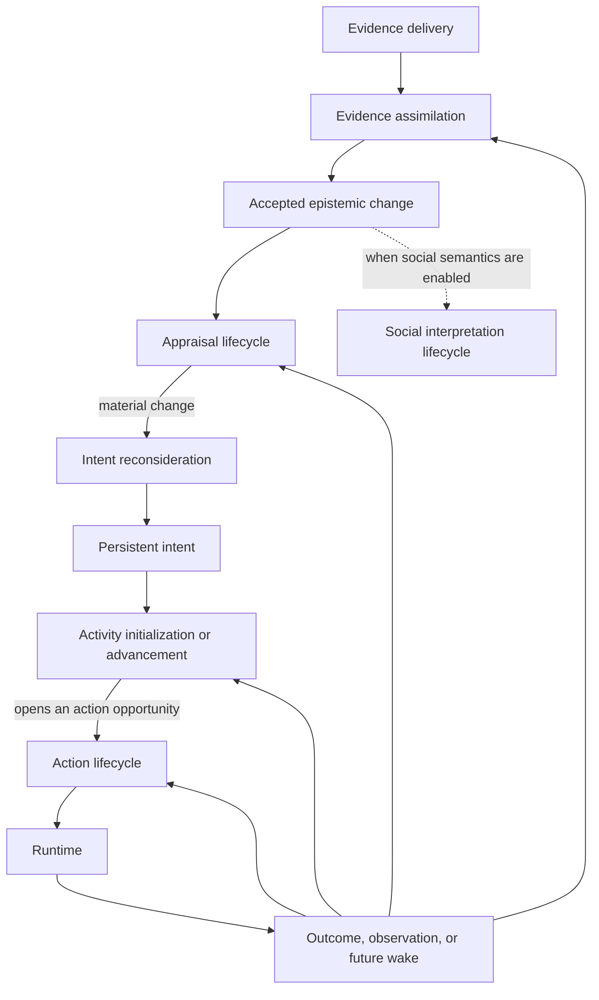

# Cognition and Agency Lifecycle Architecture

## Purpose

This document defines how actor-relative context, appraisal, intent, activity,
planning, concrete action choice, and runtime execution relate without becoming
one universal cognition pipeline.

The central distinction is:

```text
Intent owns why the actor remains committed.
Activity owns how that commitment is currently pursued.
Action selection chooses only the next concrete attempt.
Process owns authoritative time-bearing execution in the world.
Runtime owns what actually happens.
```

Appraisal is an incremental interpretation of the actor's situation. It may
influence several lifecycles, but it is not a mandatory prefix to every action.

## Vocabulary and persistence

### Evidence and belief

`EvidenceDelivery` is a transient actor-addressed observation, message,
inference support, correction, or retraction presented to the epistemic
lifecycle. Its identity, source, time, and provenance are actor-safe semantic
values. Exact authority-record/event references, delivery deduplication key,
and freshness binding remain in the private invocation envelope.

`EvidenceRecord` is the accepted epistemic provenance retained after
assimilation. It records source, observation time, acceptance time, delivery
identity, and derivation at the actor's permitted semantic boundary. The
accepted transition and authority history may retain separate exact
engine-private causal links.

`Belief` is an accepted actor-relative claim supported by evidence records. It
may be false, uncertain, outdated, or contradicted. It is never silently
replaced by world truth.

Evidence records and beliefs are persistent epistemic state. A delivery and the
decision working frame assembled from accepted state are transient.

### Social truth classes

Social semantics do not reuse `Belief` as a catch-all:

```text
Belief
  one actor's evidence-supported proposition
  owned by the epistemic gate

ActorSocialInterpretation
  one actor's accepted social meaning for an event or relation
  owned by the social gate and scoped to that actor

IntersubjectiveClaim
  a recorded assertion, declaration, promise, or commitment among parties
  owned by the social gate; its proposition is not thereby true

InstitutionalFact
  a status accepted under installed constitutive rules in one jurisdiction
  owned by the social gate; it is not physical truth or universal knowledge
```

Several actors may accept incompatible social interpretations of the same
event. A claim may support a belief or interpretation, but does not bypass
evidence assimilation. It becomes an institutional fact only through a
separate rule-checked social transition. Physical possession remains domain
state; recognized title, entitlement, permission, and obligation are social or
institutional state.

### Appraisal

`Appraisal` is a derived assessment of how an interpreted situation relates to
the actor's concerns. A small initial vocabulary is sufficient:

```text
relevance
valence
urgency
controllability
uncertainty
attribution
```

An `AppraisalResult` is not world truth and does not itself propose changes to
other state partitions. Intent and optional social policies consume its
signals. When its fingerprint or exact payload must affect later scheduling or
choice, it is retained in a typed serializable lifecycle continuation.

### Desired condition and intent

An unadopted possible desired condition exists as a grounded intent candidate;
there is no separate persistent `Goal` object in the initial architecture.

An `Intent` is an accepted commitment to pursue a desired condition under an
explicit commitment policy:

```text
Intent
  id
  actor
  desired condition
  source
  importance
  success condition
  failure or impossibility condition
  interruption policy
  reconsideration policy
  status
  adoption provenance
```

The minimum statuses are:

```text
Active
Suspended
Achieved
Abandoned
Failed
```

Intent is persistent agency state. It is not regenerated for every action.

Agency state may contain several active or suspended intentions. The
architecture does not encode a global one-intent limit. A simple baseline may
choose one focal intent, while a richer policy may maintain an intent
portfolio and explicit attention or resource conflicts.

### Activity

An `Activity` is the accepted execution method currently used to pursue an
intent:

```text
Activity
  id
  actor
  intent
  controller identity
  controller-state schema and version
  activity version
  controller state
  monitors
  status
```

The engine standardizes lifecycle metadata and directives, not a universal plan
representation. An HTN network, GOAP plan, behavior tree state, scripted
method, or learned controller state remains implementation-owned behind a
versioned activity controller.

Several activities may exist when a policy supports background or concurrent
commitments. The baseline may permit one foreground activity per actor.
Scheduler targets, attention/resource claims, and runtime conflict checks keep
this a policy choice rather than an assumption embedded in shared types.

The minimum activity statuses are:

```text
Active
Waiting
Suspended
Completed
Failed
Cancelled
```

An activity transition uses optimistic versioning. When an owning intent
becomes terminal, the same agency transaction must complete, fail, or cancel
every dependent activity; orphaned or detached live activities are invalid.

Scheduler state owns wakes. Runtime-control records own shared attempt and
fallback budgets. A process owns physical progress. Controller-specific method
progress or a current subtask may exist inside versioned controller state, but
the shared activity record does not duplicate those other authorities.

### Action

An `Action` is one immediate attempted interaction. An action definition
describes roles, bindings, requirements, cost/time semantics, effects, event
contract, and permissions.

An action decision selects one already grounded candidate. It does not invent
definitions or enumerate unrestricted bindings.

### Process

A `ProcessInstance` is an authoritative, time-bearing world mechanism such as
travel, crafting, recovery, or a staged interaction.

An activity may choose an actor action that starts or controls a process and
may register an engine-owned subscription for protocol linkage. The process's
existence, progress, reservations, and result belong to runtime control state.
Any process meaning visible to its controller is produced by the process or
action's declared observation contract and accepted as actor-relative evidence.

The only initial cross-lifetime relations are:

```text
origin:
  ProcessInstance -> AttemptRecord

awaits or subscribes:
  Activity <-> ProcessInstance
```

Origin is causal provenance, not ownership. Ending an activity never
implicitly ends a process. Process control requires an accepted grounded action
or an internal runtime rule.

Activity and process must remain distinct:

```text
activity:
  the actor's persistent method of pursuing an intention

process:
  the world's accepted execution of time-bearing mechanics
```

## Actor-relative context

### Immutable lifecycle inputs

There is no single mutable context blackboard. The context layer produces
immutable inputs tailored to each lifecycle:

```text
AppraisalContext
IntentContext
ActivityContext
ActionContextPayload
```

For each concrete port, the trusted coordinator constructs two conceptual
layers:

```text
InvocationEnvelopeK
  exact authority head and world revision
  exact SimMoment and raw trigger provenance
  LifecycleReadWitnessK and dependency stamps, when retained or deferred
  expected accepted-state versions
  private candidate-resolution table, where relevant
  private build diagnostics
  policy payload: PolicyPayloadK

PolicyPayloadK
  actor
  projection-safe semantic cause
  permitted clock/time projection, if any
  typed actor-relative projections
  projection availability
  permitted current semantic/controller state, where relevant
  actor-safe evidence/provenance/diagnostics
  ActorInputFingerprint over the canonical visible payload body with this
    fingerprint field omitted
```

These are not a universal pair of Rust structs. Each port has concrete private
envelope and payload types. The evaluator receives only `PolicyPayloadK`; the
coordinator retains the envelope, pairs it with the result, and uses it for
freshness, candidate resolution, and commit validation. A deferred invocation
checkpoints both layers but serializes only the policy payload to the external
evaluator.

An inline evaluation that finishes within one reserved prepared step is
stack-local and needs no dependency witness. It remains bound to that prepared
snapshot and to the expected accepted-state versions checked at completion.
Positive dependency witnesses, retention, rebind, and discard enter only when
an evaluation result can survive its prepared step. M3's synchronous action
path is the first stack-local example; M4's deferred action evaluation is the
first retained example with context-owned `ActionReadWitness`. Runtime's
`PreparationReadEvidence` is separate same-step transaction evidence and never
occupies this lifecycle-envelope field.

Global revision, raw `SimMoment`, `ActionReadWitness`, dependency versions,
authority-record/trigger IDs, and private diagnostics are not policy inputs.
If an actor may know time or provenance, that information appears through an
explicit actor-relative projection. An evaluator cannot query the
authoritative model after receiving the request. If a statically declared
required projection is missing, the port returns its own closed no-change,
unavailable, or error outcome as defined by that contract; the
reaction/coordinator protocol may later build a new request. Dynamic
information-query capabilities are deferred until a real scenario defines
their authorization, budget, and no-leakage contract.

Actor-facing semantic IDs—candidate, opportunity, evidence, monitor, and safe
cause IDs—derive only from actor-visible namespace, content, or sequence. They
are never aliases for an `AuthorityRecord`, `AttemptRecord`, `CommitRecord`, or
another hash that commits hidden state.

When grounding creates candidates, the coordinator also retains a private
resolution table:

```text
CandidateResolutionEntry
  actor-safe candidate ID
  durable DefinitionKey and canonical execution references
  exact lowering bindings using durable entity/role references
  source authority head and LifecycleReadWitnessK, when retained across revisions
  expected versions and validation metadata, when retained
```

The policy sees only the actor-safe candidate view. The trusted lowerer uses
the table to recover execution data after selection and resolves any
activation-local intern IDs or implementation pointers at that point. Such
process-local handles never enter a checkpointed envelope.

Candidate-set fingerprints hash the canonical set body with their own
fingerprint field omitted. The completed candidate set may then participate in
the enclosing actor-input fingerprint, whose own field is likewise omitted
from its preimage. Candidate IDs never depend on either enclosing fingerprint;
there is no identity cycle. Both fingerprints cover only policy-visible
semantic material, while a separate private validation digest may cover the
envelope. A hidden-only change may invalidate a private reuse proof, rebuild
projection locally, refresh the resolution table, or rebind an existing result
to a new private envelope. If the rebuilt policy payload is byte-identical, it
must not create another logical policy invocation or dispatch. Consequently,
hidden-only changes cannot alter the bytes, IDs, ordering, fingerprints, or
invocation count presented to the actor or evaluator.

### Projection availability

A projector backed only by total checked inputs may return its complete value
directly. When a genuine partial provider exists, its result reports whether
the projection was actually produced:

```text
Projection<T>
  status:
    Complete
    Unavailable
  value
  provenance
  diagnostics
```

Rules:

- `Complete(empty)` is a valid statement that nothing matching was found.
- `Unavailable` is not an empty value and never satisfies a required input.
- a required projection failure produces an explicit incomplete-context
  outcome, not a partially populated evaluator input presented as complete;
- actor-visible provenance and diagnostics satisfy the same knowledge
  boundary as values;
- the private decision trace may retain full build statuses and diagnostics,
  not only successful reads.

A projection that later needs reduced detail defines a projection-specific
bounded type with explicit omission semantics. There is no universal `Shallow`
status. The complete-versus-unavailable representation is introduced with its
first real partial provider, not assigned to M4 without one.

### Partial observability

The context layer may use authoritative state to construct safe projections,
but it must not leak hidden truth through:

- candidate presence or absence;
- requirement diagnostics;
- score features;
- target enumeration;
- timing estimates;
- error details;
- global revision, microstep, dependency versions, raw cause IDs, or wake
  control flow.

Actor-facing feasibility is therefore different from runtime legality:

```text
PerceivedAvailability
  actor-relative estimate from evidence and known capabilities

AuthoritativeValidity
  runtime check against current accepted state
```

An actor may reasonably select an action that later fails because its belief
was wrong or the world changed.

### Stage-checked conditions

Conditions are compiled for one authority stage:

```text
DiscoveryCondition
  actor-relative candidate and opportunity discovery

RuntimeRequirement
  authoritative action/process legality

ObservationCondition
  visibility and evidence production

AgencyMonitor
  actor-relative accepted evidence or agency-state reconsideration

SchedulerCondition
  declared virtual deadline or profile-fixed neutral control wake
```

They may share private expression infrastructure, but a condition compiled for
one stage cannot execute in another. In particular, a runtime-only fact cannot
omit an actor-visible candidate or silently mark an intent achieved.

## Lifecycle scheduling

Lifecycles are event-driven and independently budgeted. Their semantic and
execution algebras are separate:

```text
evaluateK(PolicyPayloadK) -> Result<DecisionK, ErrorK>

ExecutionK :=
  InlineDeterministic
  | DeferredCaptured
```

Every port retains its own concrete request, decision, persistent-state
proposal, and failure types. A modeled no-change result belongs inside that
port's `DecisionK`; deferral belongs to the installed execution binding and
runtime control, never to the semantic result.



The scheduler emits typed triggers. The engine's `PostCommitRouter`
deterministically proposes coalescing, cancellation, and later lifecycle wakes;
runtime commits their generations and budgets. The coordinator merely executes
the resulting accepted work and keeps no outcome-affecting private state.

### Evidence assimilation

Evidence assimilation is an authority-controlled lifecycle port, not an
unrestricted reasoning pipeline.

Inputs may include:

- observations derived from committed events;
- messages or testimony;
- action and process outcomes;
- memory retrievals;
- corrections and retractions.

A deterministic baseline implements:

```text
EvidenceAssimilator
  EvidenceAssimilationRequest
    actor
    EvidenceDelivery
    current actor-relative epistemic view
  -> Result<EpistemicTransitionProposal, EvidenceAssimilationError>

EpistemicTransitionProposal
  delivery disposition
  EvidenceRecord delta
  Belief delta
```

The coordinator reattaches the envelope's expected epistemic version and exact
delivery binding. The epistemic gate checks actor scope, provenance, expected
version, legal evidence/belief transition, delivery idempotency, and resulting
wake proposals. Alternative belief-revision implementations use the same
bounded contract.

One accepted epistemic transition creates dependency-targeted appraisal and,
where configured, social triggers. Raw delivery does not separately wake
appraisal unless a future domain explicitly defines a two-stage semantics. No
commit handler recursively executes the complete cognition stack.

### Appraisal lifecycle

Appraisal runs when a relevant dependency changes:

- evidence or belief is inserted, revised, or retracted;
- active intent or activity changes;
- an expected consequence or monitored condition changes;
- a deadline is reached;
- accepted actor-relative evidence represents relevant process progress or an
  outcome.

The stable port is:

```text
AppraisalEvaluator
  AppraisalRequest
    actor
    AppraisalContext
    previous appraisal fingerprint, if any
    evaluation budget
  -> Result<AppraisalResult, AppraisalEvaluationError>
```

The result is deliberately narrow:

```text
AppraisalResult
  typed appraisal signals
  material fingerprint
  evaluator provenance
```

When the result affects later behavior, its exact payload and previous
fingerprint live in a typed lifecycle continuation. Only materially changed
signals wake intent reconsideration or optional social interpretation.
Source-head and, when retained, projector-owned `LifecycleReadWitnessK`
provenance remain paired in the engine-private invocation envelope rather than
becoming appraisal content.
Inferred beliefs re-enter evidence assimilation as provenance-bearing
deliveries; they do not bypass the epistemic lifecycle. Evaluator trace data
belongs to the trace envelope rather than the semantic result.

There is initially one appraisal contract, not separate reactive, tactical,
social, deliberative, and emotional pipeline frameworks. Richer internal
representations remain evaluator-owned.

### Social interpretation lifecycle

Social meaning is distinct from both physical effects and general appraisal.
The lifecycle is installed only for domains and actor profiles with social
semantics:

```text
SocialInterpretationEvaluator
  SocialInterpretationRequest
    actor-relative social context
    accepted social evidence references
    AppraisalResult, if relevant
  -> Result<ActorSocialInterpretationProposal, SocialInterpretationError>
```

The coordinator binds the proposal to the private envelope's expected social
version. The social gate validates subject scope, provenance, installed social
vocabulary, expected version, and legal transition. Different actors may
accept different interpretations of the same committed event.

This evaluator can change only `ActorSocialInterpretation` values for the
request actor. `IntersubjectiveClaim` values enter through typed social acts
that prove who asserted, declared, promised, or committed what. An
`InstitutionalFact` requires an installed constitutive rule, jurisdiction, and
acceptance evidence. Those transitions use the same social gate but separate
proposal variants; neither can be minted by an interpretation evaluator.

A deterministic baseline is required when the capability is enabled. Minimal
actors and domains without social semantics use the explicit disabled binding
and have no social wakes. Rich social reasoning may later replace it without
changing runtime or appraisal authority.

### Intent reconsideration lifecycle

Intent reconsideration runs when:

- no valid active intent exists;
- a current intent succeeds or becomes impossible;
- supporting belief is retracted;
- an activity fails beyond its recovery budget;
- a material interrupt proposal crosses policy threshold;
- a deadline or scheduled reconsideration point is reached.

It does not run for every action.

Context projection grounds available intent templates before policy choice:

```text
GroundedIntentCandidate
  candidate id
  intent template key
  complete actor-relative bindings
  support and appraisal references
  allowed commitment-policy references
  success/failure/interruption monitor references

GroundedIntentCandidateSet
  deterministic fingerprint
  generation policy and budget
  Complete | BudgetLimited coverage
  candidates
```

```text
IntentPolicy
  IntentReconsiderationRequest
    IntentContext
    relevant intent portfolio and focal intent
    GroundedIntentCandidateSet
    relevant AppraisalResult
    trigger reason
    policy budget
  -> Result<IntentOutcome, IntentPolicyError>
```

Minimum outcomes:

```text
Continue(intent_id)
Adopt(candidate_id)
Replace(intent_id, candidate_id)
Suspend(intent_id)
Resume(intent_id)
Abandon(intent_id)
MarkAchieved(intent_id)
MarkFailed(intent_id)
```

The policy cannot invent a desired-condition predicate, template binding, or commitment
policy. The agency gate resolves the selected candidate, validates template
identity, bindings, monitor stages, allowed policy references, and current
versions, then persists the accepted intent transition.

A port-specific `NoChange` outcome means that the policy proposes no accepted
intent transition. It is a modeled result rather than an execution failure.
The coordinator consumes the reconsideration trigger and applies the profile's
bounded retry, wait, or no-change rule.

The initial contract applies one focal intent transition per invocation.
Richer portfolio arbitration may internally propose a bounded atomic transition
set later without changing action or runtime authority.

Commitment policies need hysteresis or an interrupt threshold so small score
changes do not cause intent thrashing. An urgent reaction may preempt an
activity without abandoning its intent.

### Activity controller lifecycle

One port owns both creation and advancement:

```text
ActivityController
  initialize(ActivityInitRequest)
    -> Result<ActivityInitOutcome, ActivityControllerError>

  advance(ActivityAdvanceRequest)
    -> Result<ActivityAdvanceOutcome, ActivityControllerError>
```

An accepted intent adoption or replacement schedules `ActivityInitNeeded`.
Initialization selects the installed controller identity and proposes its
initial versioned state:

```text
ActivityInitOutcome
  initial controller state
  monitors
  initial lifecycle status
  initial directive
  next-wake proposal
```

The private invocation envelope binds the source intent, expected agency
version, controller identity, and state schema. The agency gate atomically
creates the activity, establishes baseline focus when applicable, and
validates the initial directive and wake. This closes the transition from an
accepted intent to its first action or wait.

Every initialization decision and error is closed explicitly. A future
captured execution binding would create a typed pending invocation before
dispatch; an inline error consumes the current initialization trigger and
records the profile's bounded retry, intent suspension/failure, or fallback.
Neither path can leave an active intent dependent on an uncheckpointed
coordinator retry.

The activity controller advances on:

- a neutral actor-safe attempt-resolution wake and any separately accepted
  evidence;
- monitored evidence or state condition;
- scheduled timeout or wake;
- interruption or resumption;
- local method failure.

`ActivityAdvanceRequest` never contains an authority-record, attempt, commit,
or process reference; an authoritative acceptance/rejection class; raw
retryability; or a global revision merely because runtime knows it. Nor does it
receive a raw `Progress`/`Completed` process-cause variant. The trusted engine
may maintain activity/process linkage and other protocol bookkeeping, but
controller-visible causes and context remain actor-relative. A direct monitor
trigger is legal only when its stable `MonitorId`, emission predicate, cadence,
and generation derive from a predeclared actor-visible activity monitor.

The minimal accepted result is:

```text
ActivityAdvanceOutcome
  next controller state
  lifecycle transition
  directive
  next-wake proposal

ActivityDirective
  OpenActionOpportunity(ActionScope)
  Await(AgencyMonitor | SchedulerCondition)
  Complete
  Fail
  Suspend
  Continue
```

Planning, search, behavior-tree execution, scripted sequencing, and learned
method state are internal controller strategies. A controller may retain a plan
inside its versioned state, but it never emits an unchecked runtime request or
assumes a planned concrete step remains valid. Every step is grounded against
fresh actor-relative context and revalidated by runtime.

The coordinator binds this semantic result to the private envelope's activity
ID, expected activity version, controller identity, and state schema. The
agency gate atomically validates that binding, the legal status transition,
owning-intent consistency, typed opportunity opening, and the typed wake
proposal.

Initialization's accepted initial directive is the first controller step; it
does not automatically schedule a second `advance`. A `Continue` directive
must carry an explicit typed next wake. A future captured activity execution
binding would atomically consume the current trigger and persist a typed
continuation; captured completion would schedule a later
`ActivityAdvanceNeeded`. An inline error consumes the trigger and applies a
declared bounded retry, wait, suspension, failure, or fallback rule. No error
leaves an implicit coordinator retry.

Actor-initiated process start, pause, resume, or interruption is initially
modeled as a grounded action whose trusted runtime semantics manipulates a
process. The controller cannot construct a direct process command. Internal
process progress and completion remain runtime scheduler work.

The core does not initially choose HTN, GOAP, behavior trees, or another
universal planning representation:

- HTN, GOAP, a behavior tree, or a script may implement
  `ActivityController`;
- simple actors may use only rules;
- each implementation owns and versions its internal state.

A separately substitutable planner port is introduced only after a concrete
implementation has an independent producer, consumer, failure model, and
validation scenario.

### Foreground action opportunity

Several intents or activities may exist, but the baseline exposes one
foreground action opportunity per actor at a time. Agency/focus policy owns
preemption and chooses which activity or actor-level reaction sponsors it.

```text
ActionSponsor
  Activity {
    activity id
    expected activity version
  }
  ActorReaction {
    causal reason
  }

ActionOpportunity
  ActionOpportunityId
  actor
  authoritative ActionSponsor
  actor-safe sponsor and semantic-cause projection
  semantic urgency
  allowed action scope
  source agency version
  state:
    Open
    WaitingForEvaluation(invocation id)
    Consumed(terminal disposition)
  predecessor opportunity, if this is a retry
```

`OpenActionOpportunity` is a proposal to create this accepted control record.
`ActorReadyForAction` is only a scheduler trigger referencing the open record;
it is not another representation of readiness.

`ActionOpportunityId` derives from the actor, an actor-safe sponsor namespace,
and a visibility-stable opportunity generation—not from the publishing
authority record or private source version. The action policy receives only:

```text
ActionOpportunityView
  ActionOpportunityId
  actor-safe sponsor summary
  projection-safe semantic trigger and urgency
  allowed action scope
  actor-safe predecessor opportunity, if any
```

The source agency version, raw causal link, internal invocation ID, and control
state remain in the private invocation envelope. The policy cannot distinguish
otherwise identical opportunities through control metadata.

The opportunity ID and sponsor travel through action context, candidate IDs,
controller outcome, command provenance, attempt record, and the engine-private
attempt resolution. This lets the coordinator close the correct opportunity
and emit a neutral wake for the correct sponsor without exposing the
authoritative resolution to a replaceable controller.

A selection or no-applicable-action decision consumes the opportunity exactly
once. An inline policy error closes the attempted moment through the engine's
declared failure path; it is not another action choice. Waiting, suspension,
and reconsideration are activity or intent directives rather than additional
immediate action decisions.

Deferred execution is selected by the installed execution class, not returned
by the policy. Beginning it changes `Open` to `WaitingForEvaluation`.
Captured completion returns it to `Open` before a decision or terminal
fallback is applied. Cancellation, timeout, or exhausted fallback uses the
same ordered `Waiting -> Open -> Consumed` chain; there is no direct waiting
to consumed edge. A visible-input change instead uses
`Waiting(old) -> Open -> Waiting(successor)`. A bounded activity retry creates
a causally linked successor opportunity with a new ID rather than reviving a
consumed one. `Consumed` is a logical terminal state recorded in authority
history; the live opportunity index may remove or tombstone it after
publication.

### Concrete action lifecycle

The action lifecycle runs when `ActorReadyForAction` references an accepted
open opportunity.

```text
build ActionContextPayload
  -> generate grounded candidates
  -> evaluate candidates
  -> select candidate ID
  -> trusted request lowering
  -> runtime attempt
```

The stable policy port is:

```text
ActionPolicy
  ActionContextPayload
    ActionOpportunityView
    GroundedActionCandidateSet
    relevant actor-safe lifecycle summaries
  -> Result<ActionDecision, ActionPolicyError>
```

The complete action decision remains:

```text
Select(candidate_id)
NoApplicableAction
```

`NoApplicableAction` and an empty candidate set are valid modeled outcomes, not
runner failures. Profiles declare whether the policy sees an empty set or the
coordinator emits the standard outcome directly; that choice is fixed in the
execution configuration.

The action execution binding separately selects `InlineDeterministic` or
`DeferredCaptured`. Both produce the same `ActionDecision`; only the latter
uses the nonterminal waiting protocol and captured result ingress. After the
neutral opportunity wake, the sponsoring activity may propose a typed wait,
retry, suspension, or intent reconsideration through its own lifecycle. If
waiting is itself observable, costly, interruptible, or effectful in a domain,
that domain models a real wait/rest/idle action or process.

## Grounded action candidates

### Ownership

Candidate generation belongs to context projection because it joins:

- immutable action definitions;
- actor-known capabilities;
- actor-visible entities and relations;
- role and binding rules;
- actor-visible requirement evidence;
- current affordances;
- active intent and activity constraints.

It returns only fully bound candidates:

```text
GroundedActionCandidate
  stable candidate id
  action opportunity id
  action definition key
  complete role bindings
  perceived availability
  decision meaning view
  actor-relative expected consequence, cost, and duration hints
  supporting evidence
```

The action policy cannot add bindings, change the action definition, or select
an ID absent from its input. M3's baseline simply selects the first canonical
candidate. Later policies may score or explain candidates behind the same
ID-only boundary.

Candidate generation is internally free to use compiled queries, indexes,
staged binding, pruning, or a future domain-specific language. Its cross-layer
result is bounded and explicit:

```text
GroundedActionCandidateSet
  action opportunity id
  generation policy and version
  generation budget
  coverage:
    Complete
    BudgetLimited
  candidates
  safe rejection or omission summary
  canonical candidate-set fingerprint
```

`BudgetLimited` is not silently presented as an exhaustive action universe.
Research comparisons record the exact candidate set, coverage, and generator
identity. A later paged or iterative candidate protocol can remain internal to
the action subsystem until a real policy requires it.

Candidate identity and order are canonical functions of:

```text
ActionOpportunityId
action definition key
canonical actor-safe role bindings
generator policy version
```

Identity never depends on the candidate-set or actor-input fingerprint.
Canonical order uses declared actor-visible semantic sort keys and finally the
candidate ID; it never depends on allocation, hash iteration, discovery order,
or hidden validation metadata. Grounded intent candidate IDs analogously use a
visibility-stable reconsideration generation, template key, actor-safe
bindings, and generator version rather than an enclosing fingerprint.

Runtime independently validates binding shape, permissions, requirements,
resources, and current state.

Player, script, and automated controllers may all consume the same bounded
candidate set. `ActionPolicy` is the automated controller implementation; a
player-facing adapter submits the same candidate-ID outcome bound to the exact
actor-input fingerprint or actor-safe invocation token. Controller origin is
retained for permission, provenance, and replay, but does not change runtime
legality.

### Minimal initial decision semantics

The first shared action-policy semantics remain the canonical candidate order
and the two ready decisions:

```text
Select(first canonical applicable candidate)
NoApplicableAction
```

Canonical ordering is already a deterministic execution contract and is
sufficient for the rule baseline. A later policy may use semantic tags,
fixed-point scoring, a learned ranker, or a richer action DSL internally
without changing candidate identity, the ID-only decision boundary, private
lowering, or runtime authority. No shared score representation is introduced
before such a policy has a real producer and consumer.

## Runtime outcome and bounded recovery

The request lowerer is trusted engine code. It resolves the selected actor-safe
candidate through the engine-private candidate table, checks the visible
fingerprint and exact lowering bindings, and creates a concrete
`CommandEnvelope`. A retained M4+ invocation also checks its
`ActionReadWitness`,
source head, and expected versions. Synchronous M3 instead relies on the exact
prepared-step reservation and runtime's current authoritative validation.

Runtime produces an engine-private resolution:

```text
AuthoritativeAttemptResolution :=
  Accepted
    attempt record reference
    commit reference
    domain outcome references
    process reference, if started

  | Rejected
    attempt record reference
    stable reason class
    modeled observable-reaction reference, if any
    retryability
    current revision
```

This value is available only to the runtime kernel, authority history, and
trusted coordinator protocol. It is not an `ActivityAdvanceRequest`,
`ActionPolicy` input, or `ActorViewK`. For every submitted opportunity with a
live actor-visible sponsor, the resolving authority record atomically schedules
exactly one neutral actor-facing cause at the profile-fixed next microstep:

```text
AttemptResolved
  ActionOpportunityId
```

Its visible identity derives only from the already-known opportunity and a
fixed purpose, not from the authority-record hash or outcome. Wake presence,
effective moment, generation, and visible cause are identical for accepted and
rejected resolutions under the same actor-visible sponsor state. Later
cancellation or no-op consumption may depend only on actor-visible sponsor
version/generation state.

Rejection is not automatically a public world event and never directly
installs actor knowledge. A domain that makes an attempt, success, failure, or
process progress observable declares that observation contract; its nonempty
reaction envelope is projected into a later `EvidenceDelivery`.

The original opportunity has already been consumed when an attempt is
submitted. After the neutral wake, actor-facing recovery may use only
profile-fixed lifecycle-control budgets and fresh actor-relative input to
propose:

1. project fresh context;
2. open a causally linked successor opportunity within a configured attempt
   budget;
3. wake the sponsoring activity or intent lifecycle;
4. commit a wait, fallback, pause, or abstention disposition.

Runtime commits every outcome-affecting budget decrement and wake. The
coordinator may not spin indefinitely or retain its own same-moment retry
counter. Engine-private retryability may govern transparent protocol retry or
idempotent resubmission, but it cannot decide whether an actor-facing successor
opportunity appears; successor presence is itself actor-visible information.

## Optional learned, LLM, and research evaluators

Optional evaluators implement one lifecycle port at a time:

```text
RuleActionPolicy
LearnedActionPolicy
LlmActionPolicy
OracleActionPolicy
```

They receive the same bounded actor-relative input and produce the same closed
per-port semantic result:

```text
ActionDecision :=
  Select(candidate id, exact input fingerprint)
  | NoApplicableAction(exact input fingerprint)
```

They may interpret supplied evidence, rank candidate IDs, choose an allowed
activity method, or return only an abstention variant explicitly defined by
that particular port. `ActionPolicy` has no abstention result:
`NoApplicableAction` is its successful semantic answer, while missing
projection is engine-private execution control rather than a policy decision.

They may not:

- read the authoritative world directly;
- invent definitions or entity bindings;
- construct an unchecked command;
- mutate belief, social, agency, or domain state;
- bypass a trusted legalizer;
- hide fallback behavior.

The engine-private invocation/result record retains implementation and model
identity, source revision, interface version, parameters, captured response,
and status. Those fields do not become policy payload merely because the
evaluator is external.
Pending invocation identity, exact request, admission policy, cancellation,
captured result, retry state, and fallback state are accepted
lifecycle-control state and survive checkpoints. The runtime protocol is:

```text
DispatchPending
  -> ResultCaptured
     -> Terminal(Applied { freshness } | Reinvoked { successor })
     -> FallbackPending(cause)
  -> FallbackPending(cause)

FallbackPending(cause)
  -> Terminal(Failed { cause })
```

Choosing `DeferredCaptured` is an execution binding, not a policy response.
Runtime first commits the exact request as `DispatchPending`; only then may an
at-least-once host adapter perform I/O.
Send-attempt status is operational rather than a second authoritative
`Dispatched` state. The continuation occurs at a later microstep and cannot
retroactively participate in the moment that requested it.

M4 implements this authoritative invocation, capture, freshness, cancellation,
and fallback protocol without requiring a network service. M5 proves that
checkpoint restoration and replay reuse captured results without invoking an
evaluator. M6 supplies authenticated CLI/MCP/player/AI transport adapters and
product inspection over already committed projection-safe requests.

`Reinvoked` means a new logical evaluation after the projection-safe policy
payload changed, the evaluator semantic/configuration binding changed
explicitly on a child branch or epoch, or another actor-visible configured
cause requested a new evaluation. A transport retry reuses the same invocation
and idempotency key. A hidden-only witness or legality change may refresh the
private envelope and revalidate an existing safe selection, but it never
creates another logical policy invocation.

The initial `FrontierBlocking` mode stores the creating record's resulting
frontier as `blocked_at_frontier` and forbids later transitions from advancing
beyond it until `Admit` captures a result or `Manage` records cancellation,
timeout, failure, or disposal. Any declared fallback is a later typed
lifecycle invocation scheduled by that recorded disposition. `HostScheduled`
permits the world to advance and supplies an explicit effective moment.
Actor-local virtual clocks are not part of the initial architecture.

Asynchronous completion order never determines simulation order. When a
policy-input dependency changes, trusted projection rebuilds the payload. A
byte-identical payload reuses or privately rebinds the existing logical result
without another evaluator call; a changed payload permits an explicitly
recorded discard and new invocation. A changed execution-validation dependency
causes only selected-ID resolution and runtime legality revalidation.

Traces retain bounded structured support, evidence references, and output
rationale. The engine mints trace IDs, artifact hashes, causal edges, and
commit links. Evaluator-provided explanations are labeled
`SelfReportedRationale` with implementation provenance; they are not treated as
verified causal support and do not expose private chain-of-thought.

### Persistent evaluator state compatibility

Every port whose implementation owns persistent state declares:

```text
StateCompatibility
  implementation identity
  state schema
  compatible predecessor schemas
  migrate, reset, or reject policy
```

A stateless action-policy swap may start a child branch directly only at a
quiescent boundary for that port. A pending invocation remains bound to its
original implementation, request schema, and artifact closure: it must finish
under the old profile before branching or be explicitly cancelled/discarded by
a child-root reset before a new-profile invocation is created. Its result can
never be reinterpreted under the replacement profile.

Replacing an activity controller, intent policy, evidence assimilator, or
social policy cannot reinterpret existing state: it requires declared
compatibility, an explicit offline migration, an explicit reset recorded in
branch provenance, or a pre-policy scenario root.

## Cognition invariants

1. Every lifecycle invocation envelope binds one immutable authority head and
   raw cause; a retained or deferred invocation additionally binds a positive
   dependency witness. Its policy payload contains only the projection-safe
   semantic input.
2. Unavailable context is never represented as a valid empty input.
3. Appraisal is a narrow derived result, not a cross-partition proposal bus.
4. Intent persists until an explicit accepted lifecycle transition.
5. Activity persists across individual action attempts and owns its local
   recovery state through version-checked agency transitions.
6. Intent adoption has an explicit activity-initialization transition; any
   internal plan remains controller state and does not command runtime.
7. A process is authoritative runtime state, not cognitive activity state.
8. Every selected action refers to a candidate in the exact input set.
9. Candidate generation uses actor-relative information and cannot leak hidden
   truth.
10. Actor-initiated process control is grounded as an action; runtime
    revalidates every resulting action/process operation.
11. Rule-based lower tiers work when rich appraisal, social interpretation,
    planning, learned models, or language models are absent.
12. Fallback, abstention, stale results, and runtime rejection are visible in
    traces.
13. No failure path permits unbounded same-moment reconsideration.
14. A new shared intermediate representation requires a real producer,
    consumer, and validation scenario.
15. Intent adoption selects a grounded template candidate rather than
    evaluator-invented predicates or policies.
16. Outcome-affecting appraisal, invocation, coalescing, retry, and fallback
    state is checkpointed lifecycle-control state.
17. Every wait or wake is a typed proposal committed through runtime.
18. One foreground `ActionOpportunityId` routes an attempt and its outcome to
    one explicit sponsoring activity or actor-level reaction. Every terminal
    resolution consumes it exactly once. A `DeferredCaptured` execution
    binding performs `Open -> WaitingForEvaluation`; completion returns it to
    `Open` before application, reinvocation, or fallback uses the next checked
    edge. An activity-sponsored foreground opportunity names the actor's exact
    focused active activity version and matches the action family, method
    state, scope, and generation already represented by that activity.
19. Behavioral freshness uses engine-private dependency witnesses; a
    whole-world revision is private provenance rather than a policy input or
    the only validity test.
20. Candidate identity, ordering, and bounded selection are deterministic
    execution contracts.
21. `EvidenceDelivery`, accepted `EvidenceRecord`, and accepted `Belief` are
    distinct lifecycle values.
22. Scheduler wakes, process progress, and shared retry budgets are not
    duplicated as generic activity fields.
23. Deferred evaluators commit invocation and dispatch state before I/O and
    resume only at a later microstep.
24. Raw authoritative attempt/process outcomes and outcome-derived opaque IDs
    never enter actor-facing lifecycle inputs; observable meaning arrives
    through projected evidence.
25. Actor-facing wake presence, timing, generation, and cause satisfy the same
    noninterference boundary as payloads. Logical policy-invocation and
    dispatch presence, timing, and generation do as well; raw process
    progress/completion is not a controller cause.
26. Global revision, raw moment and trigger provenance, dependency versions,
    authority-derived IDs, and private diagnostics remain in the invocation
    envelope. Actor-visible IDs and fingerprints are stable under
    actor-indistinguishable hidden-state changes.
27. A private witness invalidation may rebuild or rebind locally, but it
    cannot create a new logical policy invocation unless the projection-safe
    payload or the explicitly selected evaluator semantic binding changes.
