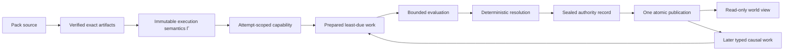

# M1 Exit Review: Architectural Fitness and Simplification

## Status

Complete. This review evaluates the finished M1 implementation against the
target architecture and defines the changes that should precede or accompany
M2. It does not reopen M1's accepted behavior or authorize M2 implementation.

## Executive verdict

M1 is architecturally sound. The nine-crate split, dependency direction,
artifact pipeline, immutable execution closure, private session head, staged
Fire capability, authority-record pipeline, attempt control, and read-only
session facade are all faithful refinements of the target formal model.

The architecture does not need another top-level redesign before M2. The
preserved target waist—which M1 currently exercises with one command and M2
will generalize to a whole moment—is:



There are two narrow gates but only one mutation waist:

1. the artifact and activation gate proves that immutable semantics are exact
   before a session exists;
2. the runtime authority gate is the only path that can replace the session
   head.

The principal M1 debt is not excessive correctness checking. It is that the
deliberately singular vertical slice is represented several times as a
single-command case analysis. Those representations must be replaced before
M2 adds whole-moment batching. Otherwise each new command outcome, transaction
kind, and causal work kind would multiply variants across preparation,
proposal, normalization, sealing, and application.

## Review basis

The review covered:

- the complete nine-crate dependency graph;
- the M1 W1-W5 completion evidence;
- the formal `Γ`, `Σ`, `Ca`, `Admit`, `Fire`, and `Manage` contracts;
- runtime preparation, authority records, sealing, application, scheduling,
  attempt control, reconciliation, and the in-memory repository;
- engine resolution, attempt and session facades, and standard semantics;
- conformance architecture tests and the reference-game pressure test;
- forced Clippy size and complexity diagnostics in addition to the ordinary
  workspace gates.

File length was used only as a navigation signal. A large module is not by
itself an architectural defect; a module is a problem when it combines
independent ownership or causes the same protocol fact to have multiple
owners.

## What is already correct

### Crate boundaries

The workspace should remain nine crates.

```text
world-core
world-defs             -> world-core
world-model            -> world-core, world-defs
world-runtime          -> world-core, world-defs, world-model
world-authoring        -> world-core, world-defs
world-standard         -> world-defs
world-standard-runtime -> world-core, world-defs, world-model,
                          world-runtime, world-standard
world-engine           -> world-core, world-defs, world-model, world-runtime
world-conformance      -> world-authoring, world-engine, world-standard,
                          world-standard-runtime       (development only)
```

| Boundary | Why it is real |
|---|---|
| `world-defs` / `world-authoring` | Runtime-verifiable artifacts do not depend on source syntax or compiler diagnostics. |
| `world-model` / `world-runtime` | Immutable domain values, checked schemas, read models, and typed deltas are not publication authority. |
| `world-standard` / `world-standard-runtime` | Pure standard vocabulary does not statically select one executable implementation. |
| `world-runtime` / `world-engine` | Runtime owns mutation and persistence semantics; engine owns composition and host-facing coordination. |
| `world-conformance` as a leaf | Cross-crate behavior can be tested without creating a production dependency cycle. |

Merging these crates would shorten the graph while weakening ownership. Adding
new crates for storage, transactions, scheduling, or workflows would instead
fragment one still-cohesive runtime kernel. Neither change is justified.

### Architectural waists

The following values are useful proof or capability boundaries and should not
be simplified away:

- `VerifiedPackArtifact`, exact pack selection, and
  `RuntimeDefinitionSet`;
- `ResolvedExecutionClosureManifestV1` and activated runtime semantics;
- private `SessionHead` and public read-only `AuthorityCursor`;
- `RuntimeAttemptDriver` and non-cloneable `PreparedFire`;
- `Draft -> Normalized -> Sealed -> Applied` authority-record stages;
- `RunAttemptControl` with `Active | Reserved | Finalized`;
- `StepPublicationReceipt`, retained disposition evidence, and
  reconciliation;
- `RuntimeSessionReader -> WorldSession -> Inspector`.

Purpose-specific identities and checked constructors are also justified. They
encode distinctions that the compiler can enforce and prevent persistence
identities, semantic identities, attempt identities, and random identities
from being accidentally exchanged.

### Validation balance

The important repeated checks are correctness checks at independent trust
boundaries, not defenses against a hostile caller:

- a semantic implementation decides whether it proposes an operation;
- runtime independently verifies actor binding, source state, authority,
  capacity, and combined invariants against the authoritative base;
- sealing proves record consistency;
- application checks that the sealed record still consumes the exact expected
  scheduler and ledger state;
- reconciliation proves whether a reserved step published exactly one direct
  successor.

These checks protect against stale evaluation, implementation bugs,
interleaving, and interrupted publication. Removing them would merge proposal
and authority. The over-defensive code is instead found in test infrastructure
that parses trusted Cargo manifests as if it were a security parser.

## Priority findings

### P0: change before M2 grows the kernel

#### 1. Move the authority aggregate out of the memory backend

[`persistence/memory.rs`](../../../crates/world-runtime/src/persistence/memory.rs)
currently owns:

- `Mutex` and `BTreeMap` storage;
- aggregate lookup and creation;
- request classification;
- attempt reservation and disposition;
- Fire preparation and completion;
- record sealing and atomic publication;
- receipt retention, reconciliation, and finalization;
- public-error mapping.

The existing private `AttemptAggregate` is the correct aggregate root, but it
is physically nested inside the storage adapter. M2 batching would make the
memory backend the de facto kernel.

Refactor to a functional core and imperative shell:

```text
MemoryRepository
  lock -> locate aggregate -> invoke one aggregate operation -> unlock

AttemptAggregate
  Ca + Σ + history + receipts + dispositions
  pure or owner-private protocol transitions
  exactly one append-and-publish linearization point
```

This is a private module split, not a new public repository trait, storage
crate, or second authority path.

#### 2. Replace the repeated single-command algebra with a batch IR

M1 classifies the same singular command through:

- `PreparedCommand`;
- `CommandProposal`;
- `DraftMomentRecordShape`;
- `NormalizedMomentRecordShape`;
- `MomentRecordShape`.

The stages are correct; the repeated variant matrix is not the M2 model.
[`authority/record.rs`](../../../crates/world-runtime/src/authority/record.rs)
should move to canonical command-group resolutions, attempt records whose
outcomes contain any rejection, accepted commit records, combined deltas, and
reactions with checked local references. Each stage adds evidence to the same
normalized whole-moment structure.

The evaluator boundary should also stop echoing facts already decided by the
runtime ledger. Exact retained outcomes, ID-reuse mismatches, collisions, and
retired IDs remain private inside `PreparedFire`. Only genuinely evaluable
work crosses into the engine, and proposals contain only decisions for those
opaque evaluation-work IDs.

This makes the boundary mean:

```text
runtime facts + evaluable work
  -> engine returns decisions only
  -> runtime combines both into one complete moment
```

#### 3. Give accepted-state transition logic one runtime owner

Containment validity is currently reconstructed in standard evaluation,
runtime sealing, and runtime application. Independent runtime revalidation is
necessary, but three implementations of the same physical invariant are not.

`world-runtime` should own one private pure containment transition or preview
used by both sealing and application:

```text
AcceptedState + typed delta -> checked successor or domain invariant error
```

`world-model` continues to own immutable accepted values, checked constructors,
queries, narrow read views, and typed deltas. It must not expose an `apply_*`
authority-shaped surface. The semantic implementation may apply its policy
requirement through a family-specific immutable view. Runtime must rebind the
command actor, run the private physical/authority transition against the
authoritative base, and recheck the combined accepted batch before sealing.
One implementation of transition logic therefore does not reduce the number
of authority boundaries.

The current `ContainmentTransferInput` also exposes the complete
`WorldSnapshot`. M2 footprint work should replace that broad capability with
the exact immutable containment facts needed by the transfer family. Otherwise
future social, epistemic, and hidden state could become an undeclared semantic
dependency.

#### 4. Replace the hand-written Cargo manifest recognizer

[`workspace_structure.rs`](../../../crates/world-conformance/tests/workspace_structure.rs)
contains a partial TOML recognizer and lexical escape cases. This is the
clearest instance of complexity exceeding the project threat model.

Keep semantic assertions:

- exact workspace members;
- exact direct local dependency graph;
- no optional or feature-selected compatibility edge;
- no patch, replace, or path escape;
- removed source trees and legacy authority symbols stay absent.

Use `cargo metadata --format-version 1` for workspace and resolved dependency
facts. If source-form assertions remain necessary, use a real TOML parser
rather than extending another recognizer. A new test-only dependency remains
an explicit implementation decision.

### P1: simplify as part of M2

#### 5. Make modeled readiness an outcome, not a fault

One broad `RuntimeDriveError` currently carries operation-specific faults and
normal states such as no scheduled work, work not yet due, or routing work
being required. M2 should use operation-specific outcomes and smaller fault
types.

Preparation should distinguish:

```text
ready with one PreparedFire
idle
waiting for a later SimMoment
protocol or integrity fault
```

Post-commit routing becomes ordinary scheduled work in the prepared moment,
not an error that escapes to the engine.

#### 6. Read one coherent session view

Cursor and snapshot are currently fetched under separate repository locks.
Expose one immutable runtime read view captured under one lock and derive
`WorldSession` projections from it. This is a small read model, not a new
authority path.

Attempt opening should similarly create-or-open, reconcile, and return binding
plus status in one repository operation. The driver and engine attempt should
retain one binding source rather than caching the same attempt identity at
multiple layers.

#### 7. Share immutable semantics and the moment base

Resolution objects are already internally shared in important places, but the
resolved closure is still deeply cloned into attempt control and accepted
snapshots are cloned again during preparation/application. M2 should extend
internal sharing specifically across those remaining boundaries and keep one
shared base snapshot per prepared moment.

This is representation sharing only. Canonical equality and identity remain
value-based, and no generic cache or storage abstraction is introduced.

#### 8. Reduce avoidable materialized payload duplication

The canonical encoder already has typed same-record references for captured
inputs and reactions. Duplication remains mainly in materialized in-memory
record/head values and repeated command/attempt fields. A post-commit dispatch
must remain self-contained so it survives source-record compaction.

M2 should generalize the existing local-reference scheme to collection
batches, remove avoidable materialized clones through shared immutable
payloads, and retain exactly the self-contained scheduler payload required for
later execution. This prevents batch size from multiplying accidental copies
without weakening recovery semantics.

#### 9. Narrow lint suppressions

`world-runtime` currently allows `large_enum_variant` and `result_large_err`
for the entire crate. Forced linting shows that record, attempt-phase, and
error values have already grown substantially.

Do not box every domain value mechanically. Make cold or retained evidence
indirect where ownership permits it, shrink internal errors whose detailed
payload is immediately erased, and localize any remaining allowance to the
specific type with a reason.

### P2: bounded cleanup, not milestone architecture

#### 10. Add only tiny canonical writer primitives

Fixed-width digest/identity writes and owned canonical-byte writes are repeated
across runtime modules. Extending the existing `world-core::CanonicalWriter`
with one or two narrow methods can remove this noise while every schema keeps
its explicit field order and version.

Do not introduce a blanket serialization trait or derive-based canonical
encoding. Schema ownership must remain visible.

#### 11. Remove abstractions without a second behavior

`DiagnosticSet` currently wraps exactly one compiler diagnostic. It can be
replaced by `CompilationDiagnostic` until a real multi-diagnostic producer
exists. This is useful cleanup but does not gate the deterministic kernel.

`EngineDistribution` should remain concrete in M2. A family registry or
builder becomes justified only when a second executable semantic family
provides a real producer, consumer, invariant, and test. M2 should avoid both
hard-coding more transfer branches into central moment algebra and inventing a
universal semantic registry in anticipation of later gameplay systems.

#### 12. Split files only along ownership boundaries

Large files worth splitting while their models change are:

- runtime aggregate protocol versus memory locking;
- record schema versus draft/normalization/sealing;
- scheduler key/work values versus scheduler state and planning.

Stable artifact and package files should not be reorganized merely to reduce
line count. Navigation-only churn would make M1 evidence harder to audit
without simplifying the model.

## Design-pattern assessment

| Pattern | M1 use | Verdict |
|---|---|---|
| Compiler passes / proof values | artifact verification, linking, activation, record normalization and sealing | Keep. Each pass removes invalid states and changes the value's meaning. |
| Object capability | attempt driver, prepared Fire, private publication values | Keep. This is the physical authority boundary. |
| Aggregate root / unit of work | attempt control plus session head, record, receipt, and atomic publish | Keep, but move it out of the memory adapter. |
| Functional core / imperative shell | partially present in sealing and application | Complete it around the aggregate and storage lock. |
| Ports and adapters | `ArtifactResolver`, semantic implementation installation, engine facade | Keep only concrete ports with real producers and consumers. |
| Algebraic state machine / typestate | attempt phases, draft-normalized-sealed record stages | Keep. Do not replace with flags. |
| Transactional outbox shape | reaction envelope plus later dispatch | Complete logical consumption in M2; durable outbox storage remains M5. |
| Generic repository, subsystem, effect, or workflow traits | absent | Keep absent until multiple real implementations force a shared abstraction. |

The useful design principle is not to maximize pattern count. It is to make
one concept have one owner and to let types make illegal cross-boundary
operations unrepresentable.

## Preserve, generalize, replace, and defer

| M1 element | M2 treatment |
|---|---|
| Nine-crate graph and dependency direction | Preserve |
| Artifact verification and activation gate | Preserve |
| Private head, cursor, prepared capability, and atomic publication | Preserve |
| Draft/normalized/sealed/applied staging | Preserve |
| Scheduler key and ordered-map basis | Generalize to every item at the least due moment |
| Prepared Fire and reservation receipt | Generalize to bind one complete due set |
| Reaction envelope | Generalize to exactly-once logical routing |
| Singular prepared/proposal/record shapes | Replace with batch-centered checked collections |
| Runtime facts echoed through proposals | Delete |
| Protocol transitions inside `MemoryRepository` | Move to the private aggregate |
| Broad snapshot input to transfer semantics | Replace with a family-specific read view |
| Global lint allowances | Remove or localize |
| Public repository SPI and second backend | Defer |
| Context, cognition, agency, gameplay subsystems, AI, CLI, and MCP | Defer to their owning milestones |
| Checkpoint, archive, compaction, and reliable external outbox | Defer to M5 |

## M2 entry decisions

The review recommends the following plan-level decisions:

1. keep the nine-crate graph unchanged;
2. replace the pre-release singular moment and execution-configuration schemas
   cleanly, update canonical vectors, and provide no compatibility reader;
3. keep one opaque staged Fire API while changing its private payload from one
   command to the complete least-due moment;
4. evaluate serially first and prove order/worker-count independence through
   permutations before adding a worker pool;
5. use a closed private prepared-transaction algebra with only exercised
   variants;
6. use equal-priority resource contention as the first real keyed-randomness
   consumer;
7. keep the storage implementation in memory while making the attempt protocol
   core independent of memory locking;
8. keep pure post-commit routing in the engine and durable trigger ownership
   in runtime;
9. establish only exercised scheduling/control substrate in M2; lifecycle
   record families wait for their M4 producers.
10. reconcile the normative roadmap before M2 activation so scenarios 1, 10,
    and 18 claim only the M2 kernel portions that have real producers and
    consumers.

Changing the canonical schemas and adding a test-only manifest parser
dependency, plus the milestone-allocation reconciliation above, are explicit
decisions to accept before implementation.

## Research anchors

This review uses external work as design pressure, not as architecture to copy:

- The [Rust API Guidelines on type
  safety](https://rust-lang.github.io/api-guidelines/type-safety.html) support
  M1's newtypes and deliberate domain values; the
  [dependability guidance](https://rust-lang.github.io/api-guidelines/dependability.html)
  supports validation at construction and authority boundaries.
- The [Rust future-proofing
  guidance](https://rust-lang.github.io/api-guidelines/future-proofing.html)
  reinforces private representations and opaque public values rather than
  speculative public extension traits.
- FoundationDB's [deterministic simulation
  account](https://apple.github.io/foundationdb/testing.html) demonstrates the
  testing value of a repeatable single-threaded simulation. That supports
  proving scheduler and resolution invariance before introducing physical
  parallelism.
- The [Calvin paper](https://ceres.cs.umd.edu/818/papers/calvin.pdf)
  separates deterministic sequencing from transaction execution and requires
  declared read/write sets. The relevant lesson here is the separation, not
  Calvin's distributed database design.
- *[Out of the Tar
  Pit](https://curtclifton.net/papers/MoseleyMarks06a.pdf)* distinguishes
  essential from accidental complexity and recommends separating necessary
  state and control. That maps directly to extracting the protocol aggregate
  from the memory-locking shell.
- Cargo's official [`cargo metadata`
  documentation](https://doc.rust-lang.org/cargo/commands/cargo-metadata.html)
  defines a versioned machine-readable workspace and dependency view, which is
  a better source for conformance facts than a partial manifest recognizer.

## Conclusion

M1 should close without changing its top-level architecture. The right M2
move is evolutionary at the proven waists and deliberately destructive inside
the singular command representation:

```text
preserve authority
+ normalize whole moments
+ separate protocol from storage
+ make evaluation inputs narrower
+ keep extension algebras closed until used
= a simpler and more extensible deterministic kernel
```
