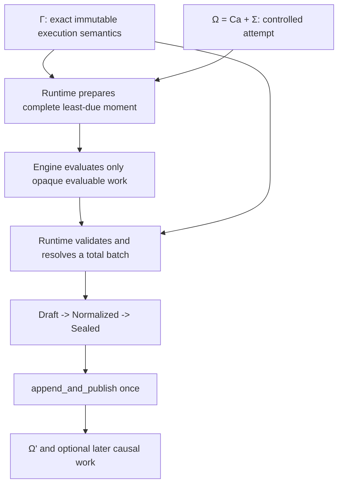

# M2: Complete Deterministic Runtime Protocol

## Status

Complete and exit-reviewed. The implementation, deletion scope, public
conformance matrix, strict verification gates, and
[M2 exit review](milestone-02-exit-review.md) are complete.

## Goal

Generalize M1's single authoritative interaction into the complete
deterministic runtime protocol for:

- external ingress and admission sealing;
- every work item at the least due simulation moment;
- typed preparation and complete command coverage;
- same-moment conflict and combined-invariant resolution;
- one atomic moment publication;
- later causal routing and bounded quiescence;
- typed idempotency, collision, and retirement;
- deterministic management and safety transitions;
- keyed authoritative randomness;
- attempt reservation, receipt, reconciliation, cancellation, termination,
  and unique finalization.

For fixed immutable execution semantics, an authoritative head, and the same
admitted input and management traces, a complete least-due moment must have one
logical result:

```text
complete least-due trigger set
  + one immutable base snapshot
  -> bounded typed evaluation work
  -> canonical prepared transactions and footprints
  -> total deterministic resolution
  -> combined-invariant verification or deterministic refinement
  -> one MomentBatchRecord publication
  -> optional later post-commit work
```

Proposal order, evaluator completion order, collection representation, and
configured worker count cannot change that result.

## Non-goals

M2 does not introduce:

- `world-context`, `world-decision`, actor-relative projections, cognition,
  intent, activity, or agency lifecycles;
- additional gameplay systems beyond the containment-contention pressure test;
- an action/effect DSL or public transaction extension API;
- a second persistence backend or public repository trait;
- checkpoints, archive/import, compaction, artifact retention, portable
  restore, or a durable external-delivery outbox;
- CLI, MCP, AI-agent, experiment, lab, or inspector product expansion;
- actual parallel commit, a worker-pool dependency, or distributed execution;
- a generic subsystem, scheduler-payload, effect-map, repository, or workflow
  framework;
- unused lifecycle records or exogenous-random stream types without a real
  producer and consumer.

M3 grounds actor-visible action and introduces the first reaction-sponsored
action-opportunity producer. M4 introduces the remaining cognition, agency,
and process lifecycle producers. M5 adds durable checkpoint, restore, archive,
compaction, and reliable external delivery. M6 adds product and AI-facing
adapters.

## Normative contracts

- [Formal System Model](../../architecture/target-architecture/formal-model.md)
- [Target Rust Code Architecture](../../architecture/target-architecture/code-architecture.md)
- [Runtime, Persistence, and Scale](../../architecture/target-architecture/runtime-persistence-and-scale.md)
- [Target Architecture Execution Roadmap](../../architecture/target-architecture/implementation-roadmap.md)
- [Validation Scenarios](../../architecture/target-architecture/validation-scenarios.md)
- [M1 exit review](milestone-01-exit-review.md)
- [M2 deterministic-kernel research](../../research/m2-deterministic-kernel-research.md)

The target documents own authority, state partitioning, and dependency
direction. This plan chooses a concrete M2 refinement inside those boundaries.

## Fixed architectural shape

The two M1 gates and the one mutation waist remain:



The public authority seam remains staged in substance. Exact method names may
stay private to the work package:

```text
driver.prepare_next(through)
  -> Idle
   | Waiting
   | Fire(opaque PreparedFire)
   | KernelSafety(opaque PreparedSafetyManage)

engine decides each PreparedFire.work()
  -> WorkDecisions for opaque work IDs only

driver.complete_fire(prepared, proposals)
  -> one Fire publication outcome

driver.complete_kernel_safety(prepared)
  -> one Management publication outcome, with no ordinary-work proposal
```

Exact duplicates, mismatches, collision tombstones, and retired commands are
runtime facts. They do not cross the evaluator boundary merely to be echoed
back.

## M2 formal projection

Let:

```text
Γ  = immutable execution semantics
Ωr = (Ca, Σr)
D  = the complete canonical trigger set at the least due SimMoment
E  = bounded evaluator outputs correlated to exactly the evaluable subset
```

Then an ordinary Fire step is:

```text
prepareΓ(Ωr, through)
  -> Idle
   | Waiting
   | KernelSafety(prepared cause at unchanged cursor)
   | PreparedFire(D, base_r, work)

resolveΓ(base_r, D, E)
  -> ResolvedMoment

publish(Ωr, ResolvedMoment)
  -> Ωr+1
```

The partiality is restricted to preparation readiness or an explicit protocol
fault. A valid `PreparedFire` and proposal set resolve totally and consume
their exact due set: every newly admitted logical command receives one outcome,
and combined-invariant failure has a deterministic rejection-only fallback.
The separately prepared kernel-safety branch consumes no ordinary due trigger
and preserves the exact unresolved set.

Required invariants:

1. `D` contains every and only trigger at the least due moment selected by the
   reserved operation descriptor.
2. Every evaluation reads one immutable base snapshot at revision `r`.
3. Runtime-owned ledger classifications precede same-ID grouping and
   evaluation.
4. Every genuinely new logical command has exactly one nested attempt outcome.
5. Every accepted transaction declares bounded read, write, resource, and
   invariant footprints.
6. Conflict resolution is canonical, terminating, permutation-invariant, and
   independent of persistence IDs and insertion order.
7. The combined accepted successor satisfies every hard invariant.
8. One outer authority record consumes the due set and publishes state,
   control, scheduler, history, receipt, and reactions atomically.
9. A nonempty reaction is scheduled for later routing in the same publication;
   an empty reaction schedules nothing.
10. A Fire at `m` publishes
    `frontier' = max(frontier, next(m))`; no scheduler delta targets the past,
    and neither Fire nor admission-sealing Manage can skip earlier due work or
    an unresolved frontier blocker.
11. Scheduler proposals produced together are sorted by format-independent
    semantic fields before sequence allocation.
12. Reservation reconciliation selects exactly the unpublished base cursor or
    the one receipt-proven direct successor.
13. No attempt-scoped world transition can publish after finalization.

## Core internal model

Names below describe the intended responsibilities. Exact private names may
change while implementing a work package.

### Prepared moment

The opaque public capability remains `PreparedFire`. Its private body becomes
whole-moment data:

```text
PreparedMoment
  expected authority cursor
  attempt step and grant
  least due SimMoment
  resulting AdmissionFrontier
  canonical due scheduler keys and trigger IDs
  due-set fingerprint
  one shared immutable base snapshot
  runtime-owned delivery resolutions
  ordered PreparedWork[]
```

The engine-facing work algebra is closed and concrete:

```text
PreparedWork
  Command(opaque work ID, family-specific immutable input)
  PostCommitDispatch(opaque work ID, self-contained reaction)

WorkDecision
  Command(opaque work ID, command decision)
  PostCommitDispatch(opaque work ID, consumed routing decision)
```

Command work excludes retained, mismatched, colliding, and retired requests.
The M2 post-commit decision has one real behavior: consume the dispatch and
emit no follow-up when no observation/context/lifecycle subsystem is installed.
Later milestones add concrete routed proposal variants with their real
producers and consumers; M2 does not add a test-only generic follow-up type.

The scheduler retains its existing canonical key
`(SimMoment, lane, sequence)` and ordered-map foundation. M2 removes the
one-command-per-moment restriction, selects the entire least-due moment, and
consumes the exact prepared key set. Scheduler sequence remains an ordering
coordinate, never a domain conflict tie-breaker. When one authority
publication creates multiple scheduler entries, runtime sorts them by their
semantic moment, lane, cause, target, generation, and payload identity before
allocating consecutive sequences.

### Prepared transactions and footprints

The transaction algebra is private, closed, and typed:

```text
PreparedTransaction
  shared immutable base handle and base cursor
  base revision and read witness
  transaction kind
  participating gate receipts
  read, write, resource, and invariant footprints
  exact accepted-state delta
  exact runtime-control and scheduler deltas
  domain events and command outcome
  random key/result evidence
  invariant evidence

transaction kind
  ContainmentTransfer(typed transfer delta)
```

M2 does not add a public trait or arbitrary delta list. A new variant is added
only with a real semantic producer, runtime validator/applier, record form, and
conformance test.

The first footprint is concrete:

```text
TransactionFootprint
  containment reads
  containment writes
  exclusive item claims
  container-capacity invariant keys
```

The standard semantic implementation receives a containment-specific
immutable read view, not the complete world snapshot. `world-model` owns that
read value and the typed delta. One runtime-private pure transition function
owns physical validation and successor construction; sealing and application
both invoke it. Runtime independently rebinds and revalidates each proposed
transaction against the authoritative base.

### Resolved and recorded moment

Replace the singular record variants with a normalized graph:

```text
ResolvedMoment
  fired SimMoment
  resulting AdmissionFrontier
  consumed deliveries
  canonical ResolvedWork[]
  conflict-resolution evidence
  exact combined accepted-state delta
  runtime-control delta
  scheduler delta
  optional mode delta
  optional nonempty ReactionEnvelope

ResolvedWork
  Command(CommandGroupResolution)
  PostCommit(consumed dispatch and routing outcome)

CommandGroupResolution
  source and CommandId
  canonical member delivery IDs
  Retired
  RetainedExact {
    original attempt and outcome
    exact-member delivery IDs
    mismatched-member delivery IDs
  }
  RetainedCollision(original group outcome)
  NewExact {
    one request fingerprint
    new attempt local reference
    optional accepted-commit local reference
  }
  NewCollision {
    sorted distinct request fingerprints
    new group-level IdCollision attempt local reference
    collision outcome
  }

NormalizedMomentBatch
  fired SimMoment
  resulting AdmissionFrontier
  exact consumed trigger IDs
  canonical ordered deliveries
  AttemptRecord[]
  CommitRecord[]
  typed local references
  exact combined deltas and optional reaction
```

Draft, normalization, sealing, identity derivation, and application remain
separate stages. M2 generalizes the existing same-record local-reference
encoding to every collection correlation. Same-record relations use checked
local indexes before the outer record ID exists and are materialized only
after sealing. Materialized scheduler work remains self-contained where later
execution and history compaction require it; other repeated large payloads use
shared immutable storage.

The checked accepted-state successor is derived during verification and
application; it is not an alternative persisted schema beside the exact
combined delta. Rejection lives in its attempt outcome. Accepted delta, events,
gate receipts, and random evidence live in one correlated commit.

M2 also completes the other two outer record families:

```text
IngressBatchRecord
  admitted CapturedInputRecord[]
  ingress-ledger delta
  canonically sequenced scheduler delta

ManagementBatchRecord
  HostRequest(captured typed request) | KernelSafety(typed cause)
  exact mode/frontier/control/scheduler delta
  preserved unresolved-work frontier
```

Host management and deterministic kernel safety remain distinct cause
families even though both publish through `Manage`.

### Conflict and invariant resolution

Resolution is one pure total function over canonical inputs:

1. canonicalize new logical attempts by semantic command identity;
2. prepare each command independently against the shared base;
3. partition hard resource conflicts and combined-invariant groups;
4. rank contenders with the configured named policy;
5. construct a deterministic candidate accepted set;
6. apply the set through the runtime-private checked transition;
7. if a combined invariant fails, deterministically refine the set;
8. retain rejection-only as the mandatory valid fallback;
9. record every accepted and rejected outcome.

M2 has no grounded priority producer. Its first named, `Γ`-bound conflict
policy therefore treats every otherwise eligible containment contender as
equal and ranks an exclusive-resource group by keyed semantic randomness.
Priority is added only when a later domain definition or policy has a real
producer. No record ID, attempt ID, commit ID, scheduler insertion sequence,
worker ID, or collection iteration order participates.

The conflict receipt retained in history includes the canonical contender
identities, conflict group, resolver and conflict-policy versions, RNG and
key-policy versions, and every random key/result needed to verify the ranking.

### Authoritative idempotency in the in-memory backend

Each retiring world-request family retains its public/domain-specific ID,
fingerprint, outcome, and error vocabulary. A private retained-sequence core
may share only the proven common mechanics:

```text
retired_through
retained[sequence] = Exact(fingerprint, outcome) | Collision(...)
exact retry
ID reuse mismatch
DuplicateExpired
contiguous-prefix retirement
```

Command grouping remains specialized:

- consult retired, exact, and collision entries before grouping;
- one absent ID and one fingerprint creates one logical attempt;
- one absent ID and multiple fingerprints creates one durable collision
  attempt and evaluates no request body;
- an existing exact outcome can never be replaced by a later collision;
- an all-duplicate moment still consumes its due triggers in one moment
  publication.

Input and host-management requests remain singular linearized operations and
therefore never synthesize a same-barrier collision.

Attempt cancellation separately retains exact replay and mismatch
classification for the selected terminal prefix. M2 does not expose a
cancellation-ledger retirement transition: crash-safe attempt-control
compaction, acknowledgement evidence, and restoration belong to M5.

These outcomes are authoritative parts of the session/control model and have
canonical record forms, but M2 still stores them only in memory. Process-crash
persistence, checkpoint restoration, and compaction remain M5.

Exact duplicates short-circuit to their original outcomes before current
freshness or legality checks. Retirement is an authoritative ledger delta, not
storage garbage collection. M2 exercises one captured management disposition
that names a typed request namespace and target prefix; runtime advances the
frontier only when every sequence in that contiguous prefix is terminal or
explicitly closed. A gap remains retained, and physical deletion can follow
only after the management record commits.

### Causal routing and bounded work

Runtime owns reaction retention, dispatch scheduling, exact trigger
consumption, and authority publication. Engine owns the pure
`PostCommitRouter` port with concrete bounded input and output types.

M2 provides:

- one production behavior that consumes a reaction and emits no follow-up when
  the installed semantics require none;
- logical exactly-once trigger consumption;
- no successor dispatch for an empty reaction or empty routing result.

The no-follow-up router is an explicit behavior-affecting implementation
binding in `Γ`, not an ambient host default.

The complete durable external outbox, acknowledgements, checkpoint pinning,
and compaction interaction remain M5.

Execution configuration includes checked deterministic limits for:

- maximum due work prepared in one moment;
- maximum evaluable transaction candidates in one moment;
- maximum same-`SimTime` causal waves or microsteps;
- the deterministic safety policy selected for each exhaustion family;
- resolver/conflict policy version;
- RNG algorithm and random-key policy version.

Budget exhaustion does not recurse, partially roll back accepted history, or
use wall-clock telemetry. It causes a scheduler-independent safety `Manage`
publication that preserves unresolved due work.

All M2 simulation limits are inspectable at the serialized barrier before an
ordinary Fire reservation is created. If the complete due set or accumulated
same-`SimTime` wave count is already over its configured limit, runtime:

1. leaves every ordinary due trigger untouched;
2. reserves a distinct kernel-safety management operation at the unchanged
   cursor;
3. records a deterministic typed safety cause and bounded trigger/causal
   evidence;
4. publishes one `ManagementBatchRecord` whose configured disposition is
   `Paused` for same-time wave exhaustion or `Quarantined` for a
   population/candidate excess;
5. preserves the complete unresolved frontier.

The safety operation has its own reservation and does not consume the exhausted
ordinary-work budget. Ordinary scheduler insertion enforces the configured
per-moment population bound, so population excess is an integrity backstop,
not an expected recovery loop. An idempotent host `Resume` from a wave-budget
pause records a new bounded wave tranche. Plain resume is illegal from
quarantine because unchanged semantics and an unchanged oversized due set
would deterministically fail again. Host/process evaluation budget failure
discovered after a Fire was reserved remains an attempt disposition through
`fail_prepared_fire`; it does not become trajectory-affecting safety Manage.

### Keyed randomness

Authoritative randomness is a stateless keyed PRF:

```text
RandomKey
  root execution semantic namespace
  subsystem and purpose
  semantic causal identity
  resource/conflict-group identity
  contender identity
  draw ordinal
  key-policy version
```

Branch namespace expansion waits for the real M5 branch producer and a new
checked schema; M2 retains no unused counterfactual branch type.

The execution configuration binds `Blake3KeyedPrf256V1`, the semantic-key
policy, and component-level greedy conflict selection. The private master key
is derived from the `ExecutionSpec` root seed under one fixed application
context; each contender receives a keyed BLAKE3 score in every constrained
resource ranking it participates in. The minimum of those resource-local
scores gives the contender one total priority inside its connected component.
A deterministic greedy capacity pass in that order produces a maximal feasible
set. Independent per-resource winners are not intersected: doing so can reject
every contender even when a non-empty feasible set exists. The conflict-group
identity describes the semantic resource/opportunity rather than the complete
contender set. Distinct semantic uses sharing a key and distinct keys sharing a
score are typed safety faults; neither falls back to scheduler or identifier
order.

Adding an unrelated purpose key or losing contender must not change existing
scores or choices. M2 proves
the endogenous authoritative case used by conflict resolution. Paired
exogenous study streams remain deferred until a real stochastic scenario or
experiment consumes them. Accepted commit and conflict records retain the
random key/result evidence required for verification, not only the algorithm
version.

### Attempt protocol

The private aggregate owns:

```text
AttemptAggregate
  RunAttemptControl
  SessionHead
  authority history
  publication receipts
  retained dispositions
```

The memory repository becomes only the lock, map, authority-domain owner, and
atomic invocation shell.

A Fire reservation binds the exact due-set selector and fingerprint, not one
trigger. Its publication receipt binds the expected cursor, exact operation,
outer record, and direct successor. Reconciliation:

- returns to active only when the head stayed at the expected cursor and no
  retained disposition requires finalization;
- accepts only the unique receipt-proven direct successor;
- fails closed on missing or mismatched evidence, a non-successor head, or a
  second successor.

Termination projection and policy evaluation are separated from attempt phase
storage. `RunAttemptControl` validates the checked finalization and owns the
unique phase transition. Cancellation remains idempotent attempt-control work;
pause, quarantine, failure, resume, and admission sealing remain `Manage`
world transitions.

The trusted termination projector and ordered policy run:

- at root construction, before an active driver can escape;
- after every successful `Admit`, `Fire`, and `Manage` publication;
- during receipt-based reconciliation after interrupted finalization.

M2 covers simultaneous eligible reasons under canonical contract order,
root-immediate finalization without minting an active mutation capability,
receipt-free recovery at the unchanged cursor when a retained disposition
requires finalization, and rejection of every later attempt-scoped mutation.

## Public API direction

M2 keeps the engine facade strong:

- callers obtain `Engine`, non-cloneable `RunAttempt`, and read-only
  `WorldSession`;
- runtime mutation capabilities and repository values remain opaque/private;
- modeled readiness is represented as an outcome, while faults are
  operation-specific;
- one immutable session read captures cursor, mode, and snapshot under one
  lock;
- lower runtime protocol errors are deliberately mapped at the engine
  boundary instead of re-exported as the primary product API.

No universal error envelope or service locator is introduced.

## Crate ownership and dependency direction

The direct dependency graph remains unchanged.

| Crate | M2 ownership |
|---|---|
| `world-core` | Only genuinely shared checked scalar/key primitives; no runtime policy. |
| `world-defs` | No planned change unless explicit execution configuration requires a real artifact-facing contract. |
| `world-model` | Immutable accepted values, checked schemas, narrow read views, queries, typed deltas, and events; no state-application or publication API. |
| `world-runtime` | Private checked state transition, aggregate protocol, scheduler batching, typed ledgers, prepared transactions and footprints, resolver, randomness, budgets, authority records, attempt state machine, and memory shell. |
| `world-authoring` | No kernel role; optional deletion of the unused single-item diagnostic wrapper does not gate M2. |
| `world-standard` | Existing pure transfer vocabulary. |
| `world-standard-runtime` | Transfer policy over a narrow immutable view. |
| `world-engine` | Composition, batch evaluation coordination, pure post-commit routing port, and host facade; no mutation authority. |
| `world-conformance` | Architecture graph checks, scenario matrices, permutations, and interruption tests. |

No `world-storage`, transaction, scheduler, random, or workflow crate is
created.

## Decisions fixed for this milestone

Subject to acceptance of this plan:

1. The M1 pre-release singular moment/configuration schemas are replaced
   cleanly. Canonical vectors and identities change; no compatibility decoder,
   importer, alias, or old/new switch remains.
2. The nine-crate graph and authority direction do not change.
3. `PreparedFire` remains the opaque staged capability but represents one
   complete least-due moment.
4. The first implementation evaluates work serially. Tests vary logical worker
   completion order and configured worker count without adding a worker pool.
5. Prepared transactions and footprints remain a private closed algebra.
6. Every M2 containment contender has equal domain priority; keyed
   exclusive-resource ranking is the first real authoritative randomness
   consumer.
7. Runtime owns reaction durability and scheduling; engine owns the pure
   router.
8. The only storage backend remains in memory. The protocol core becomes
   independent of the memory lock without creating a public backend SPI.
9. Exhaustive small-domain generators and permutation matrices satisfy the
   property-testing requirement initially. No property-test dependency is
   added without evidence that the deterministic harness is insufficient.
10. `ExecutionConfigArtifactV1` is replaced by the explicit M2 configuration
    contract before any resolver, budget, or random policy consumes it. The
    resolved execution-semantics manifest binds those policies and their
    implementation identities.
11. Population/candidate excess quarantines and is not resumable under
    unchanged semantics. Same-time wave exhaustion pauses; an idempotent
    resume explicitly starts a new bounded tranche.

## Work packages

Only the active work package receives method-level task decomposition. Later
packages may adapt internally when preceding evidence reveals a simpler
implementation, but their outcomes and gates remain fixed.

### W1: Authority-core cleanup

Outcome: the existing one-command behavior passes through a smaller, more
coherent authority core without changing scheduler reachability or canonical
record behavior.

- extract `AttemptAggregate` protocol operations from memory locking;
- make create/open/reconcile and session reads atomic repository operations;
- share the remaining deeply cloned execution closure and immutable read
  state;
- replace normal Fire readiness errors with modeled outcomes;
- split operation-specific faults and map runtime faults deliberately at the
  engine facade;
- remove duplicate attempt/binding caches;
- replace the hand-written manifest recognizer with semantic inspection;
- narrow crate-wide lint allowances.

W1 does not allow more than one work item at a moment and does not change the
record schema. This prevents an intermediate state in which sequential Fire
could seal a moment while same-moment work remained.

### W2: Batch IR and semantic boundary

Outcome: the exercised singleton path uses the final collection-shaped
protocol and narrow semantic boundary, while the one-work-per-moment guard
still prevents incomplete batch semantics from becoming reachable.

- replace singular prepared, proposal, draft, normalized, sealed, ingress, and
  management record shapes with checked collection forms;
- generalize the existing same-record local-reference encoding rather than
  creating parallel index-aligned arrays;
- remove runtime ledger facts from evaluator proposals;
- narrow transfer evaluation to a family-specific immutable read view;
- centralize physical containment transition logic in one private runtime
  helper shared by sealing and application;
- introduce the complete private prepared-transaction evidence shape and
  concrete containment footprint;
- keep the public single-transfer conformance path green through the new IR.

### W3: Execution configuration and whole-moment publication

Outcome: the scheduler restriction is removed only together with complete
all-lane least-due preparation, command-barrier semantics, routing
consumption, fully enforced execution configuration, preflight safety control,
total resolution, receipt, and publication.

- replace `ExecutionConfigArtifactV1` with checked resolver, conflict-policy,
  maximum-due-work, maximum-evaluable-candidate, same-`SimTime` wave,
  exhaustion-disposition, RNG algorithm, key-policy, and choice-mapping
  configuration;
- bind every configuration-selected algorithm and implementation identity into
  the resolved execution-semantics manifest and rebuild canonical vectors only
  when all selectable values have an active enforcement path;
- enable multiple scheduler entries at one moment and drain the complete least
  due set from one base snapshot;
- expose `PreparedWork::PostCommitDispatch`, install the pure engine-owned
  router, and correlate its concrete consumed/no-follow-up decision so existing
  M1 dispatches participate in the complete due set;
- consume a dispatch exactly once and prove empty reaction/routing output
  schedules no successor;
- sort every multi-entry scheduler delta by semantic fields before allocating
  sequences;
- enforce the configured per-moment population limit at every ordinary
  scheduler insertion; before making multi-item moments reachable, also
  enforce the configured
  maximum-due-work, maximum-evaluable-candidate, and accumulated
  same-`SimTime` wave limits at the serialized pre-Fire barrier;
- on preflight excess, reserve and publish the distinct kernel-safety
  `ManagementBatchRecord`, consume no due trigger or exhausted ordinary-work
  budget, and preserve the complete unresolved frontier;
- bind the reservation descriptor, step ID, and due-set fingerprint to the
  fired moment, exact consumed keys, and resulting admission frontier;
- complete command-ledger short-circuiting, same-ID grouping, exact/mismatch/
  collision classification, and all-duplicate trigger consumption before
  evaluation;
- correlate complete proposal coverage to opaque work IDs;
- form connected conflict components from intersecting resource and invariant
  footprints, treat all M2 containment contenders as equal under the named
  policy, retain BLAKE3-keyed highest-random-weight evidence for every
  constrained resource, and greedily admit a maximal feasible set using the
  derived component priority;
- record contender, resolver, conflict, RNG, key-policy, and random
  key/result evidence;
- apply combined invariants, deterministic refinement, and rejection-only
  fallback;
- publish one collection-based `MomentBatchRecord` with a canonical delta,
  attempt/commit coverage, reactions, and scheduler consequences;
- generalize publication receipts and reconciliation to the complete due set
  in the same package, so no multi-item batch can publish without recovery
  evidence;
- exercise the safety path with an admitted deterministic same-time work
  sequence, without inventing a test-only lifecycle or routing framework.

W3 activates reachability in dependency order: the batch IR and reference
resolver pass on the singleton path; ledger grouping passes; complete due-set
reservation plus atomic batch record and receipt pass; only then is the
one-item occupancy guard removed. Configuration, routing, and safety behavior
are completed before that newly reachable path is exposed through the engine.

### W4: Management and bounded recovery

Outcome: every W3 safety state is recoverable through the ordinary management
surface, which preserves due work and validates every frontier change.

- retain bounded trigger and causal evidence in the W3 safety cause and expose
  it through inspection-safe outcomes;
- keep host/process evaluation failure on the attempt-disposition path;
- complete pause, resume, quarantine, failure, and admission sealing while
  preventing skipped due work and unresolved frontier blockers;
- prove idempotent bounded-tranche resume from a wave-budget pause without
  deleting or reordering the unresolved due set;
- prove that population/candidate quarantine is inspectable and cannot be
  resumed into the same deterministic failure.

### W5: Typed ledgers and attempt completion

Outcome: singular ingress, host management, world-ledger retirement,
cancellation, termination, and finalization complete the protocol around the
W3 command barrier.

- preserve and prove atomic ingress capture plus effective-moment scheduling;
- complete exact retry and mismatch behavior for input, management, and
  cancellation families, plus retired behavior for the world request ledgers,
  with exact retry preceding freshness checks;
- add the captured `Manage` producer that advances a validated contiguous
  terminal request prefix and leaves every unresolved gap retained;
- prove that retirement is an authority delta rather than storage garbage
  collection;
- retain cancellation exact-replay evidence without exposing premature
  attempt-control compaction; M5 owns its crash-safe retirement protocol;
- ensure cancellation races never synthesize command-style collision state;
- separate termination projection/policy from attempt phase storage;
- evaluate termination at root, after every successful authority publication,
  and during reconciliation;
- cover ordered simultaneous reasons, root-immediate finalization,
  receipt-free retained-disposition recovery, publication interruption, and
  unique receipt-proven finalization;
- forbid every new attempt-scoped world transition after finalization;
- preserve deterministic outcomes across admission/sealing and
  cancellation/reservation races.

### W6: Conformance, simplification, and closeout

Outcome: the deterministic kernel is proven through public behavior and its
internal representation contains no superseded singular path.

- run exhaustive small-batch permutations and representation variants;
- simulate evaluation completion orders and worker-count configurations;
- prove unrelated random draws do not perturb existing outcomes;
- exercise publication/no-publication interruption cuts and reconciliation;
- prove every command has one outcome and every reaction is pending, consumed,
  or explicitly disposed;
- remove superseded singular APIs, shapes, avoidable materialized payload
  clones, and broad lint exemptions;
- simplify architecture conformance tests to semantic facts;
- update canonical vectors, target conformance claims, and completion
  evidence;
- perform an independent architecture and correctness exit review.

## Deletion scope

M2 closes with no:

- one-command-per-moment occupancy rule;
- singular `NewRejected | NewAcceptedTransfer | RetainedExact |
  IdReuseMismatch` moment matrix;
- retained/mismatched command echo through evaluator proposals;
- `PostCommitRoutingRequired` error path;
- protocol state machine embedded in the memory storage shell;
- complete-world snapshot capability in transfer semantics;
- persistence or scheduler ID used as a domain conflict/random key;
- mutable global random stream;
- crate-wide large-enum or large-error allowance without a type-local reason;
- public generic repository, transaction, effect, subsystem, scheduler
  payload, or workflow trait;
- compatibility reader or dual canonical schema.

## Acceptance gates

### Structural

- the exact nine-crate graph and dependency direction remain unchanged;
- publication-capable values and the aggregate repository remain private;
- runtime protocol transitions are independent of memory locking;
- the engine has no session-head or record-sealing capability;
- only work requiring an engine decision crosses the engine/runtime proposal
  seam; runtime ledger facts never do;
- no superseded singular moment path remains selectable.

### Whole-moment semantics

- every least-due trigger is included exactly once in one prepared due set;
- every due trigger is consumed exactly once by one moment publication or
  preserved by the specified safety transition;
- the record carries the fired moment, exact consumed trigger IDs, and
  `max(previous frontier, next(fired moment))`;
- no Fire or Manage schedules into the past, skips earlier due work, or crosses
  an unresolved frontier blocker;
- every evaluation observes the same immutable base snapshot;
- every newly admitted logical command has one recorded attempt outcome;
- exact, mismatched, colliding, and retired command IDs remain distinct;
- exact retries return before freshness/legality checks, an all-duplicate
  moment still consumes its triggers, and unresolved retirement gaps remain
  retained;
- non-conflicting work commits with the conflict winner in the same batch;
- combined accepted state always satisfies all hard invariants;
- the authority record persists one exact combined delta; the checked
  successor is derived during verification/application;
- the resolver terminates and rejection-only is a valid total fallback.

### Determinism

- all small input permutations produce the same resolved logical record;
- simulated worker completion order and configured worker count do not change
  results;
- ordered-map, vector, and deliberately permuted collection preparation do not
  change canonical results;
- scheduling proposals are semantically sorted before sequence assignment, so
  proposal/completion order cannot change scheduler state or record identity;
- no run-record sequence, record ID, insertion sequence, or worker identity
  selects a conflict winner;
- an unrelated keyed draw leaves existing choices unchanged;
- contender identities, random key/results, and RNG, key-policy, resolver, and
  conflict-policy versions enter history, execution semantics, and canonical
  tests.

### Causal progress and management

- nonempty reaction output is atomically paired with pending later work;
- routing consumes its trigger exactly once;
- empty reaction or empty routing output reaches quiescence;
- Fire and routing are iterative rather than recursive, and the same-time wave
  counter applies to every future causal producer;
- budget exhaustion is detected before Fire reservation, reserves a distinct
  safety-Manage operation, consumes none of the exhausted ordinary budget,
  records bounded trigger/causal evidence, publishes one deterministic safety
  state, and preserves the complete unresolved frontier;
- a wave-budget pause remains recoverable through an idempotent host resume
  that records a new bounded tranche; population/candidate quarantine cannot
  be resumed unchanged;
- admission sealing cannot cross due work or an unresolved blocking frontier.

### Attempt control

- reservation precedes every world publication;
- the receipt binds the exact complete due set and one direct successor;
- no-publication recovery returns to the exact base only when permitted;
- publication recovery accepts only the matching receipt-proven successor;
- invalid bindings, receipts, successors, termination views, or competing
  successors fail closed;
- termination is checked at root, after every successful `Admit`, `Fire`, and
  `Manage`, and during reconciliation;
- simultaneous reasons follow contract order and root-immediate termination
  cannot expose an active mutation capability;
- finalization has one terminal cursor and reason;
- no attempt-scoped world record can publish after finalization.

### Quality and verification

```text
cargo fmt --all --check
cargo check --locked --workspace
cargo clippy --locked --workspace --all-targets
cargo test --locked --workspace
git diff --check
```

Targeted deterministic generators, interruption tests, canonical golden
vectors, compile-fail authority tests, dependency inspection, and the public
engine conformance path must also pass.

## Validation-scenario allocation

| Scenario | M2 commitment |
|---|---|
| 1 — same-resource contention | Kernel portion: shared base, non-conflicting third command, combined invariant, total resolver, atomic batch, permutation and worker invariance. Actor projection and policy selection remain M3. |
| 10 — zero-duration causal cycle | Kernel budget portion: iterative execution, same-time work/wave accounting, separately reserved safety `Manage`, preserved frontier, and idempotent recovery management. A real self-generating process/lifecycle loop is exercised when M4 supplies its producer. |
| 14 — crash before dispatch | Kernel portion: reaction and dispatch publish atomically, logical trigger consumes once, and empty routing reaches quiescence. Checkpoint, compaction, persistent cursor, archive, and external outbox remain M5. |
| 15 — duplicate input around checkpoint | Kernel portion: capture plus schedule, frontier race, exact/mismatch/collision/retired outcomes, and exactly-once command delivery. Checkpoint restoration remains M5. |
| 18 — unrelated random draw | Authoritative endogenous portion: semantic keys, versioned algorithm/policy, and unrelated-draw independence. Paired exogenous study streams wait for a real M6 consumer. |
| 19 — crash before finalization | Kernel portion: reservation, publication receipt, reconciliation, cancellation race, termination, unique finalization, and no post-finalization step. Archive, artifact pins, portable-copy ownership, and verification trace remain M5. |

## Architecture-document reconciliation

The accepted normative roadmap states:

- M2 owns the kernel portion of scenario 1; actor projection/selection remains
  M3;
- M2 owns the budget/safety portion of scenario 10; a real self-generating
  lifecycle/process cycle remains M4;
- M2 owns the endogenous authoritative portion of scenario 18; paired
  exogenous study streams wait for their first real M6 consumer;
- “complete lifecycle-control records” in M2 means only exercised
  scheduler/management substrate, not placeholder M4 lifecycle types.

This is a correction to milestone allocation, not a second authority model.
It is now reflected in the target roadmap and code-architecture cutover.

## Decision triggers

Stop for an explicit decision before:

- changing a crate boundary or dependency direction;
- exposing a repository, aggregate, session head, sealing token, or
  publication capability;
- adding a second storage backend;
- adding a major runtime dependency, worker pool, async runtime, property-test
  framework, or generic transaction framework;
- adding a test-only TOML/metadata parsing dependency if Cargo metadata alone
  cannot express the retained conformance assertions;
- adding another semantic transaction variant without a vertical producer,
  consumer, invariant, record form, and conformance case;
- allowing a semantic implementation to read undeclared world state;
- changing the configured randomness/conflict semantics after M2 vectors are
  accepted;
- importing context, cognition, agency lifecycle, checkpoint, reliable
  delivery, CLI, MCP, AI, or experiment scope into M2.

## Completion evidence

### W1 — authority-core cleanup

Complete:

- `AttemptAggregate` now owns attempt creation/opening, reservation,
  publication, receipt, reconciliation, cancellation, termination, and
  finalization independently of storage locking.
- `MemoryRepository` is a process-local authority-domain, mutex, map, lookup,
  and delegation shell.
- one locked operation returns the attempt binding after create/open/reconcile;
  one locked read returns cursor, mode, snapshot, and attempt status.
- containment semantics receives a family-specific immutable read view rather
  than an open-ended accepted-state capability.
- workspace conformance uses Cargo's resolved dependency graph instead of a
  handwritten TOML recognizer.
- the nine-crate graph, authority visibility, and public singleton behavior
  remain intact.

The extraction is protected by eighteen aggregate protocol tests, including
publication interruption, receipt reconciliation, cancellation/reservation
races, retained failure disposition, termination, and independent authority
domains.

### W2 — complete moment and decision boundary

Complete:

- Fire freezes every delivery at the canonical least due `SimMoment`, one
  shared immutable base, the resulting frontier, and one due-set fingerprint;
- runtime classifies exact, mismatch, collision, and retired command facts
  before exposing work;
- only unique evaluable commands and post-commit dispatches cross as opaque
  step-scoped work;
- complete proposal collection rejects missing, duplicate, unknown,
  cross-step, and wrong-kind decisions;
- the engine owns the concrete pure post-commit router while runtime retains
  scheduler and publication authority.

### W3 — certification and atomic moment publication

Complete:

- concrete containment transactions declare read, write, resource, and
  combined-invariant footprints;
- the total resolver builds connected conflict components, applies the
  configured equal-priority component-greedy policy, and verifies one checked
  successor;
- BLAKE3 keyed semantic randomness and resource-local HRW rankings retain
  canonical contender/key/score evidence while their derived component order
  admits a maximal feasible set;
- rejection-only is the finite valid fallback for ranking or combined
  transition failure;
- one batch record publishes delivery coverage, attempts, commits, state,
  reactions, scheduler deltas, cursor, and receipt atomically;
- singular scheduler and moment APIs are absent.

### W4 — management and bounded recovery

Complete:

- configured due, evaluator, same-time wave, and terminal-clock limits are
  inspected at the serialized barrier;
- safety Manage preserves unresolved work and records bounded typed evidence;
- same-time wave exhaustion pauses and exact Resume starts a new recorded
  tranche;
- population excess quarantines and terminal-clock exhaustion fails;
- explicit host `Quarantine` and `Fail` are idempotent terminal management
  transitions that preserve state, scheduler, due work, and frontier.

### W5 — ledgers and attempt completion

Complete:

- input, management, and source-scoped command ledgers implement exact replay,
  mismatch, collision where applicable, retired behavior, and validated
  contiguous world-ledger retirement;
- admission sealing is monotonic and cannot cross unresolved due work;
- cancellation retains exact replay and mismatch classification without a
  speculative compaction protocol;
- termination projection is separate from attempt phase storage and runs at
  root, publication, and reconciliation boundaries;
- receipts, interruption cuts, cancellation/reservation races, retained
  failure, and unique finalization are covered.

### W6 — simplification and conformance

Complete:

- all six ingress permutations of a contested pair plus one disjoint transfer
  produce identical public outcomes and accepted successor state;
- proposal completion-order and simulated logical worker-count variants are
  invariant;
- unrelated semantic random draws do not perturb existing results;
- the public engine facade maps runtime protocol errors into engine-owned
  operation facts;
- premature cancellation compaction, speculative branch-random types,
  singular APIs, stale re-exports, broad lint allowances, and inflated
  first-version schema numbering are removed;
- the exact nine-crate graph remains unchanged;
- the [exit review](milestone-02-exit-review.md) finds one authority waist and
  no speculative framework.

### Verification

Passing commands:

```bash
cargo fmt --all --check
cargo check --locked --workspace --all-targets
cargo clippy --locked --workspace --all-targets -- -D warnings
cargo test --locked --workspace
git diff --check
```

The workspace has 278 passing unit/integration/conformance tests and 30
passing documentation compile tests. Runtime contributes 188 unit tests and
18 documentation tests; the public standard-transfer suite contributes 17
scenarios.

## Next milestone handoff

M3 receives:

- one complete deterministic moment protocol;
- opaque evaluation-work correlation;
- narrow immutable semantic inputs;
- typed footprints and runtime revalidation;
- complete command outcomes and causal scheduling;
- keyed randomness and bounded progress;
- unique attempt finalization.

M3 can then add actor-relative context and grounded action selection as
proposal producers without changing the publication waist, scheduler
authority, attempt lifecycle, or engine/runtime dependency direction.
