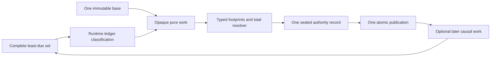

# M2 Exit Review: Deterministic Kernel

## Status

Complete. M2 satisfies its structural, semantic, lifecycle, conformance, and
verification gates. This review closes the milestone; it does not activate or
detail-plan M3.

## Executive verdict

The implementation is a faithful refinement of the target architecture. The
M1 singleton transition has become a complete deterministic
batch-certification kernel without introducing a second authority path, a
generic transaction framework, a worker architecture, or a compatibility
layer.

The kernel is explained by one waist:



For immutable execution semantics `Γ`, controlled state `Ωr`, complete
least-due deliveries `D`, and complete decisions `E`, the implemented ordinary
step is:

```text
prepareΓ(Ωr, through)
  -> Idle | Waiting | KernelSafety | PreparedFire(D, base_r, work)

resolveΓ(base_r, D, E)
  -> one total ResolvedMoment

publish(Ωr, ResolvedMoment)
  -> Ωr+1
```

All authoritative mutation remains inside runtime. Engine sees only sealed
execution semantics and opaque prepared work, evaluates commands through the
activated implementation, routes post-commit work through an engine-owned
pure router, and returns correlated decisions. Runtime alone classifies
ledgers, resolves, seals, applies, publishes, schedules, and retains recovery
evidence.

## Review basis

The exit review covered:

- the normative formal model, code architecture, persistence model, roadmap,
  and M2 plan;
- the M2 research synthesis across discrete-event simulation, simultaneous
  adjudication, deterministic databases, invariant certification,
  idempotency, fencing, keyed randomness, and game turn systems;
- the exact nine-crate dependency graph and public visibility surface;
- complete-moment preparation, evaluation, resolution, records, application,
  scheduling, and receipts;
- safety, management, world-ledger retirement, cancellation, termination,
  reconciliation, and finalization;
- public conformance scenarios and internal exhaustive permutation tests;
- canonical vectors, formatting, compilation, Clippy with warnings denied,
  tests, and diff hygiene.

## Architectural findings

### One mutation authority

`AttemptAggregate` owns the `Ca + Σ` transition protocol. `MemoryRepository`
is only the process-local authority-domain map, lock, lookup, and invocation
shell. `SessionHead`, authority-record sealing, scheduler installation,
ledgers, receipts, and finalization remain runtime-private.

There is no selectable singular path beside the batch path. The removed
one-item scheduler and moment APIs cannot bypass complete-moment preparation.

### One engine/runtime decision seam

`PreparedFire` freezes:

- the exact attempt step and fenced reservation;
- the complete canonical least-due delivery set and fingerprint;
- one shared immutable snapshot;
- runtime-owned retained, mismatch, collision, and retired classifications;
- only the genuinely evaluable command and post-commit work.

Opaque `WorkId` values are scoped to the exact attempt step. Decision
collection rejects missing, duplicate, unknown, cross-step, and wrong-kind
work before resolution.

Command evaluation remains runtime-activated but mutation-free. The concrete
post-commit policy interpreter is owned by `world-engine`; runtime only
constructs bounded inputs and validates complete decisions. This keeps future
routing complexity inside the engine subsystem without moving scheduler or
publication authority.

### Total domain resolver

The containment pressure test uses concrete, private transaction footprints:

- accepted-state reads;
- exclusive writes;
- typed conflict resources;
- combined invariant keys.

All candidates read the same base. Connected conflict components and resource
rankings are canonical. The configured equal-priority policy uses a stateless
BLAKE3 keyed PRF and highest-random-weight selection over semantic identities,
not scheduler, attempt, record, worker, or collection coordinates.

The resolver terminates with a checked successor or monotonically refines to
the rejection-only valid fallback. Every new logical command receives one
outcome.

### Atomic publication and causal work

One `MomentBatchRecord` correlates delivery classifications, attempt outcomes,
accepted commits, combined state delta, conflict/random evidence, reactions,
scheduler consequences, cursor advancement, and receipt evidence.

Publication installs the head, history, control ledgers, scheduler, and
receipt under one aggregate linearization point. Nonempty reactions schedule
self-contained post-commit work at the strict later microstep; empty reactions
schedule nothing. A dispatch is consumed exactly once.

### Lifecycle and bounded progress

All configured limits are deterministic execution semantics. They are checked
before ordinary Fire reservation:

- complete due-work population;
- evaluable command population;
- same-`SimTime` causal-wave count;
- terminal virtual-time advancement.

Safety publication consumes no blocked ordinary work and preserves its exact
frontier. Wave exhaustion pauses and supports an idempotent bounded-tranche
resume. Population excess quarantines. Terminal clock exhaustion fails.
Explicit host `Quarantine` and `Fail` are distinct idempotent management
transitions that preserve state, scheduler, due work, and admission frontier;
they clear a stale live pause blocker while history retains its cause.

Input, management, and source-scoped command ledgers implement exact replay,
mismatch, collision where applicable, typed retired behavior, and validated
contiguous world-ledger retirement. Admission sealing is monotonic and cannot
cross unresolved work.

Cancellation remains attempt-control-only with exact replay and mismatch
classification. The reviewed implementation deliberately removed a
premature cancellation-compaction API: real crash-safe acknowledgement,
retirement, and restoration belong to M5.

Termination projection is separate from attempt phase storage and runs at
root, after publication, and during reconciliation. Finalization is unique,
receipt-proven where publication occurred, and permanently closes later
attempt-scoped mutation.

## Simplification review

M2 closes with the following rejected or removed designs:

- no one-command-per-moment occupancy rule or singular scheduler API;
- no evaluator echo of runtime-owned retained or mismatch facts;
- no `PostCommitRoutingRequired` escape path;
- no storage-owned kernel state machine;
- no complete-world semantic read capability;
- no mutable random stream or unused branch-random namespace;
- no public generic repository, transaction, effect, workflow, scheduler
  payload, or subsystem trait;
- no cancellation compaction without durable acknowledgement evidence;
- no crate-wide large-enum, large-error, or dead-code allowance;
- no dual canonical schema or inflated first-version numbering;
- no runtime-internal error enums in the primary engine facade.

Large values are boxed only at their actual rare or sum-type owner. The first
reserved-operation schema is version 1 under its version-1 domain, and all
dependent frozen vectors were regenerated together.

## Research-to-design trace

The research note influenced the implementation in bounded ways:

| Research result | Retained design |
|---|---|
| Parallel DEVS and simultaneous adjudication | Complete least-due set and explicit confluent resolution |
| Ptolemy and Lingua Franca | `SimMoment = (SimTime, Microstep)` and later causal microsteps |
| Calvin and MLIR | Explicit freeze, pure evaluation, certification, and publication stages |
| Invariant confluence and snapshot-isolation failures | Concrete footprints plus combined-successor verification |
| AWS idempotency, RIFL, and Chubby fencing | Typed identities, exact replay, contiguous retirement, receipts, and stale-grant fencing |
| Random123, JAX PRNG, and HRW | Stateless semantic keys and permutation-independent ranking |
| Qud, Cogmind, Angband, and Diplomacy | Kernel owns virtual-time authority and simultaneous resolution, not game-specific speed policy |

The implementation does not import the larger frameworks from those systems.

## Conformance evidence

The public engine-only suite proves:

- accepted, rejected, retained, mismatched, and malformed controller paths;
- complete same-moment publication;
- all six ingress permutations of a contested pair plus a disjoint transfer,
  with identical normalized outcomes and accepted successor;
- atomic configured population rejection;
- inspectable quarantine with unresolved work preserved;
- same-time wave pause, exact Resume retry, tranche reset, and later dispatch
  consumption;
- world-ledger retirement, exact management retry, admission sealing, and
  typed backdated rejection;
- repeated semantic history across independent authority domains;
- artifact and engine-composition gates;
- terminal-clock failure with due work preserved.

Internal tests add proposal completion-order and logical worker-count
invariance, random-draw independence, transitive conflict components,
interruption cuts, receipt reconciliation, stale-capability fencing,
publication/finalization races, and canonical byte vectors.

## Verification

The completed tree passes:

```text
cargo fmt --all --check
cargo check --locked --workspace --all-targets
cargo clippy --locked --workspace --all-targets -- -D warnings
cargo test --locked --workspace
git diff --check
```

The workspace test run contains 278 unit/integration/conformance tests and 30
documentation compile tests, all passing. Runtime contributes 188 unit tests
and 18 compile-fail documentation tests; the public standard-transfer suite
contains 17 scenarios.

## Deliberate deferrals

These are later-milestone scope, not M2 defects:

- M3: actor-relative perception, capabilities, affordances, grounded
  candidates, action selection, and the first reaction-sponsored
  action-opportunity protocol;
- M4: real process, intent, activity, evidence, and social lifecycle
  producers, including richer post-commit routing;
- M5: durable backend, checkpoints, restore, archive, branching,
  attempt-control compaction, and reliable delivery;
- M6: CLI, MCP, AI-agent adapters, authoring expansion, and experiments;
- M7: multi-resolution simulation and evidence-driven scale work.

M2 evaluates serially in production. Its proposal and resolver semantics erase
completion order and simulated logical worker count, so later parallel pure
evaluation can be introduced as an optimization without changing authority
semantics.

## Exit decision

M2 is accepted. No architectural redesign is required before M3. M3 should be
planned from the completed public kernel and the reference-game pressure test
at milestone entry; distant implementation details remain roadmap-only.
