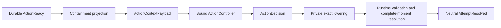

# M3 Exit Review: Actor-Relative Grounded Action

## Status

Accepted.

M3 establishes one complete actor-control path without introducing another
mutation authority, a generic projection framework, or speculative lifecycle
machinery. The architecture remains centered on one narrow rule:

> A controller may choose only actor-safe meaning; runtime alone decides
> authoritative truth and publishes state.

## Final waist



The public half contains actor-safe object references, complete grounded
bindings, canonical candidate IDs, bounded coverage, and an input fingerprint.
The private half contains only the exact reference and candidate resolution
needed immediately for lowering. Candidate discovery never reads hidden
destination capacity or occupancy to suppress an attempt.

The concrete projector is intentionally not hidden behind a universal
provider, pass, query, capability, or affordance framework. A second genuinely
different grounding family remains the evidence threshold for a shared
projection IR.

## Physical architecture

M3 adds two crates with one-way dependencies:

```text
world-context  -> world-core, world-defs, world-model
world-decision -> world-core, world-defs, world-context
world-engine   -> world-context, world-decision, world-runtime, ...
```

- `world-context` owns actor-safe grounded candidates, canonical
  fingerprints, the concrete containment-transfer projector, and the private
  exact resolution table.
- `world-decision` owns the closed `Select | NoApplicableAction` result and
  the deterministic first-canonical-candidate baseline.
- `world-model` owns the immutable, versioned, one-shot action opportunity.
- `world-runtime` owns opportunity state, scheduler work, command legality,
  conflict resolution, mutation, authority records, and publication.
- `world-engine` owns controller binding, projection/controller composition,
  membership checks, and private lowering.
- `world-conformance` proves the public cross-crate behavior and dependency
  allowlist.

No lower crate depends on engine, standard content, persistence adapters, or a
product transport.

## Controller authority

`EngineBuilder` installs the baseline controller by default. A host may install
one replacement controller before building the engine; resolution captures
that implementation and its semantics identity in `ResolvedExecution`.
`RunAttempt::advance` cannot replace it.

This keeps the authority surfaces separate:

- the controller receives only `ActionContextPayload` and returns only
  `ActionDecision`;
- the host retains `RunAttempt`, system ingress, management, cancellation, and
  inspection capabilities;
- an actor adapter is never handed the host capability.

The synchronous callback is a trusted in-process boundary. Durable external
agent invocation, authentication, timeout, capture, and replay require M4/M6
protocols and are not simulated by blocking this interface.

The retired M3 singleton lifecycle profile was the versioned execution
commitment to the grounder, canonical ordering and fingerprint rules, and
default baseline semantics. A replacement controller was trusted exogenous
behavior: its semantics identity changed the input fingerprint, and its
resulting disposition or command was captured by authority history.

## Durable lifecycle and timing

Every checked origin opportunity has an actor, reaction sponsor, bounded
containment interaction scope, actor-local generation, and expected version.
It moves exactly once:

```text
Open(v) -> Consumed(v + 1, terminal disposition)
```

At `ActionReady(m)`:

- `Select` atomically consumes the opportunity and schedules an action-origin
  command at `next(m)`;
- `NoApplicableAction` or controller failure atomically consumes it and
  schedules a neutral wake at `next(m)`;
- resolution of the selected command at `next(m)` schedules the neutral wake
  at `next(next(m))`.

Accepted, rejected, retained, collision-losing, and conflict-losing selected
attempts share the same actor-visible wake identity, shape, and timing. Rich
attempt results remain runtime/host data and do not enter the controller
payload or actor wake.

Action-origin commands use a domain-separated namespace derived from the
opportunity. Trusted system commands use a distinct typed source derivation.
The engine's private table and input fingerprint enforce selected-candidate
membership and budget; runtime intentionally does not duplicate the projector.
Runtime validates that an action proposal matches the authoritative
opportunity actor, source anchor, destination scope, containment-transfer
family, and definition set before it can enter resolution.

## Freshness model

M3 has no retained policy result. Projection, decision, membership validation,
and lowering are stack-local within one exact `PreparedFire` reservation over
an immutable base snapshot. Completion verifies the reserved head, due set,
and prepared work, while runtime reevaluates current command legality.

The exit review removed the unused `ReadWitness` implementation. Positive
dependency witnesses, cross-revision reuse, private rebind, discard, and
reinvocation begin only with M4's first retained or deferred evaluation, where
they have a real producer and consumer.

## Authority and atomicity

The runtime seals and applies one complete moment. For actor work that means
the same authority record covers:

- exact prepared-work consumption;
- opportunity compare-and-set transition;
- action-origin command or neutral-wake scheduler insertion;
- command attempt, accepted delta or stable rejection, reactions, and later
  wake where applicable;
- one resulting state, scheduler, ledger, cursor, and history prefix.

Same-moment actors project and lower against one immutable base. Their commands
then enter the existing deterministic resolver together. Contention can accept
only one physical transfer, but it cannot change either controller's earlier
payload or the neutral continuation contract.

## Conformance evidence

The public conformance suite includes:

- paired states with identical actor-permitted containment facts and different
  hidden destination capacity;
- byte-identical payloads, candidates, decisions, invocation counts, and wake
  timing across that pair;
- divergent authoritative acceptance without rich outcome leakage;
- two actors selecting the same item before shared same-moment resolution;
- exactly one physical transfer and two outcome-neutral continuations;
- complete-empty projection and `NoApplicableAction`;
- fabricated, cross-input, and incompatible controller decisions rejected
  before command creation;
- stale/duplicate opportunity transitions rejected by runtime;
- source-namespace separation and action-scope authorization;
- workspace dependency-direction enforcement.

## Simplification review

The final implementation deliberately removes or declines:

- the old ordinary actor API that accepted an arbitrary action key and
  bindings; the remaining `SystemCommandRequest` is named trusted system
  ingress;
- per-advance controller replacement;
- unused `Wait` and `Abstained` action dispositions;
- unused dependency witnesses and truncated dependency versions;
- unused opportunity predecessor linkage before any successor producer exists;
- baseline scores and diagnostics when canonical first selection is sufficient;
- a generic `ProjectionResult` before a partial provider exists;
- a projection DSL, universal registry, pass framework, or empty future
  lifecycle modules.

These deletions reduce concepts without weakening the target architecture:
every retained type has an M3 producer, consumer, invariant, and test.

## Explicit deferrals

M4 inherits the first work that genuinely needs more machinery:

- observation, evidence assimilation, beliefs, appraisal, intent, activity,
  social interpretation, and process lifecycles;
- activity-sponsored successor action opportunities;
- a typed partial projection only when a real unavailable provider and
  production consumer exist; M4 later kept this unassigned rather than
  inventing a synthetic failure source;
- retained/deferred evaluator invocations, positive dependency witnesses,
  freshness, rebind, discard, cancellation, timeout, and replay capture;
- visible outcome evidence after the neutral wake.

M5 retains checkpoint/restore and durable backend work. M6 retains CLI, MCP,
player/AI sessions, authentication, and product transport. Multi-resolution
simulation remains later roadmap work. None of these deferrals requires
changing M3's actor-safe candidate waist, private lowering boundary, or runtime
authority.

## Verification gate

The accepted gate is:

```text
cargo fmt --all --check
cargo check --locked --workspace --all-targets
cargo clippy --locked --workspace --all-targets -- -D warnings
cargo test --locked --workspace
git diff --check
```

All gates passed on 2026-07-28, including workspace unit, integration,
conformance, compile-fail, and documentation tests.

## Exit decision

M3 is complete. Its core abstraction is small enough to remain stable:
actor-safe grounded choices cross the policy boundary; exact bindings cross
only the private engine/runtime boundary. M4 can add independently scheduled
agency lifecycles around this waist without changing crate dependency
direction or creating another command, mutation, or publication path.
