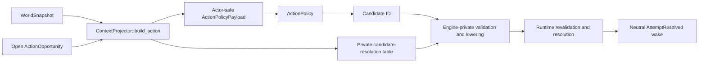

# M3 Plan: Actor-Relative Grounded Action

## Status

Complete and exit-reviewed.

The actor-control waist, durable lifecycle, authoritative integration,
conformance fixtures, and simplification review are complete. Detailed closure
evidence is recorded in
[the M3 exit review](milestone-03-exit-review.md).

## Goal

Add one complete actor-control waist in which the deterministic baseline,
scripts, and trusted synchronous host controllers can choose only from a
bounded actor-safe set of fully grounded action candidates. Later human and
external-agent adapters use the same waist through a durable invocation
protocol.

For fixed execution semantics `Γ`, authoritative state `Σ`, actor `a`, and one
open action opportunity `u`:

```text
trusted projection
  -> actor-safe action payload plus private build material
  -> candidate-ID-only decision
  -> private membership validation and lowering
  -> existing runtime command validation and complete-moment resolution
  -> one-shot opportunity consumption and neutral later wake
```

Candidate construction proves complete bindings, not hidden legality. Runtime
remains the only authority for requirements, conflict resolution, mutation,
publication, and scheduling.

## Non-goals

M3 does not introduce:

- appraisal, social interpretation, intent, activity, evidence assimilation,
  belief revision, persistent memory, or process-control lifecycles;
- a broad context aggregate, mutable blackboard, generic subsystem runner, or
  lifecycle pass graph;
- grid position, field of view, lighting, sound, smell, or a complete
  perception system;
- a capability, affordance, projection, query, action, planning, or effect DSL;
- a universal provider registry or generic compiler-pass framework;
- GOAP, HTN, behavior trees, utility AI, learned policy, LLM reasoning, or
  AI-generated executable code;
- CLI, MCP, JSON/wire schemas, authentication, controller sessions, or product
  transport state;
- detailed duration, skill, equipment, condition, or environmental modifiers;
- checkpoint, restore, archive, delivery durability, database persistence, or
  multi-resolution simulation;
- a second mutation authority, command path, runtime backend, or compatibility
  surface;
- synthetic production providers or fake domain flags created only to make an
  unavailable-projection test pass.

M4 adds the higher agency lifecycles and real partial projection dependencies.
M5 makes their protocols restorable. M6 adds player/AI/product adapters over
the M3 actor-control boundary.

## Normative contracts

- [Formal System Model](../../architecture/target-architecture/formal-model.md)
- [System Architecture](../../architecture/target-architecture/system-architecture.md)
- [Target Rust Code Architecture](../../architecture/target-architecture/code-architecture.md)
- [Cognition and Agency](../../architecture/target-architecture/cognition-and-agency.md)
- [Architecture Decisions](../../architecture/target-architecture/decisions.md)
- [Validation Scenarios](../../architecture/target-architecture/validation-scenarios.md)
- [Target Architecture Execution Roadmap](../../architecture/target-architecture/implementation-roadmap.md)
- [Reference Game Vision](../../design/reference-game-vision.md)
- [M3 research synthesis](../../research/m3-grounded-action-research.md)
- [M2 exit review](milestone-02-exit-review.md)

The target documents own authority, dependency direction, state partitioning,
and lifecycle separation. This plan refines only the M3 action slice.

## Entry-state evidence

M2 closes with one deterministic authoritative waist:

```text
complete least-due work
  + one immutable base snapshot
  -> opaque pure decisions
  -> typed command preparation and total resolution
  -> one sealed record and atomic publication
  -> optional later causal work
```

M3 began with:

- a sealed `ResolvedExecution` and exact definition set;
- one typed containment-transfer semantic family;
- immutable `WorldSnapshot` and bounded containment query views;
- same-moment preparation, revalidation, conflict resolution, and
  permutation-invariant publication;
- a typed scheduler, later post-commit work, and bounded causal waves;
- source-scoped command identity, replay, collision, retirement, and attempt
  finalization.

It did not yet have:

- `world-context` or `world-decision`;
- a non-disabled lifecycle profile;
- durable action opportunities or action-ready scheduler work;
- actor-safe candidate/fingerprint identity;
- a private candidate-resolution table;
- an ID-only action policy and controller surface;
- neutral attempt-resolution lifecycle work.

The former raw controller ingress accepted an action key and arbitrary
bindings. M3 replaced it as actor control. The remaining
`SystemCommandRequest` is explicitly trusted system/exogenous ingress and uses
a source namespace distinct from action opportunities.

## Fixed architectural shape

### One public waist, one private envelope



Policy can borrow the payload. It cannot obtain, clone, serialize, or inspect
the private build product.

### Action-only milestone

M3 creates only action-lifecycle projection and decision modules. Final module
maps for observation, evidence, appraisal, intent, activity, and social
interpretation do not authorize empty files, placeholder ports, or speculative
traits.

Reusable primitives introduced by M3 must already have a producer, consumer,
invariant, and test inside the action slice.

### Grounding ownership

The first projector is a concrete containment-transfer projector in
`world-context`.

It does not know the standard pack key. It validates the checked
actor/item/source/destination role shape and reads only immutable containment
queries required for actor-safe discovery. `world-engine` invokes it only for
the typed containment-transfer family already selected by sealed runtime
activation.

No crate dependency direction changes:

```text
world-context  -> world-core, world-defs, world-model
world-decision -> world-core, world-defs, world-context
world-engine   -> world-core, world-defs, world-model, world-runtime,
                  world-context, world-decision
```

The second different grounding family is the decision point for either another
concrete projector or a minimal checked projection IR.

## Formal projection

Let:

```text
Γ  exact immutable execution semantics
Σ  authoritative state
a  actor
u  open action opportunity
B  primitive permitted actor-view basis
V  actor-safe action frame
C  bounded grounded candidate set
R  private candidate-resolution table
```

Actor-indistinguishability is:

```text
Σ1 ≈a,u Σ2
  iff canonical(BΓ(a, u, Σ1)) = canonical(BΓ(a, u, Σ2))
```

The definition is independent of projector output so a paired test cannot
prove itself circularly.

Context construction is:

```text
BuildActionΓ(Σ, a, u)
  -> Complete(payload(V, C), R)
```

`Complete(empty)` is a successful projection and yields
`NoApplicableAction`. The concrete M3 projector is total over its checked
inputs. A typed `Unavailable` result is reserved for M4's first genuinely
partial provider; M3 does not add an unused abstraction or fake failure source.

For action definition `d` and complete typed binding `β`:

```text
CandidateΓ(V, u, d, β)
  iff InScope(u, d)
   ∧ CompleteTypedBinding(d.roles, β)
   ∧ DiscoverΓ(V, d, β)
```

Authoritative execution is distinct:

```text
ExecutableΓ(Σ, a, d, β)
  iff PermissionΓ(Σ, a, d, β)
   ∧ RequirementΓ(Σ, d, β)
   ∧ ResourceAvailabilityΓ(Σ, d, β)
   ∧ HardInvariantsΓ(Σ, d, β)
```

Grounding cannot invoke `Executable`.

Policy is a pure staged transducer:

```text
PolicyΓ(payload)
  -> Select(candidate_id)
   | NoApplicableAction
```

Controller failure is not a policy decision. It consumes the opportunity with
the terminal `Failed` disposition. Waiting, external defer, intent
reconsideration, and richer recovery require later lifecycle protocols.

Private lowering is:

```text
LowerΓ(R, selected_id)
  -> CommandEnvelope
   | private integrity failure
```

M3 builds, invokes, and lowers synchronously against one immutable snapshot
reserved by `PreparedFire`; there is no cross-revision reuse interval. Runtime
independently revalidates the authoritative opportunity, action scope, binding
shape, hard authority, requirements, resources, and current accepted state.
Retained evaluations and dependency witnesses begin in M4.

## Initial durable protocol

### Action opportunity

M3 owns the durable one-shot action protocol. Its minimum states are:

```text
Open
Consumed(terminal disposition)
```

`WaitingForEvaluation` is added only when a real nonblocking evaluator exists.
It is not needed by the synchronous M3 baseline.

Every opportunity has:

- stable identity and actor;
- one explicit sponsor;
- bounded interaction scope;
- expected version;
- one terminal disposition.

M3 seeds checked origin opportunities sponsored by an actor reaction and
schedules corresponding action-ready work. M4 later adds activity-sponsored
opportunities; it does not replace or duplicate this protocol.

### Neutral resolution

Submitting or terminally disposing one opportunity consumes it exactly once.
For an `ActionReady` delivery at moment `m`:

- a selected action schedules its command at `next(m)` and the neutral
  `AttemptResolved(ActionOpportunityId)` wake at `next(next(m))`;
- a terminal non-submission schedules the neutral wake at `next(m)`.

Selected attempts use the same wake identity and timing regardless of:

- runtime acceptance;
- hidden requirement rejection;
- stale authoritative legality;
- same-moment conflict loss.

The wake does not carry the rich attempt result, retryability, authority
record, revision, commit, or rejection class. A later visible difference must
come through a modeled observation and accepted evidence transition in M4.

## First gameplay slice

The existing containment transfer is the only action family needed.

### Interaction projection

The action opportunity supplies bounded source and destination interaction
anchors. The projector:

- derives actor transfer capability from hard source-container authority;
- exposes direct items in the actor-controlled source;
- treats supplied destination anchors as known interaction subjects;
- excludes destination capacity and hidden occupancy from the public view;
- produces actor-safe references and one private exact-reference index;
- creates one fully bound candidate per permitted
  actor/item/source/destination combination;
- enforces a deterministic candidate budget and canonical order.

This is a real relational observation boundary. It does not pretend to be
tile visibility. A later local-grid/FOV subsystem can produce the same visible
subjects and relations without changing the candidate, policy, lowering, or
runtime contracts.

### Paired hidden-state fixture

Two authoritative states have identical permitted actor views:

```text
Σ1: destination has remaining hidden capacity
Σ2: destination is secretly full
```

They must produce byte-identical:

- payloads;
- candidate membership, bindings, ordering, and IDs;
- input fingerprints and bounded coverage;
- policy selection and logical invocation count;
- neutral-wake identity, generation, and effective timing.

Their authoritative outcomes may differ.

### Same-moment fixture

Two actors receive independent opportunities, ground the same physical item,
and select their own candidate IDs for the same simulation moment. Both
selections lower before resolution. M2's existing complete-moment resolver
chooses the deterministic accepted result and rejects the loser without a
second authority path.

## Type and crate ownership

### `world-core`

M3 adds no generic dependency or projection vocabulary to core. IDs with one
domain owner remain beside that owner. Dependency evidence will enter only
with M4's first retained evaluation that consumes it.

### `world-model`

Own immutable action-opportunity protocol values, sponsor/scope records,
terminal dispositions, and any bounded containment read views needed by the
projector.

`world-model` exposes no scheduler mutation, record append, store, or
`apply_*` API.

### `world-context`

Own:

- actor-safe action-opportunity and interaction views;
- actor-safe object references;
- grounded candidate and candidate-set identities;
- input fingerprints and bounded coverage;
- the concrete containment-transfer projector;
- opaque `ActionContextBuild` with the actor-safe payload and private
  candidate-resolution table.

There is no broad `Context`, feature map, mutable query session, universal
provider trait, or runtime dependency.

### `world-decision`

Own only the M3 action policy:

- actor-safe input borrowed from `world-context`;
- closed bounded result enum;
- deterministic selection of the first canonically ordered candidate;
- selection membership checks at the coordinator boundary.

It has no `WorldSnapshot`, runtime command, authority cursor, or mutation
dependency.

### `world-runtime`

Own:

- lifecycle profile identity and behavior-affecting budgets in `Γ`;
- durable opportunity state and expected-version checks;
- action-ready and neutral attempt-resolution scheduled work;
- atomic opportunity consumption and scheduling consequences;
- current-state command requirements, hard authority, conflict resolution,
  mutation, publication, and rich private result.

### `world-engine`

Own:

- activation-time join of runtime family, checked definition, projector,
  lifecycle profile, and execution-bound action policy;
- stack-local synchronous invocation;
- context build, payload-only policy invocation, selection membership, and
  private lowering;
- mapping the lowered selection into the existing command ingress;
- controller-neutral public actor-control facade.

Engine coordinates but cannot publish state.

### `world-conformance`

Exercise the public engine-only actor-control path, dependency allowlist,
execution-bound controller interchange, same-moment resolution, hidden-state
noninterference, stale input, fabricated IDs, and absence of the replaced raw
normal-controller path.

## Identity and determinism

Candidate identity uses an explicit versioned canonical preimage equivalent
to:

```text
GroundedActionCandidateId =
  H(
    "grounded-action-candidate-v1",
    opportunity_id,
    definition_key,
    canonical(actor_safe_bindings),
    grounding_semantics_id
  )
```

It excludes:

- global revision and raw simulation moment;
- source head and authority record;
- exact private entity-resolution metadata;
- collection insertion or hash-map iteration order;
- private runtime-legality facts;
- candidate-set fingerprint.

The action input fingerprint covers the complete ordered actor-safe payload,
configured budgets, and behavior-affecting projector/policy semantics.

Boundary collections are sorted vectors or ordered maps. An internal hash map
may not determine output order or canonical bytes.

## Decisions fixed for M3

1. M3 is action-only; other lifecycle modules remain absent.
2. Grounded candidate means fully bound from actor-safe input, not secretly
   legal.
3. The public policy waist is candidate-ID-only.
4. The first public affordance representation is the grounded candidate;
   separate public capability and affordance frameworks wait for a consumer.
5. The first grounder is the concrete containment-transfer projector in
   `world-context`.
6. No dependency direction changes and no standard-pack key matching occur.
7. `world-engine` owns the typed family/definition/projector/policy join.
8. Synchronous build, decision, and lowering have no retained freshness gap.
9. Runtime legality is revalidated on every attempt.
10. Action opportunity is a durable one-shot protocol owned by M3.
11. Immediate resolution feedback is one neutral later wake.
12. Checked origin input supplies the first real reaction-sponsored
    opportunities.
13. The initial visibility model is bounded containment interaction, not grid
    FOV.
14. The total M3 projector supports `Complete(empty)`; typed unavailability
    waits for the first partial provider in M4.
15. The raw arbitrary-binding controller API is removed or made explicitly
    non-actor system ingress after the replacement path exists.

## Work packages

Each package closes with focused tests, formatting, compilation, Clippy, and
diff hygiene. Local names may change when implementation evidence shows a
smaller domain shape.

### W1: Actor-safe projection and decision vertical

- add `world-context` and `world-decision` with target dependencies only;
- add the minimum checked interaction scope and actor-safe reference types;
- implement the concrete containment-transfer projector;
- build bounded canonical candidates and private resolution entries;
- implement action-safe fingerprinting;
- implement the deterministic baseline selection from supplied IDs;
- prove successful, empty, hidden-capacity, canonical-order, fabricated-ID,
  and policy-confinement cases without adding runtime authority.

This package must have a real snapshot producer, projector, policy consumer,
private-resolution invariant, and tests. It does not create empty future
lifecycle modules.

### W2: Durable opportunity and lifecycle

- add checked one-shot opportunity, sponsor, interaction scope, version, and
  terminal disposition records;
- extend lifecycle profile semantics in `Γ`;
- extend checked origin state with real reaction-sponsored opportunities and
  corresponding ready work;
- add runtime-owned opportunity ledger/state validation;
- prove duplicate, stale-version, replay, and terminal one-shot behavior.

### W3: Engine coordinator and private lowering

- bind the containment projector and baseline policy into sealed execution;
- prepare action-ready work with one private invocation envelope;
- expose only the actor-safe payload to policy;
- reject unknown, fabricated, cross-opportunity, duplicate, and stale
  selections;
- consume the private table to construct the existing command envelope;
- admit selections into the existing least-due complete-moment path.

### W4: Neutral wake and hidden-state noninterference

- consume an attempted opportunity exactly once;
- schedule the same neutral later wake for accepted and rejected outcomes;
- retain rich attempt resolution privately;
- add paired-state tests covering hidden capacity, payload identity,
  invocation count, authoritative divergence, and exact wake timing;
- leave retained-result freshness, private rebind, and reinvocation to M4.

### W5: Same-moment actor control and public facade

- bind one controller to the resolved execution while exposing it only
  actor-safe payloads;
- prove deterministic baseline and alternate test controllers use the same
  coordinator and lowering path;
- prove two actor selections enter one M2 complete-moment base and resolver;
- separate host controller authorization from actor in-world capability;
- remove or narrow the ordinary raw action/binding bypass
  after all conformance callers move to candidate selection.

### W6: Conformance, simplification, and exit review

- add public engine-only conformance scenarios;
- verify crate dependency and privacy boundaries;
- remove unused wrappers, duplicate identities, broad traits, placeholder
  lifecycle types, and transition-only APIs;
- reconcile normative documents with implemented names and evidence;
- run the full workspace gates;
- write the M3 exit review and detail M4 only after M3 closes.

## Deletion scope

After the replacement actor-control path is complete:

- remove the public normal-controller ability to provide an arbitrary
  `DefinitionKey` and bindings;
- remove any duplicate actor-visible and private candidate representation;
- remove policy access to snapshot, global revision, raw moment, runtime
  command, or rich attempt resolution;
- remove any candidate filter that uses private authoritative legality;
- remove temporary singular-action scheduling or direct recursive
  action-resolution path if one appears during integration;
- remove any broad provider/registry/trait introduced without a second real
  implementation.

Trusted exogenous or system command ingress may remain only as a separately
named and typed non-actor boundary with its own authority semantics.

## Acceptance gates

### Structural

- `world-context` depends only on core, defs, and model;
- `world-decision` depends only on core, defs, and context;
- neither crate depends on runtime, engine, standard, persistence, or product
  adapters;
- only engine sees both decision results and runtime command requests;
- no new publication capability or mutable world surface exists;
- no empty lifecycle module or speculative public plugin trait exists.

### Projection and candidate soundness

- every public candidate is complete and type-correct;
- every public candidate has exactly one private resolution entry;
- private attachment cannot change public membership or order;
- candidate generation is bounded and canonical;
- item visibility is limited by explicit interaction scope;
- hidden destination capacity/occupancy does not change candidates;
- guessed raw entities, definitions, bindings, and candidate IDs cannot create
  a command;
- a successful empty projection is not treated as an error.

### Policy confinement

- policy receives actor-safe immutable bytes only;
- policy returns only a supplied candidate ID or a closed modeled
  non-selection result;
- the baseline selects the first semantic, canonically ordered candidate;
- controller kind does not change payload, lowering, or runtime legality.

### Reservation and noninterference

- hidden-only or unrelated revision changes cannot alter actor-safe bytes,
  candidate IDs/order, invocation count, generation, or effective timing;
- build, decision, and lowering complete inside one reserved prepared step;
- runtime revalidates legality in every case;
- paired hidden states may differ only in authoritative outcomes before
  modeled observation.

### Opportunity and causal progress

- every opportunity has one sponsor, actor, scope, version, and terminal
  disposition;
- one opportunity is consumed exactly once;
- replay, duplicate, stale, and cross-opportunity selections produce no
  command;
- M3 never reopens a consumed opportunity; causal successor linkage enters
  only with M4's first real continuation producer;
- attempted acceptance, rejection, and contention loss schedule the same
  neutral later wake shape;
- no action call recursively runs observation, evidence, appraisal, intent,
  activity, and another action.

### Runtime integration

- selected candidates lower only through the private table;
- the existing runtime performs hard authority and requirement validation;
- two same-moment actor selections use one immutable base and M2's total
  deterministic resolver;
- opportunity consumption, command consequence, scheduler consequence, and
  authority publication are atomic under the selected protocol;
- no old actor-control bypass remains.

### Quality and verification

```text
cargo fmt --all --check
cargo check --locked --workspace --all-targets
cargo clippy --locked --workspace --all-targets -- -D warnings
cargo test --locked --workspace
git diff --check
```

Focused tests also cover canonical vectors, insertion/permutation invariance,
privacy/compile-fail boundaries, state-machine transitions, paired
noninterference, and dependency allowlists.

## Validation-scenario allocation

- Scenario 1: actor-safe candidate selection enters the existing complete
  same-moment contention resolver.
- Scenario 2: M3 covers false/stale actor-relative grounding, private runtime
  rejection, neutral wake, and paired noninterference. M4 completes modeled
  observation, evidence, belief, and appraisal.
- Scenario 4: M3 covers successful `Complete(empty)` behavior. M4's first real
  partial provider introduces typed unavailability and its policy disposition.
- Scenario 16: M3 covers hidden-state noninterference, candidate fingerprints
  independent of global revision, exact prepared-step reservation, and runtime
  legality. M4 owns retained-result witnesses, private rebind, and visible
  reinvocation.

## Architecture-document reconciliation

The entry review made these corrections:

- roadmap M3 owns only synchronous action projection and selection;
- scenario 2 is explicitly split between M3 and M4;
- scenario 4 does not require a fake provider;
- M4 extends the M3 opportunity with activity sponsors rather than adding a
  second action-selection path;
- the older broad `AgentTurnInput`, arbitrary `ActionRequest`, and direct
  structured invalid-action feedback are marked superseded;
- decisions D-032 and D-033 fix the actor-relative compiler waist and concrete
  first grounder.

## Decision triggers

Stop and record a new architecture decision before:

- changing crate dependency direction;
- moving publication, opportunity mutation, or scheduler authority out of
  runtime;
- allowing decision code to inspect `WorldSnapshot` or private execution
  material;
- introducing a generic grounder/provider registry or projection DSL;
- treating a second action family as the same typed grounding contract without
  structural evidence;
- adding a second backend or persistence abstraction;
- exposing rich runtime rejection directly to actor policy;
- making controller transport state part of authoritative agency state;
- adding async evaluation before a durable waiting/invocation protocol exists;
- changing canonical identity schemas without version/domain updates.

Local concrete names, module splits, error granularity, and private algorithms
may change without an architecture decision when ownership and observable
semantics stay fixed.

## Completion evidence

### Entry review

Complete:

- current M2 code and public API inspected;
- target formal, system, code, cognition, persistence, scenario, and roadmap
  documents cross-checked;
- primary research reviewed across partial observability, epistemic
  indistinguishability, affordances, action grounding, noninterference,
  game-action systems, controller APIs, AI grounding, MCP, and incremental
  computation;
- roadmap ownership defects corrected;
- first concrete grounding family and dependency-preserving ownership fixed;
- first gameplay slice and paired-state verification program selected;
- M3 was marked active after the entry review.

### Implementation and exit review

Complete:

- added `world-context` and `world-decision` with the intended dependency
  direction and no runtime authority;
- implemented canonical bounded containment-transfer grounding, actor-safe
  fingerprints, ID-only decisions, private exact resolution, and the baseline
  first-candidate policy;
- added durable reaction-sponsored opportunities, compare-and-set terminal
  consumption, `ActionReady`, action-origin commands, and neutral
  `AttemptResolved` wakes;
- integrated selected actions into the existing complete-moment resolver and
  atomic authority record, including same-moment contention;
- separated trusted `SystemCommandRequest` from actor control and
  domain-separated its command-source namespace;
- bound controller choice at execution resolution rather than accepting a new
  controller on each advance;
- removed unused witness, wait, abstention, scoring, generic projection-result,
  and provider abstractions;
- proved hidden-capacity noninterference and same-moment actor contention in
  public conformance tests;
- reconciled the target documents and passed the locked workspace gate.

## Next milestone handoff

M4 may now be detail-planned from the accepted M3 actor-control waist.

The expected handoff is:

- stable action opportunity and candidate identities;
- one actor-safe payload/private envelope split;
- real action-ready and neutral-resolution scheduling;
- deterministic baseline policy;
- controller-neutral candidate selection;
- private lowering and runtime revalidation;
- paired hidden-state noninterference evidence;
- no raw ordinary actor-command bypass.

M4 then adds evidence, appraisal, intent, activity, process, and deferred
evaluation lifecycles around this existing action protocol.
